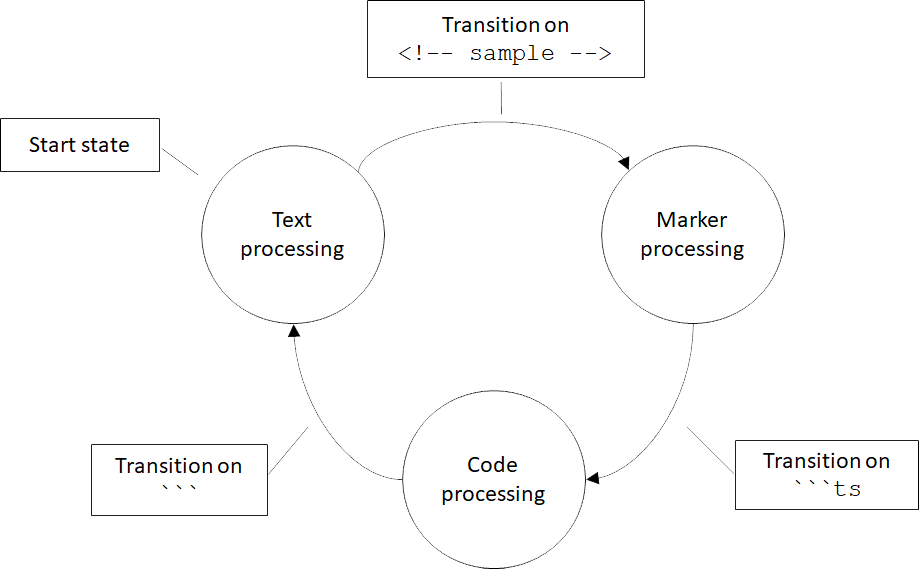

# A Switchless State Machine

This blog post is an excerpt from my book, [Programming with
Types](https://www.manning.com/books/programming-with-types). The code
samples are in TypeScript.

## Early Programming with Types

While working on an early draft of the book, I wrote a small script to
help me keep the source code in sync with the text. The draft was
written in the popular Markdown format. I kept the source code in
separate TypeScript files so I could compile them and ensure that, even
if I update the code samples, they still work.

I needed a way to ensure that the Markdown text always contains the
latest code samples. The code samples always appear between a line
containing ```` ```ts```` and a line containing ```` ``` ````. When generating
HTML from the Markdown source, ```` ```ts ```` is interpreted as the beginning
of a TypeScript code block, which gets rendered using TypeScript syntax
highlighting, while ```` ``` ```` marks the end of that code block. The contents
of these code blocks had to be inlined from actual TypeScript source files
which I could compile and validate outside of the text.


The figure shows two TypeScript (.ts) files containing code samples which
should be inlined in the Markdown document between ```` ```ts ```` and
```` ``` ```` markers. The `<!-- ... -->` comments annotate the code samples for
my script.

To determine which code sample goes where, I relied on a small trick: Markdown
allows raw HTML in the document text. I annotated each code sample with an
HTML comment, for example `<!-- sample1 -->`. HTML comments do not get
rendered, so when converting Markdown to HTML, these became invisible. On the
other hand, my script could use these to determine which code sample to inline
where.

Once all code samples were loaded from disk, I had to process each Markdown
document of the draft and produce an updated version as follows:

* In text processing mode, simply copy each line of the input text to the
  output document as-is. Once a marker is encountered (`<!-- sample -->`),
  grab the corresponding code sample and switch to marker processing mode.
* In marker processing mode, again copy each line of the input text to the
  output document until we encounter a code block marker (```` ```ts ````).
  Once the code marker is encountered, output the latest version of the code
  sample as loaded from the TypeScript file and switch to code processing mode.
* In code processing mode, we already ensured the latest version of the code is
  in the output document, so we can skip over the potentially outdated version
  in the code block. That means we skip each line until we encounter the end of
  code block marker (```` ``` ````). Then we switch back to text processing
  mode.
  
With each run, the existing code samples in the document preceded by a
`<!-- ... -->` marker get updated to the latest version of the TypeScript files
on disk. Other code blocks that aren't preceded by `<!-- ... -->` don't get
updated as they are processed in text processing mode.

As an example, let's take a `helloWorld.ts`code sample:

``` ts
console.log("Hello world!");
```

We want to embed this in `Chapter1.md` and make sure it's kept up to date.

```` md
# Chapter 1

Printing "Hello world!".
<!-- helloWorld -->
```ts
console.log("Hello");
```
````

This is not quite up to date, the string here is `"Hello"`, not matching
`helloWorld.ts`.

This document gets processed line by line as follows:

1. In text processing mode,`"# Chapter 1"` is copied to the output as-is.
2. `""` (blank line) is copied to the output as-is.
3. `"Printing "Hello world!"."` is copied to the output as-is.
4. `"<!-- helloWorld -->"` is copied to the output as-is. This is a marker
   though, so we keep track of the code sample to be inlined (helloWorld.ts)
   and switch to marker processing mode.
5. ```` "```ts" ```` is copied to the output as-is. This is a code block marker,
   so immediately after copying it to the output we also output the contents
   of `helloWorld.ts`. We also switch to code processing mode.
6. `"console.log("Hello");"` is skipped. We don't copy lines in code
   processing mode, as we are replacing them with the latest in the
   code sample file.
7. ```` ``` ```` is an end of code block marker. We insert it then switch
   back to text processing mode.

## State Machines

The behavior of our text processing script is best modelled as a state
machine. A state machine has a set of states and a set of transitions
between pairs of states. The machine starts in a given state, also known
as the *start state*, then if certain conditions are met, it can
transition to another state.

This is exactly what our text processor does, with its three processing
modes. Input lines are processed a certain way when in *text processing
mode*. When some condition is met (a `<!-- sample -->` marker is
encountered), our processor transitions to the marker processing mode.
Again, when some other condition is met (```` ```ts ```` code block marker
encountered), it transitions to *code processing mode*. When the end of the
code block marker is encountered (```` ``` ````), it transitions back to
*text processing mode*.



The figure shows a text processing state machine with the three states (text
processing, marker processing, code processing) and transitions between the
states based on input. Text processing is the initial state or start state.

Now that we modeled the solution, let's look at how we would implement it. One
way to implement a state machine is by defining the set of states as an
enumeration, keeping track of the current state, and get the desired behavior
with a `switch` statement that covers all possible states. In our case, we can
define a `TextProcessingMode` enum.

Our`TextProcessor` class will keep track of the current state in a `mode`
property, and implement the switch statement in a `processLine()` method.
Depending on the state, this method will in turn invoke one of the three
processing methods, `processTextLine()`, `processMarkerLine()`, or
`processCodeLine()`. These functions will implement the text processing then,
when appropriate, transition to another state by updating the current state.

Processing a Markdown document consisting of multiple lines of text means
processing each line in turn using our state machine then returning the final
result to the caller:

``` ts
enum TextProcessingMode {
    Text,
    Marker,
    Code,
}

class TextProcessor {
    private mode: TextProcessingMode = TextProcessingMode.Text;
    private result: string[] = [];
    private codeSample: string[] = [];

    processText(lines: string[]): string[] {
        this.result = [];
        this.mode = TextProcessingMode.Text;

        for (let line of lines) {
            this.processLine(line);
        }

        return this.result;
    }

    private processLine(line: string): void {
        switch (this.mode) {
            case TextProcessingMode.Text:
                this.processTextLine(line);
                break;
            case TextProcessingMode.Marker:
                this.processMarkerLine(line);
                break;
            case TextProcessingMode.Code:
                this.processCodeLine(line);
                break;
        }
    }

    private processTextLine(line: string): void {
        this.result.push(line);

        if (line.startsWith("<!--")) {
            this.loadCodeSample(line);

            this.mode = TextProcessingMode.Marker;
        }
    }

    private processMarkerLine(line: string): void {
        this.result.push(line);

        if (line.startsWith("```ts")) {
            this.result = this.result.concat(this.codeSample);

            this.mode = TextProcessingMode.Code;
        }
    }

    private processCodeLine(line: string): void {
        if (line.startsWith("```")) {
            this.result.push(line);

            this.mode = TextProcessingMode.Text;
        }
    }

    private loadCodeSample(line: string) {
        /* Load sample based on marker, store in this.codeSample  */
    }
}
```

We omitted the code to actually load a sample from an external file as
it isn't particularly relevant to our state machine discussion. This
implementation works but it can be simplified if we use a pluggable
function.

Note that all our text processing functions have the same signature:
they take a line of text as a `string` argument and return `void`. What
if, instead of having `processLine()` implement a big switch statement
and forward to the appropriate function, we make `processLine()` *be*
one of those functions?

Instead of implementing `processLine()` as a method, we can define it as
a property of the class with type `(line: string) => void` and
initialize it with `processTextLine()`. Then, in each of the three text
processing methods, instead of setting `mode` to a different enum value,
we set `processLine()` to a different method. In fact, we no longer need
to externally keep track of our state. We don't even need an enum:

``` ts
class TextProcessor {
    private result: string[] = [];
    private processLine: (line: string) => void = this.processTextLine;
    private codeSample: string[] = [];

    processText(lines: string[]): string[] {
        this.result = [];
        this.processLine = this.processTextLine;

        for (let line of lines) {
            this.processLine(line);
        }

        return this.result;
    }

    private processTextLine(line: string): void {
        this.result.push(line);

        if (line.startsWith("<!--")) {
            this.loadCodeSample(line);

            this.processLine = this.processMarkerLine;
        }
    }

    private processMarkerLine(line: string): void {
        this.result.push(line);

        if (line.startsWith("```ts")) {
            this.result = this.result.concat(this.codeSample);

            this.processLine = this.processCodeLine;
        }
    }

    private processCodeLine(line: string): void {
        if (line.startsWith("```")) {
            this.result.push(line);

            this.processLine = this.processTextLine;
        }        
    }

    private loadCodeSample(line: string) {
        /* Load sample based on marker, store in this.codeSample  */
    }
}
```

The second implementation gets rid of the `TextProcessingMode` enum, the
`mode` property, and the switch statement which forwarded processing to
the appropriate method. Instead of handling forwarding, `processLine()`
now *is* the appropriate processing method.

This implementation removes the need to keep track of states separately
and keep that in sync with the processing logic. If we ever wanted to
introduce a new state, the old implementation would've forced us to
update the code in several places. Besides implementing the new
processing logic and state transitions, we would've had to update the
enum and add another case to the switch statement. Our alternative
implementation removes the need for that: a state is represented purely
by a function.

## State Machines with Sum Types

One caveat to this is that, for state machines with many states,
capturing states and even transitions explicitly might make the code
easier to understand. Even so, instead of using enums and switch
statements, another possible implementation is to represent each state
as a separate type and the whole state machine as a sum type of the
possible states. This allows us to break it apart into type-safe
components. Below is an example of how we would implement the above
state machine using a sum type. The code is a bit more verbose, so if
possible, we should try the implementation we discussed so far, but this
is another alternative to a switch-based state machine.

Using a sum type, each state is represented by a different type, so we
have a `TextLineProcessor`, a `MarkerLineProcessor`, and a
`CodeLineProcessor`. Each of them keeps track of the processed lines so
far in a result member and provides a `process()` method to handle a
line of text:

``` ts
class TextLineProcessor {
    result: string[];

    constructor(result: string[]) {
        this.result = result;
    }

    process(line: string): TextLineProcessor | MarkerLineProcessor {
        this.result.push(line);

        if (line.startsWith("<!--")) {
            return new MarkerLineProcessor(
                this.result, this.loadCodeSample(line));
        } else {
            return this;
        }
    }

    private loadCodeSample(line: string): string[] {
        /* Load sample based on marker, store in this.codeSample */
    }
}

class MarkerLineProcessor {
    result: string[];
    codeSample: string[]

    constructor(result: string[], codeSample: string[]) {
        this.result = result;
        this.codeSample = codeSample;
    }

    process(line: string): MarkerLineProcessor | CodeLineProcessor {
        this.result.push(line);

        if (line.startsWith("```ts")) {
            this.result = this.result.concat(this.codeSample);

            return new CodeLineProcessor(this.result);
        } else {
            return this;
        } 
    }
}

class CodeLineProcessor {
    result: string[];

    constructor(result: string[]) {
        this.result = result;
    }

    process(line: string): CodeLineProcessor | TextLineProcessor {
        if (line.startsWith("```")) {
            this.result.push(line);

            return new TextLineProcessor(this.result);
        } else {
            return this;
        }
    }
}

function processText(lines: string): string[] {
    let processor: TextLineProcessor | MarkerLineProcessor
        | CodeLineProcessor = new TextLineProcessor([]);

    for (let line of lines) {
        processor = processor.process(line);
    }

    return processor.result;
}
```

All our processors return a processor instance. Either `this`, if there
is no state change, or a new processor as state changes. The
`processText()` runs the state machine by calling `process()` on each
line of text and updating processor as state changes by reassigning it
to the result of the method call.

Now the set of states is explicitly spelled out in the signature of the
processor variable, which can be a `TextLineProcessor` or a
`MarkerLineProcessor`, or a `CodeLineProcessor`.

The possible transitions are captured in the signatures of the
`process()` methods - for example `TextLineProcessor.process()` returns
`TextLineProcessor | MarkerLineProcessor`, meaning it can either stay in
the same state (`TextLineProcessor`) or transition to the
`MarkerLineProcessor` state. These state classes can have more
properties and members if needed. This implementation is slightly longer
than the one relying on functions, so if we don't need the extra
features, we are better off using the simpler solution.

## State Machine Implementation Recap

Let's quickly review the alternative implementations discussed.

* The "classical" implementation of a state machine uses an enum to
  define all the possible states, a variable of that enum type to keep
  track of the current state, and a big switch statement to determine
  which processing should be performed based on the current state.
  State transitions are implemented by updating the current state
  variable. The drawback of this implementation is that states are
  completely removed from the processing we want to run during each
  state, so the compiler can't prevent mistakes when we run the wrong
  processing while in a given state. For example, nothing stops us
  from calling `processCodeLine()` even when we're in
  `TextProcessingCode.Text`. We also have to maintain state and
  transitions as a separate enum, with the risk of running out of sync
  (for example we might add a new value to the enum but forget to add
  a case for it in the switch statement).
* The functional implementation represents each processing state as a
  function and relies on a function property to track the current
  state. State transitions are implemented by assigning the function
  property to another state. This is a lightweight implementation
  which should work for many cases. The drawbacks are sometimes we
  need to associate more information with each state, and sometimes we
  might want to be explicit when declaring what the possible states
  and transitions are.
* The sum type implementation represents each processing state as a
  class and relies on a variable representing the sum type of all the
  possible states to keep track of the current state. State
  transitions are implemented by re-assigning the variable to another
  state. This allows us to add additional properties and members to
  each state and keep them grouped together. The drawback is that the
  code is more verbose than the functional alternative.
