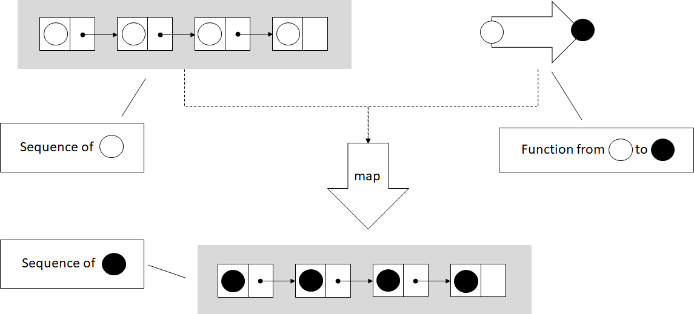
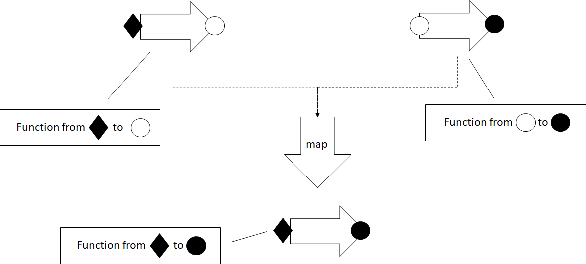

# Higher Kinded Types: Functors

This blog post is an excerpt from my book, [Programming with
Types](https://www.manning.com/books/programming-with-types). The code
samples are in TypeScript. If you enjoy the article, you can use the
discount code **vlri40** for a 40% discount on the book.

## An Even More General Map

In the [previous
post](https://vladris.com/blog/2019/08/10/common-algorithms.html) we saw
a generic `map()` implementation working on iterators. Iterators
abstract data structure traversal, so `map()` can apply a function to
elements in any data structure.



In the figure, `map()` takes an iterator over a sequence, in this case a
list of circles, and a function which transforms a circle. `map()`
applies the function to each element in the sequence, and produces a new
sequence with the transformed elements.

``` ts
function* map<T, U>(
    iter: Iterable<T>,
    func: (item: T) => U): IterableIterator<U> {
    for (const value of iter) {
        yield func(value);
    }
}
```

This implementation works on iterators, but we should be able to apply a
function of the form `(item: T) => U` to other types too. Let's take,
as an example, an `Optional<T>` type:

``` ts
class Optional<T> {
    private value: T | undefined;
    private assigned: boolean;

    constructor(value?: T) {
        if (value) {
            this.value = value;
            this.assigned = true;
        } else {
            this.value = undefined;
            this.assigned = false;
        }
    }

    hasValue(): boolean {
        return this.assigned;
    }

    getValue(): T {
        if (!this.assigned) throw Error();

        return <T>this.value;
    }
}
```

It feels natural to be able to map a function `(value: T) => U` over an
`Optional<T>`. If the optional contains a value of type `T`, mapping the
function over it should return an `Optional<U>` containing the result of
applying the function. On the other hand, if the optional doesn't
contain a value, mapping would result in an empty `Optional<U>`.


Let's sketch out an implementation for this. We'll put this function
in a namespace. Since TypeScript doesn't support function overloading,
in order to have multiple functions with the same name, we need this so
the compiler can determine which function we are calling. Here's the
`Optional<T>` `map()` implementation:

``` ts
namespace Optional {
    export function map<T, U>(
        optional: Optional<T>,
        func: (value: T) => U): Optional<U> {
        if (optional.hasValue()) {
            return new Optional<U>(func(optional.getValue()));
        } else {
            return new Optional<U>();
        }
    }
}
```

`export` simply makes the function visible outside the namespace. If the
optional has a value, we extract it, pass it to `func()`, and use its
result to initialize an `Optional<U>`. If the optional is empty, we
create a new empty `Optional<U>`.

We can do something very similar with the TypeScript sum type `T` or
`undefined`. The `Optional<T>` we just saw is a DIY version of such a
type that works even in languages which don't support sum types
natively, but TypeScript does. Let's see how we can map over a
"native" optional type `T | undefined`.

Mapping a function `(value: T) => U` over `T | undefined` should apply
the function and return its result if we have a value of type `T`, or
return `undefined` if we start with `undefined`:

``` ts
namespace SumType {
    export function map<T, U>(
        value: T | undefined,
        func: (value: T) => U): U | undefined {
        if (value == undefined) {
            return undefined;
        } else {
            return func(value);
        }
    }
}
```

These types can't be iterated over, but it still makes sense for a
`map()` function to exist for them. Let's define another simple generic
type, `Box<T>`. This type simply wraps a value of type `T`:

``` ts
class Box<T> {
    value: T;

    constructor(value: T) {
        this.value = value;
    }
}
```

Can we map a function `(value: T) => U` over this type? We can. As you
might have guessed, `map()` for `Box<T>` would return a `Box<U>`: it
will take the value `T` out of `Box<T>`, apply the function to it, and
put the result back into a `Box<U>`.


``` ts
namespace Box {
    export function map<T, U>(
        box: Box<T>,
        func: (value: T) => U): Box<U> {
        return new Box<U>(func(box.value));
    }
}
```

There are many generic types over which we can map functions. Why is
this useful? It's useful because `map()`, just like iterators, provides
another way to decouple types which store data from functions which
operate on that data.

## Processing Results or Propagating Errors

As a concrete example, let's take a couple of functions which process a
numerical value. We'll implement a simple `square()`, a function which
takes a number as an argument and returns its square. We'll also
implement `stringify()`, a function which takes a number as an argument
and returns its string representation:

``` ts
function square(value: number): number {
    return value ** 2;
}

function stringify(value: number): string {
    return value.toString();
}
```

Now let's say we have a function `readNumber()`, which reads a numeric
value from a file. Since we are dealing with input, we might run into
some problems: what if the file doesn't exist or can't be opened? In
that case, `readNumber()` will return `undefined`. We won't look at the
implementation of this function, the important thing for our example is
its return type:

``` ts
function readNumber(): number | undefined {
    /* Implementation omitted */
}
```

If we want to read a number and process it by applying `square()` to it
first, then `stringify()`, we need to ensure we actually have a
numerical value as opposed to `undefined`. A possible implementation is
to convert from `number | undefined` to just `number` using `if`
statements wherever needed:

``` ts
function process(): string | undefined {
    let value: number | undefined = readNumber();

    if (value == undefined) return undefined;

    return stringify(square(value));
}
```

We have two functions that operate on numbers, but since our input can
also be `undefined`, we need to explicitly handle that case. This is not
particularly bad, but in general the less branching our code has, the
less complex it is. It is easier to understand, to maintain, and there
are less opportunities for bugs. Another way to look at this is that
`process()` itself simply propagates `undefined`, it doesn't do
anything useful with it. It would be better if we can keep `process()`
responsible for processing, and let someone else handle error cases. How
can we do this? With the `map()` we implemented for sum types:

``` ts
namespace SumType {
    export function map<T, U>(
        value: T | undefined,
        func: (value: T) => U): U | undefined {
        if (value == undefined) {
            return undefined;
        } else {
            return func(value);
        }
    }
}

function process(): string | undefined {
    let value: number | undefined = readNumber();

    let squaredValue = SumType.map(value, square);

    return SumType.map(squaredValue, stringify);
}
```

Instead of explicitly checking for `undefined`, we call `map()` to apply
`square()` on the value. If it is `undefined`, `map()` will give us back
`undefined`. Just like with `square()`, we `map()` our `stringify()`
function on the `squaredValue`. If it is `undefined`, `map()` will
return `undefined`.

Now our `process()` implementation has no branching -- the
responsibility of unpacking `number | undefined` into a `number` and
checking for `undefined` is handled by `map()`. `map()` is generic and
can be used across many other types (like `string | undefined`) and in
many other processing functions.

In our case, since `square()` is guaranteed to return a `number`, we can
create a small lambda which chains `square()` and `stringify()`, and
pass that to `map()`:

``` ts
function process(): string | undefined {
    let value: number | undefined = readNumber();

    return SumType.map(value,
        (value: number) => stringify(square(value)));
}
```

This is a functional implementation of `process()`, in which the error
propagation is delegated to `map()`. We'll talk more about error
handling in a later blog post, when we will discuss monads. For now,
let's look at another application of `map()`.

## Mix-and-match Function Application

Without the `map()` family of functions, if we have a `square()`
function which squares a `number`, we would have to implement some
additional logic to get a `number` from a `number | undefined` sum type.
Similarly, we would have to implement some additional logic to get a
value from a `Box<number>`, and package it back in a `Box<number>`:

``` ts
function squareSumType(value: number | undefined)
    : number | undefined {
    if (value == undefined) return undefined;

    return square(value);
}

function squareBox(box: Box<number>): Box<number> {
    return new Box(square(box.value));
}
```

So far this isn't too bad. But what if we want something similar with
`stringify()`? We'll again end up writing two functions which look a
lot like the previous ones:

``` ts
function stringifySumType(value: number | undefined)
    : string | undefined {
    if (value == undefined) return undefined;

    return stringify(value);
}

function stringifyBox(box: Box<number>): Box<string> {
    return new Box(stringify(box.value))
}
```

This starts to look like duplicate code, which is never good. If we have
`map()` functions available for `number | undefined` and `Box`, they
provide the abstraction to remove the duplicate code. We can pass either
`square()` or `stringify()` to either `SumType.map()` or to `Box.map()`,
no additional code needed:

``` ts
let x: number | undefined = 1;
let y: Box<number> = new Box(42);

console.log(SumType.map(x, stringify));
console.log(Box.map(y, stringify));

console.log(SumType.map(x, square));
console.log(Box.map(y, square));
```

Now let's define this family of `map()` functions.

## Functors and Higher Kinded Types

What we just talked about in this section are *functors*.

A functor is a generalization of functions that perform mapping
operations. For any generic type like `Box<T>`, a `map()` operation
which takes a `Box<T>` and a function from `T` to `U` and produces a
`Box<U>` is a functor.


In the figure we have a generic type `H` which contains 0, 1, or more
values of some type `T`, and a function from `T` to `U`. In this case
`T` is an empty circle and `U` is a full circle. The `map()` functor
unpacks the `T` or `T`s from the `H<T>` instance, applies the function,
then places the result back into an `H<U>`.

Functors are extremely powerful concepts, but most mainstream languages
do not have a good way to express them. That's because the general
definition of a functor relies on *higher kinded types*.

A generic type is a type which has a type parameter, for example a
generic type `T`, or a type like `Box<T>`, have a type parameter `T`. A
higher kinded type, just like a higher-order function, represents a type
parameter with another type parameter. For example, `T<U>` or
`Box<T<U>>`, have a type parameter `T` which, in turn, has a type
parameter `U`.

Since we don't have a good way to express higher kinded types in
TypeScript, C#, or Java, we can't define a construct using the type
system to express a functor. Languages like Haskell and Idris, with more
powerful type systems, make these definitions possible. In our case
though, since we can't enforce this capability through the type system,
we can think of it more as a pattern.

We can say a functor is any type `H` with a type parameter `T` (`H<T>`)
for which we have a function `map()` which takes an argument of type
`H<T>`, and a function from `T` to `U`, and returns a value of type
`H<U>`.

Alternately, if we want to be more object-oriented, we can make `map()`
a member function and say `H<T>` is a functor if it has a method `map()`
which takes a function from `T` to `U` and returns a value of type
`H<U>`.

To see exactly where the type system is lacking, we can try to sketch
out an interface for it. Let's call this interface `Functor` and have
it declare `map()`:

``` ts
interface Functor<T> {
    map<U>(func: (value: T) => U): Functor<U>;
}
```

We can update `Box<T>` to implement this interface:

``` ts
class Box<T> implements Functor<T> {
    value: T;

    constructor(value: T) {
        this.value = value;
    }

    map<U>(func: (value: T) => U): Box<U> {
        return new Box(func(this.value));
    }
}
```

This code compiles, the only problem is that it isn't specific enough.
Calling `map()` on `Box<T>` returns an instance of type `Box<U>`. But if
we work with `Functor` interfaces, we see that the `map()` declaration
specifies it returns a `Functor<U>`, not a `Box<U>`. This isn't
specific enough. We need a way to specify, when we declare the
interface, exactly what the return type of `map()` will be (in this case
`Box<U>`).

We would like to be able to say "this interface will be implemented by
a type `H` with a type argument `T`". The following code shows how this
declaration would look like if TypeScript supported higher kinded types.
It obviously doesn't compile:

``` ts
interface Functor<H<T>> {
    map<U>(func: (value: T) => U): H<U>;
}

class Box<T> implements Functor<Box<T>> {
    value: T;

    constructor(value: T) {
        this.value = value;
    }

    map<U>(func: (value: T) => U): Box<U> {
        return new Box(func(this.value));
    }
}
```

Lacking this, let's just think of our `map()` implementations as a
pattern for applying functions to generic types, or "values in some
box".

## Functors for Functions

Note that we also have functors over functions. Given a function with
any number of arguments that returns a value of type `T`, we can map a
function which takes a `T` and produces a `U` over it, and end up with a
function which takes the same inputs as the original function and
returns a value of type `U`. `map()` in this case is simply function
composition.



Mapping a function over another function composes the two functions. The
result is a function which takes the same arguments as the original
function and returns a value of the second function's return type. The
two functions need to be compatible -- the second function must expect
an argument of the same type as the one returned by the original
function.

As an example, let's take a function which takes two arguments of type
`T`, and produces a value of type `T` and implement its corresponding
`map()`. This will return a function which takes two arguments of type
`T` and returns a value of type `U`:

``` ts
namespace Function {
    export function map<T, U>(
        f: (arg1: T, arg2: T) => T,
        func: (value: T) => U): (arg1: T, arg2: T) => U {
        return (arg1: T, arg2: T) => func(f(arg1, arg2));
    }
}
```

`map()` takes a function `(T, T) => T`, and a function `T => U` to map
over it. It returns a lambda function `(T, T) => U`.

Let's map `stringify()` over a function `add()`, which takes two
numbers and returns their sum. The result is a function which takes two
numbers and returns a string, the stringified result of adding the two
numbers:

``` ts
function add(x: number, y: number): number {
    return x + y;
}

function stringify(value: number): string {
    return value.toString();
}

const result: string = Function.map(add, stringify)(40, 2);
```

## Summary

* `map()` generalizes beyond iterators, to other generic types.
* Functors encapsulate data "unboxing", with applications in
  composition and error propagation.
* With higher kinded types, we can express constructs like functors
  using generics which themselves have type parameters.
