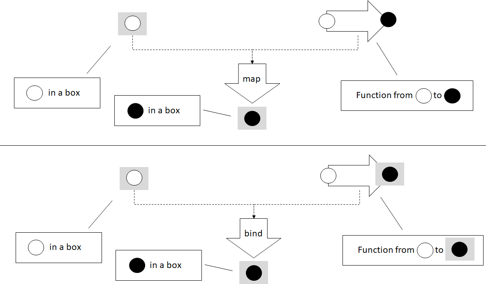

# Higher Kinded Types: Monads

This blog post is an excerpt from my book, [Programming with
Types](https://www.manning.com/books/programming-with-types). The code
samples are in TypeScript. If you enjoy the article, you can use the
discount code **vlri40** for a 40% discount on the book.

Make sure to read the previous post first, [Higher Kinded Types:
Functors](https://vladris.com/blog/2019/09/06/higher-kinded-types-functors.html).

## Monads

You have probably heard the term *monad*, as it's been getting a lot of
attention lately. Monads are making their way into mainstream
programming, so you should know one when you see it. Building on the
previous blog post, in this post we will explain what a monad is and how
it is useful. We'll start with a few examples and then look at the
general definition.

## Result or Error

In the previous post, we had a `readNumber()` function that returned
`number | undefined`. We used functors to sequence processing with
`square()` and `stringify()`, so that if `readNumber()` returns
`undefined`, no processing happens, and the `undefined` is propagated
through the pipeline.

This type of sequencing works with functors as long as only the first
function - in this case, `readNumber()` - can return an error. But what
happens if any of the functions we want to chain can error out? Let's
say that we want to open a file, read its content as a `string`, and
then deserialize that string into a `Cat` object.

We have an `openFile()` function that returns an `Error` or a
`FileHandle`. Errors can occur if the file doesn't exist, if it is
locked by another process, or if the user doesn't have permission to
open it. If the operation succeeds, we get back a handle to the file.

We have a `readFile()` function that takes a `FileHandle` and returns
ether an `Error` or a `string`. Errors can occur if the file can't be
read, perhaps due to being too large to fit in memory. If the file can
be read, we get back a `string`.

Finally, `deserializeCat()` function takes a `string` and returns an
`Error` or a `Cat` instance. Errors can occur if the string can't be
deserialized into a `Cat` object, perhaps due to missing properties.

All these functions follow the "return result or error" pattern, which
suggests returning either a valid result or an error from a function,
but not both. The return type will be an `Either<Error, ...>`:

``` ts
declare function openFile(
    path: string): Either<Error, FileHandle>;

declare function readFile(
    handle: FileHandle): Either<Error, string>;

declare function deserializeCat(
    serializedCat: string): Either<Error, Cat>;    
```

We are omitting the implementations, as they are not important. Let's
also quickly see the implementation of `Either`:

``` ts
class Either<TLeft, TRight> {
    private readonly value: TLeft | TRight;
    private readonly left: boolean;

    private constructor(value: TLeft | TRight, left: boolean) {
        this.value = value;
        this.left = left;
    }

    isLeft(): boolean {
        return this.left;
    }

    getLeft(): TLeft {
        if (!this.isLeft()) throw new Error();

        return <TLeft>this.value;
    }

    isRight(): boolean {
        return !this.left;
    }

    getRight(): TRight {
        if (this.isRight()) throw new Error();

        return <TRight>this.value;
    }

    static makeLeft<TLeft, TRight>(value: TLeft) {
        return new Either<TLeft, TRight>(value, true);
    }

    static makeRight<TLeft, TRight>(value: TRight) {
        return new Either<TLeft, TRight>(value, false);
    }
}
```

The type wraps a value of either `TLeft` or `TRight` and a flag to keep
track of that type is used. It has a private constructor, as we need to
make sure that the value and boolean flag are in sync. Attempting to get
a `TLeft` when we have a `TRight`, or vice versa, throws an error. The
factory functions call the constructor and ensure that the boolean flag
is consistent with the value.

Now let's see how we could chain these functions together into a
`readCatFromFile()` function that takes a file path as an argument and
returns an `Error` if anything went wrong along the way, or a `Cat`
instance:

``` ts
function readCatFromFile(path: string): Either<Error, Cat> {
    let handle: Either<Error, FileHandle> = openFile(path);

    if (handle.isLeft()) return Either.makeLeft(handle.getLeft());

    let content: Either<Error, string> = readFile(handle.getRight());

    if (content.isLeft()) return Either.makeLeft(content.getLeft());

    return deserializeCat(content.getRight());
}
```

This function is very similar to the first implementation of `process()`
in the previous blog post. There, we provided an updated implementation
that removed all the branching and error checking from the function and
delegated those tasks to `map()`. Let's see what a `map()` for
`Either<TLeft, TRight>` would look like. We will follow the convention
"Right is right; left is error", which means that `TLeft` contains an
error, so `map()` will just propagate it. `map()` will apply a given
function only if the `Either` contains a `TRight`:

``` ts
namespace Either {
    export function map<TLeft, TRight, URight>(
        value: Either<TLeft, TRight>,
        func: (value: TRight) => URight): Either<TLeft, URight> {
        if (value.isLeft()) return Either.makeLeft(value.getLeft());

        return Either.makeRight(func(value.getRight()));
    }
}
```

There is a problem with using `map()`, though: the types of the
functions it expects as argument is incompatible with the functions we
are using. With `map()`, after we call `openFile()` and get back an
`Either<Error, FileHandle>`, we would need a function
`(value: FileHandle) => string` to read its content. That function can't
itself return an `Error`, like `square()` or `stringify()`. But in our
case, `readFile()` itself can fail, so it doesn't return `string`, it
returns `Either<Error, string>`. If we attempt to use it in our
`readCatFromFile()`, we get a compilation error:

``` ts
function readCatFromFile(path: string): Either<Error, Cat> {
    let handle: Either<Error, FileHandle> = openFile(path);

    let content: Either<Error, string> = Either.map(handle, readFile);

    /* ... */
}
```

This fails to compile due to a type mismatch. The error message we get
is

> `Type 'Either<Error, Either<Error, string>>' is not assignable to type 'Either<Error, string>'.`

Our functor falls short here. Functors can propagate an initial error
through the processing pipeline, but if every step in the pipeline can
fail, functors no longer work. In the following figure, the black square
represents an `Error`, and the white and black circles represent two
types, such as `FileHandle` and `string`.


We can't use a functor in this case because the functor is defined to
map a function from a white circle to a black circle. Unfortunately, our
function returns a type already wrapped in an `Either` (an
`Either<black square, black circle>`). We need an alternative to `map()`
that can deal with this type of function.

`map()` from `Either<Error, FileHandle>` would need a function from
`FileHandle` to `string` to produce an `Either<Error, string>`. Our
`readFile()` function, on the other hand, is from `FileHandle` to
`Either<Error, string>`.

This problem is easy to fix. We need a function similar to `map()` that
goes from `T` to `Either<Error, U>`. The standard name for such a
function is `bind()`:

``` ts
namespace Either {
    export function bind<TLeft, TRight, URight>(
        value: Either<TLeft, TRight>,
        func: (value: TRight) => Either<TLeft, URight>
        ): Either<TLeft, URight> {
        if (value.isLeft()) return Either.makeLeft(value.getLeft());

        return func(value.getRight());
    }
}
```

`func()` has a different type from the `func()` in `map()`. We can
simply return the result of `func()`, as it has the same type as the
result of `bind()`.

As we can see, the implementation is even simpler than the one for
`map()`: after we unpack the value, we simply return the result of
applying `func()` to it. Let's use `bind()` to implement our
`readCatFromFile()` function and get the desired branchless error
propagation behavior:

``` ts
function readCatFromFile(path: string): Either<Error, Cat> {
    let handle: Either<Error, FileHandle> = openFile(path)

    let content: Either<Error, string> =
        Either.bind(handle, readFile);

    return Either.bind(content, deserializeCat);
}
```

Unlike the `map()` version, this code works. Applying `readFile()` to
`handle` gives us back an `Either<Error, string>`. `deserializeCat()`
has the same return type as `readCatFromFile()`, so we simply return the
result of `bind()`.

This version seamlessly chains together `openFile()`, `readFile()`, and
`deserializeCat()` so that if any of the functions fails, the error gets
propagated as the result of `readCatFromFile()`. Again, branching is
encapsulated in the `bind()` implementation, so our processing function
is linear.

## Difference between map() and bind()

Before moving on to define monads, let's take another simplified example
and contrast `map()` and `bind()`. We'll again use `Box<T>`, a generic
type that simply wraps a value of type `T`. Although this type is not
particularly useful, it is the simplest generic type we can have. We
want to focus on how `map()` and `bind()` work with values of types `T`
and `U` in some generic context, such as `Box<T>`, `Box<U>` (or `T[]`,
`U[]`; or `Optional<T>`, `Optional<U>`; or `Either<Error, T>`,
`Either<Error, U>` etc.).

For a `Box<T>`, a functor (`map()`) takes a `Box<T>` and a function from
`T` to `U` and returns a `Box<U>`. The problem is that we have scenarios
in which our functions are directly from `T` to `Box<U>`. This is what
`bind()` is for. `bind()` takes a `Box<T>` and a function from `T` to
`Box<U>` and returns the result of applying the function to the `T`
inside `Box<T>`.



If we have a function `stringify()` that takes a `number` and returns
its `string` representation, we can `map()` it on a `Box<number>` and
get back a `Box<string>`:

``` ts
namespace Box {
    export function map<T, U>(
        box: Box<T>,
        func: (value: T) => U): Box<U> {
        return new Box<U>(func(box.value));
    }
}

function stringify(value: number): string {
    return value.toString();
}

const s: Box<string>
    = Box.map(new Box(42), stringify);
```

If instead of `stringify()`, which goes from `number` to `string`, we
have a `boxify()` function that goes from `number` directly to
`Box<string>`[, ]{.title-ref}[map()]{.title-ref}[ won't work. We'll need
]{.title-ref}[bind()]{.title-ref}\` instead:

``` ts
namespace Box {
    export function bind<T, U>(
        box: Box<T>,
        func: (value: T) => Box<U>): Box<U> {
        return func(box.value);    
    }
}

function boxify(value: number): Box<string> {
    return new Box(value.toString());
}

const b: Box<string> =
    Box.bind(new Box(42), boxify);    
```

The result of both `map()` and `bind()` is still a `Box<string>`. We
still go from `Box<T>` to `Box<U>`; the difference is how we get there.
In the `map()` case, we need a function from `T` to `U`. In the `bind()`
case, we need a function from `T` to `Box<U>`.

## The Monad Pattern

A monad consists of `bind()` and one more, simpler function. This other
function takes a type `T` and wraps it into the generic type, such as
`Box<T>`, `T[]`, `Optional<T>`, or `Either<Error, T>`. This function is
usually called `return()` or `unit()`.

A monad allows structuring programs generically while encapsulating away
boilerplate code needed by the program logic. With monads, a sequence of
function calls can be expressed as a pipeline that abstracts away data
management, control flow, or side effects.

Let's look at a few examples of monads. We can start with our simple
`Box<T>` type and add `unit()` to it to complete the monad:

``` ts
namespace Box {
    export function unit<T>(value: T): Box<T> {
        return new Box(value);
    }

    export function bind<T, U>(
        box: Box<T>, 
        func: (value: T) => Box<U>): Box<U> {
        return func(box.value);    
    }
}
```

`unit()` simply calls `Box`'s constructor to wrap the given value into
an instance of `Box<T>`. `bind()` unpacks the value from `Box` and calls
`func()` on it.

The implementation is very straightforward. Let's look at the
`Optional<T>` monad functions:

``` ts
namespace Optional {
    export function unit<T>(value: T): Optional<T> {
        return new Optional(value);
    }

    export function bind<T, U>(
        optional: Optional<T>,
        func: (value: T) => Optional<U>): Optional<U> {
        if (!optional.hasValue()) return new Optional();

        return func(optional.getValue());
    }
}
```

`unit()` takes a value of type `T` and wraps it into an `Optional<T>`.
If the optional is empty, `bind()` returns an empty optional of type
`Optional<U>`. If the optional contains a value, `bind()` return the
result of calling `func()` on it.

Very much as with functors, if a programming language can't express
higher kinded types, we don't have a good way to specify a `Monad`
interface. Instead, let's think of monads as a pattern:

> A monad is a generic type `H<T>` for which we have a function like
> `unit()`, that takes a value of type `T` and returns a value of type
> `H<T>`, and a function like `bind()` that takes a value of type `H<T>`
> and a function from `T` to `H<U>`, and returns a value of type `H<U>`.

Bear in mind that because most languages use this pattern, without a way
to specify an interface for the compiler to check, in many instances the
two functions, `unit()` and `bind()`, may show up under different names.
You may hear the term *monadic*, as in **monadic error handling**, which
means that error handling follows the monad pattern.

Next, we'll look at a few other examples.

## The Continuation Monad

A promise represents the result of a computation that will happen
sometime in the future. `Promise<T>` is the promise of a value of type
`T`. We can schedule execution of asynchronous code by chaining
promises, using the `then()` function.

Let's say we have a function that determines our location on the map.
Because this function will work with the GPS, it may take longer to
finish, so we make it asynchronous. It will return a promise of type
`Promise<Location>`. Next, we have a function that, given a location,
will contact a ride-sharing service to get us a `Car`:

``` ts
declare function getLocation(): Promise<Location>;
declare function hailRideshare(
    location: Location): Promise<Car>;

let car: Promise<Car> = getLocation().then(hailRideshare);
```

When `getLocation()` returns, `hailRideshare()` will be invoked with its
result. This should look very familiar to you at this point. `then()` is
just how `Promise<T>` spells `bind()`!

we can also create an instantly resolved promise by using
`Promise.resolve()`. This takes a value and returns a resolved promise
containing that value, which is the `Promise<T>` equivalent of `unit()`.

Turns out chaining promises, an API available in virtually all
mainstream programming languages, is monadic. It follows the same
pattern that we saw in this section, but in a different domain. While
dealing with error propagation, our monad encapsulated checking whether
we have a value that we can continue operating on or have an error that
we should propagate. With promises, the monad encapsulates the
intricacies of scheduling and resuming execution. The pattern is the
same, though.

## The List Monad

Another commonly used monad is the list monad. Let's look at an
implementation over sequences: a `divisors()` function that takes a
number n and returns an array containing all of its divisors except 1
and n itself.

This straightforward implementation starts from 2 and goes up to half of
n, and adds all numbers it finds that divide n without a remainder.
There are more efficient ways to find all divisors of a number, but
we'll stick to a simple algorithm in this case:

``` ts
function divisors(n: number): number[] {
    let result: number[] = [];

    for (let i = 2; i <= n / 2; i++) {
        if (n % i == 0) {
            result.push(i);
        }
    }

    return result;
}
```

Now let's say we want to take an array of numbers and return an array
containing all their divisors. We don't need to worry about dupes. One
way to do this is to provide a function that takes an array of input
numbers, applies `divisors()` to each of them, and joins the results of
all the calls to `divisors()` into a final result:

``` ts
function allDivisors(ns: number[]): number[] {
    let result: number[] = [];

    for (const n of ns) {
        result = result.concat(divisors(n));
    }

    return result;
}
```

It turns out that this pattern is common. Let's say that we have another
function, `anagrams()`, that generates all permutations of a string and
returns an array of strings. If we want to get the set of all anagrams
of an array of strings, we would end up implementing a very similar
function:

``` ts
declare function anagram(input: string): string[];

function allAnagrams(inputs: string[]): string[] {
    let result: string[] = [];

    for (const input of inputs) {
        result = result.concat(anagram(input));
    }

    return result;
}
```

`allAnagrams()` is very similar to `allDivisors()`.

Now let's see whether we can replace `allDivisors()` and `allAnagrams()`
with a generic function. This function would take an array of `T`s and a
function from `T` to an array of `U`s, and return an array of `U`s:

``` ts
function bind<T, U>(
    inputs: T[],
    func: (value: T) => U[]): U[] {
    let result: U[] = [];

    for (const input of inputs) {
        result = result.concat(func(input));
    }

    return result;
}

function allDivisors(ns: number[]): number[] {
    return bind(ns, divisors);
}

function allAnagrams(inputs: string[]): string[] {
    return bind(inputs, anagram);
}
```

As you've probably guessed, this is the `bind()` implementation for the
list monad. In the case of lists, `bind()` flattens the arrays returned
by each call of the given function into a single array. While the
error-propagating monad decides whether to propagate an error or apply a
function and the continuation monad wraps scheduling, the list monad
combines a set of results (a list of lists) into a single flat list. In
this case, the box is a sequence of values.


The `unit()` implementation is trivial. Given a value of type `T`, it
returns a list containing just that value. This monad generalizes to all
kinds of lists: arrays, linked lists, and iterator ranges.

> **Category theory**
>
> Functors and monads come from category theory, a branch of mathematics
> that deals with structures consisting of objects and arrows between
> these objects. With these small building blocks, we can build up
> structures such as functors and monads. We won't go into its details
> now; we'll just say that multiple domains, like set theory and even
> type systems, can be expressed in category theory.
>
> Haskell is a programming language that took a lot of inspiration from
> category theory, so its syntax and standard library make it easy to
> express concepts such as functors, monads, and other structures.
> Haskell fully supports higher kinded types.
>
> Maybe because the building blocks of category theory are so simple,
> the abstractions we've been talking about are applicable across so
> many domains. We just saw that monads are useful in the context of
> error propagation, asynchronous code, and sequence processing.
>
> Although most mainstream languages still treat monads as patterns
> instead of proper constructs, they are definitely useful structures
> that show up over and over in different contexts.

## Other Monads

A couple of other common monads, which are popular in functional
programming languages with pure functions (functions that don't have
side effects) and immutable data, are the state monad and the IO monad.
We'll provide only a high-level overview of these monads, but if you
decide to learn a functional programming language such as Haskell, you
will likely encounter them early in your journey.

The state monad encapsulates a piece of state that it passes along with
a value. This monad enables us to write pure functions that, given a
current state, produce a value and an updated state. Chaining these
together with `bind()` allows us to propagate and update state through a
pipeline without explicitly storing it in a variable, enabling purely
functional code to process and update state.

The IO monad encapsulates side effects. It allows us to implement pure
functions that can still read user input or write to a file or terminal
because the impure behavior is removed from the function and wrapped in
the IO monad.
