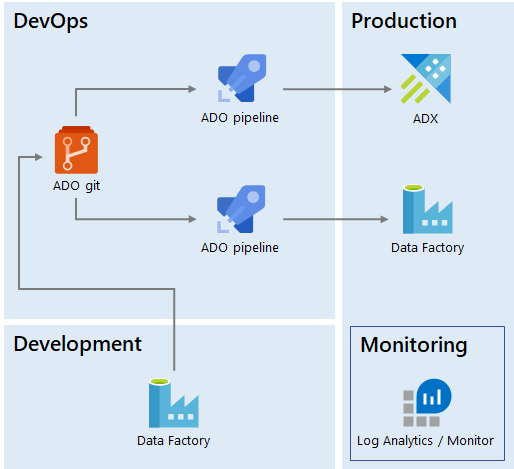

# Self-Serve Analytics

This is a cross-post of the article I wrote for Data Science @
Microsoft, [How we built self-serve data environment tools with
Azure](https://medium.com/data-science-at-microsoft/how-we-built-self-serve-data-environment-tools-with-azure-3951a698fc9d).
Many thanks to my colleague Casey Doyle for editing this into good
shape.

Our team not only helps the engineering org build Azure - we use it,
too, in our data science work. Our team consists of program managers,
data scientists, and data engineers. In this post I describe how our
data engineering team developed a scalable, self-serve analytics
platform for our data science organization.

We maintain a big data platform with all the required data points to
view and understand the Azure business. While we work with multiple data
fabrics (such as Azure SQL and Azure Data Lake Storage), our main
storage solution is Azure Data Explorer (ADX). We use ADX for several
reasons, but two key ones involve the scale of the data we are dealing
with and the exploratory nature of the work our data scientists are
doing. ADX excels at quickly running queries across huge volumes of
data.

## Reproducibility

When we were a small team, data scientists produced ad hoc reports and
analyses, building queries and running them from their own machines.
This worked for a while, but soon we hit issues of reproducibility: If a
set of queries exists only on one person's machine and that person goes
on vacation, nobody else on the team can reproduce their work.

Of course, this is a well known issue in the software engineering world,
with an industry-standard solution: Source control. As a first step, we
asked everyone on the team to use Git to store their ADX scripts. This
not only enabled capturing "canonical" queries in a public repository,
it also allowed us to adopt other good practices such as mandatory code
reviews.

Bringing engineering best practices to analytics was the first step
toward a reliable analytics platform.

## Environments

Another problem we ran into was around the interdependencies among
various data sets. Some reports or metrics took dependencies on the
output of other metrics. But consider a situation in which the dependent
metric consists of one-off exploratory output, while the other is a
monthly report. Without a systematic way of keeping track of what
depends on what, things start to look like Jenga - maybe a critical
piece of an important artifact disappears because the original author
didn't realize anyone cared about it.

To solve this problem, we split our ADX cluster into three different
environments: Scratch, Work Area, and Production.

*Changes flow from Scratch to Work Area to Production. Production is
read-only for everyone except engineering.*

*Scratch* is an area open to everyone on the team to do anything they
want, with one important rule: No production dependencies are allowed.
Scratch is used for prototyping, proof-of-concepts, and other
exploratory work. To enforce this, we set a 30-day [retention
policy](https://docs.microsoft.com/en-us/azure/kusto/management/retention-policy).
This ensures that nothing beyond prototypes exists there. Only our team
has access to this area.

*Work Area* is the place data scientists use once they are done
prototyping and have a good idea of what they need to do next. They
still have full access to Work Area but unlike Scratch, data scientists
can share work-in-progress with external stakeholders for user
acceptance testing. If the artifact is a one-time analysis, it stops
here. If it is recurring, for example a monthly report, it graduates to
Production.

*Production* is a locked down environment and only a few data engineers
have Write access to it. This is the equivalent of a production services
environment, where access is restricted such that nobody can
accidentally cause an impact to a live application. In our case, nobody
can accidentally modify a recurring report or key metric others depend
on.

Moving work from Scratch to Work Area to Production ensures dependencies
can only flow in one direction (Scratch can depend on something in
Production, but not vice versa). Quality gates like mandatory code
reviews ensure that whatever makes it to Production meets a high quality
bar.

We also created explicit guidelines for what should go into Production:
Queries should be packaged into functions, tables and functions should
be created with `.create-or-alter`, and so on.

## Self-Serve

Because the Production environment is restricted to data engineers,
graduating something to Production first involved a hand-off process: A
data scientist would have to ask the data engineering team to create or
update an entity in the Production environment. This usually meant
creating a work item that had to be prioritized against others.

Our data engineering team is much smaller than our data science
organization (we have about one engineer for every five data
scientists), and so this approach didn't scale very well. To optimize
this, we invested in enabling a self-serve model.

We created an [Azure DevOps release
pipeline](https://docs.microsoft.com/en-us/azure/devops/pipelines/release/?view=azure-devops)
that uses the [ADX
Task](https://docs.microsoft.com/en-us/azure/data-explorer/devops) to
execute ADX scripts in the git repo against the Production database. We
release from the master branch, but in order for a new script to make it
to master, it must be submitted as a pull request and code review
signoff is required from a member of the engineering team.

With this model, data scientists send a pull request and, once reviewed
by a maintainer of the Production environment, it is automatically
merged and deployed. In contrast to the original hand-off process (via
work items), engineering involvement can be as simple as approving a
pull request. The code review process still ensures that the engineers
who operate the Production environment have a say in what makes it into
that environment and can always request changes to scripts if they
believe, for example, a query can be further optimized.

## Data Movement

Similar to the analytics needs described above, we needed to orchestrate
data movement. This includes copying data from external sources into our
ADX cluster and running functions on a schedule to produce reports.

Production data movement was originally operated by the engineering
team, and so requests again used to come in the form of work items to be
prioritized and scheduled. But because our data scientists are familiar
with [Azure Data
Factory](https://azure.microsoft.com/en-us/services/data-factory/) (ADF)
and use it for data movement in the Work Area environment, we realized
we could enable self-serve capabilities for data movement too, by
leveraging the [ADF continuous integration and delivery
setup](https://docs.microsoft.com/en-us/azure/data-factory/continuous-integration-deployment).
This way, scientists can create ADF pipelines and submit pull requests
that engineers deploy to production.

We are using [Azure
Monitor](https://azure.microsoft.com/en-us/services/monitor/) integrated
with IcM, the company-wide incident management system, to monitor the
production pipelines. Azure Monitor [integrates natively with
ADF](https://docs.microsoft.com/en-us/azure/data-factory/monitor-using-azure-monitor).
Our support model entails the engineering team looking at tickets
generated by pipeline failures, which are then restarted to recover from
transient issues. In case of persistent failures, we involve the
original pipeline authors to help debug. This way, the engineering team
operates all Production data movement without having full ownership of
the pipelines.

*We deploy both Kusto objects and Data Factory pipelines from ADO git
using ADO pipelines. The Production environment is operated by
engineering.*

## Data Contracts

But there is still more to it than just deploying and monitoring ADF
pipelines: Bringing external data into the production area of our
cluster means taking an upstream dependency on that data. There are
several properties to be defined for such a dependency, including things
like the service level agreement (SLA) with the upstream provider and
the data classification, which ensures our system stays compliant. The
topic of maintaining compliance in a big data platform deserves an
article by itself, so I won't go into details in this one. The key
point is that in this case, self-serve is not enough - we also need data
contracts.

A *data contract* specifies all the details of a dependency, whether
upstream or downstream of our platform. As part of the quality gates for
pull requests, we thoroughly review proposed pipelines and in general we
don't allow new
[connectors](https://docs.microsoft.com/en-us/azure/data-factory/connector-overview)
to be added with this model. A new connector implies a new dependency,
so before deploying to production we need to ensure we have a contract
in place and that the connector uses the production service principles
the engineering team is maintaining.

## Summary

In this article we reviewed several of the infrastructure and processes
built by our data engineering team:

* We brought engineering rigor to our analytics through source
  control, code reviews, and automated deployment.
* We enabled self-serve by leveraging Azure DevOps.
* We similarly enabled self-serve for data movement using ADF CI/CD.
* We have processes in place to ensure our data is compliant and that
  production dependencies are properly documented.

More importantly, we achieved all of the above without maintaining any
custom application code: Our entire solution is built on Azure PaaS
services, which frees up our engineering team to tackle other
challenges, ones we will discuss in future articles.
