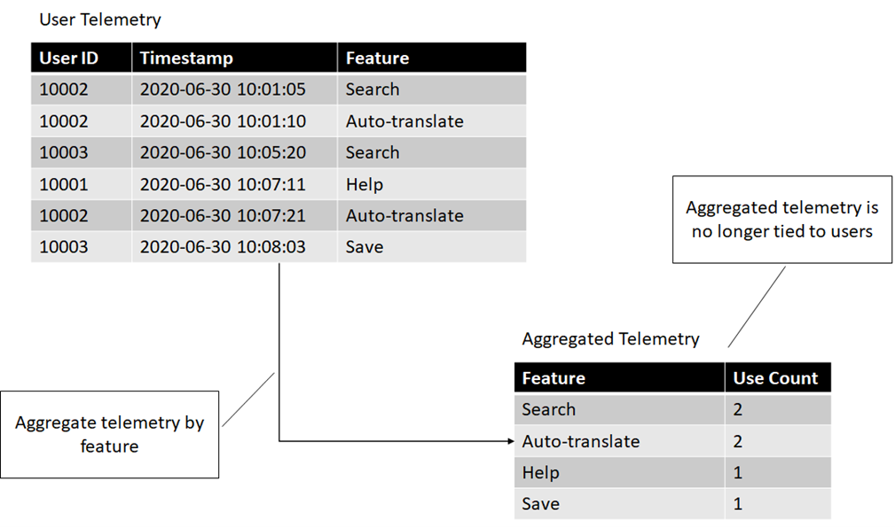

# Changing Data Classification Through Processing

This is an excerpt from a draft of chapter 10 of my book, [Azure Data
Engineering](https://www.manning.com/books/azure-data-engineering),
which deals with compliance. In this article we'll look at a few
techniques to transform sensitive user data into less sensitive data. In
the book, this includes code samples for implementation on Azure Data
Explorer, which are omitted from this article. Let's start with a
couple of definitions.

## User Data

User data is data that can be directly tied to the user. This class of
data is important since this is what GDPR covers. User data also comes
in a couple of subcategories. One of them is *End User Identifiable
Information* or *EUII*.

> **End user identifiable information** is information that can directly
> identify the user. Examples of EUII are name, email address, IP
> address, or location information.

As data moves through our systems, we generate various IDs. Any data
that we have tied to such an ID, for example order history for account
ID, is called *End User Pseudonymous Information* or *EUPI*.

> **End user pseudonymous information** are IDs used by our systems
> which, in conjunction with additional information (for example a
> mapping table) can be used to identify the user.

Note the important distinction: When we look at EUII, for example name
and address, we can immediately identify the user. When we look at EUPI,
for example account ID, we need an additional mapping to tell us which
user the account ID belongs to.

In general, we have one primary ID (or several) which directly
identifies the user, which we consider EUII, and multiple other IDs
which indirectly identify the user through their connection to the
primary ID. These other IDs are EUPI.

## Changing Classification Through Processing

In general, we restrict the number of people who can access sensitive
data. In most cases, access is *on a need-to-know basis*, where data
scientists and engineers allowed to process this data have done some
compliance training and understand the risks and liabilities.

In some scenarios we want to process data so that it becomes less
sensitive. A good example is we want to open it up for more data
scientists to look at. In this article we will look at a few techniques
for achieving this.

Let's start by defining two datasets, as shown in the following figure:

The first dataset, *User profiles*, contains user accounts, including
names, credit cards, and billing addresses. We omitted actual billing
addresses to keep things short. This dataset also contains a *User ID*
column which associates an identification number with each user. This is
the primary ID in our system, since we can use it to link back to a
user's profile information.

The second dataset, *User telemetry*, contains telemetry data we collect
from our users. It contains the user ID, timestamp and product feature
the user engaged with.

Let's see some techniques we can use on the *User telemetry* table to
change its classification to something less sensitive.

### Aggregation

The first technique is aggregation: we can take user identifiable
information from multiple users, aggregate it, and get rid of the end
user identifiable part. For example, if we collect telemetry from our
users that captures which features of our product they are using, we can
aggregate it, so we know how much each feature is being used, but not
who used what.

The following figure shows how aggregation transform user identifiable
information into data that can't be tied back to individual users.

Before processing, we could see exactly what set of features an
individual user was using, which has privacy implications. After
aggregation, we can no longer tell that. We still have valuable data --
we know which features of our product are the most used, which ones are
not that important to our customers etc. We can store this data for
analytics and ML purposes without having to worry about end user
privacy.

> Data **aggregation** is the processing of data into a summarized
> format. This can be used to transform the data so it can no longer be
> tied to individual users.

But maybe we want to know more: we want to see when each feature is used
or how our customers use different features in conjunction. Now simply
counting feature usage is not enough. We can use a different technique
for that: anonymization.

### Anonymization

We can use anonymization to unlink the data from the end user. Once the
data is no longer connected to a user identifier, we can't tell which
user it came from. Going back to our telemetry example, if we want to
know when features are used, but don't care who uses them, we can get
rid of the user identifier. The following figure shows how we can
anonymize data by dropping the user identifiers.

Maybe this is not enough either. What if we still need to see which
features are used together by a user, but we don't really care who the
user is? We can still anonymize by replacing user identifiers (which can
be tracked back to the user) with randomly generated IDs. The following
figure shows how we can anonymize the data by replacing each user ID
with a randomly generated GUID.

Note that we are intentionally not persisting a mapping between user IDs
and corresponding random IDs. We generate the random IDs once and
intentionally "forget" the association.

Once this happens, we can no longer tie the data back to the user, so it
is no longer user identifiable. We can still tie together datasets by
the random ID, but there is no way to associate the random ID with a
user.

> **Anonymization** is the process of removing user identifiable
> information from the data or replacing it with data that cannot be
> linked back to a user.

If we get new telemetry from our users, we won't be able to generate
the same GUID when anonymizing. Each time we run the query we will get
different random IDs corresponding to our users. In some cases, this
might not be enough. Or we might need to maintain that ability to link
back to our original user IDs but restrict who can make that
association. For these cases, we can use pseudonymization.

### Pseudonymization

In this case, we have scenarios for which we still need to know who the
data belongs to, but this is not needed for all scenarios. For example,
we might want to keep track of which user used which features so we can
notify them of updates to that feature. But for other analytics, it is
irrelevant who the user is. For the first case, we have a small set of
people who can view this association. For analytics, we have a large
team of people looking at the data, but from their perspective, it is
anonymous.

We can achieve this by pseudonymizing the data. The difference between
pseudonymization and anonymization is that pseudonymization gives us a
way to reconstruct the relationship.

When we looked at anonymizing data, we swapped out the user ID with a
randomly generated ID. Unless we explicitly stored which user ID got
assigned which random ID, we can no longer recover the link.

For pseudonymization, we replace random IDs with something more
deterministic. This can be either a hash of the user ID, or an
encryption of the user ID.

As a reminder, hashing is a one-way function. Give the result of a hash,
you cannot "un-hash" it to get the original value. Encryption is
different -- an encrypted value can be decrypted if we know the
encryption key.

> **Pseudonymization** is the process of replacing user identifiable
> information with a pseudonym. The data can be linked back to a user
> given some additional information.

Let's look at both approaches.

#### Pseudonymizing by hashing

If we hash the user IDs and provide a dataset with just hashes, the only
way to tie this pseudonymous data back to actual users would be to take
all the user IDs in our system and hash them to see where we find a
match.

If we restrict the access to the user IDs, then someone who can only
query the pseudonymized table can still see all the connections within
the dataset (which features are used by which user), but instead of
seeing a user ID, they see a pseudonymous identifier. The following
figure shows the transformation.

Note that if we only have this dataset consisting of *Pseudonymous ID*,
*Timestamp*, and *Feature*, we can't produce a user ID. On the other
hand, if we have a user ID, we can always hash it and link it to the
pseudonymized data.

We can use this technique in cases when the data scientists processing
the pseudonymized data don't have access to the unprocessed, end user
identifiable data. This way, they get a dataset that is, for all intents
and purposes, just like the original, except there is no mention of user
IDs.

This doesn't work if the user IDs are also visible since it is easy to
hash them again and produced the pseudonymous IDs. One option is to keep
the hashing algorithm secret and add a salt. In cryptography, a salt is
some additional secret data mixed-in, to make it harder to recreate the
connection. For example we can XOR the user ID with some number (our
salt).

Now, as long as the salt is kept secret, someone can't get from user ID
to the pseudonymous ID even if they know which hashing algorithm is used
for pseudonymization.

Let's now look at the alternative to hashing: encryption.

#### Pseudonymizing by encrypting

If we encrypt the user IDs and provide a dataset with encrypted values,
the only way to tie this back to actual users would be to decrypt. As
long as the encryption key is secure and only available on a
need-to-know basis, people that don't need to know can't recover the
association.

This is similar to the hashing technique we just saw, except it is a
two-way transformation. Even without having access to a user ID to hash,
we can produce a user ID by decrypting an encrypted pseudonymized ID.
Figure 6 shows how this would look like.

We will use encryption instead of hashing if we have a scenario in which
we don't have the original dataset available, but we need a way to
recover it. In this case, we can rely on the two-way transformation
provided by encryption and restore the original dataset by decrypting
the pseudonymized dataset.

An alternative to transforming data is masking.

### Masking

Masking means hiding parts of the data from whoever access it, even if
the data is fully available in our system. Think of how social security
numbers are reduced to the last 4 digits: `***-**-1234`.

Masking sensitive data makes it less sensitive -- obviously, even with
bad intent, someone can't do much with just the last 4 digits of a
social security number, with just the city and state of a home address,
or with the first few digits of a phone number.

Masking the data does require an additional layer in between the raw
storage and people querying the data, which determines who gets to see
the unmasked, full dataset, and who is restricted to a more limited view
of the data. The following figure shows how masking looks like for our
*User profile* table.

Unlike our previous techniques, which transformed the data, this happens
in-place. We still have the full credit card number stored, but not
everyone querying the table will be able to see it.

> **Masking** leverages an additional layer between the raw data and
> query issuers to hide sensitive information from non-privileged
> access.

The good news is many storage solutions and database engines offer such
a layer out-of-the-box (see Azure Data Explorer's [row level
security](https://docs.microsoft.com/en-us/azure/data-explorer/kusto/management/rowlevelsecuritypolicy)
for example).

## Summary

In this article we looked at a few ways in which we can take sensitive
data and make it less sensitive:

* Aggregating data makes it impossible to connect it back to
  individual users.
* Anonymizing data, while a bit more involved than aggregating,
  preserves the granularity of user-level data, while removing the
  identifiable parts.
* In some cases, we do have legitimate scenarios in which we want to
  trace back the data to actual users. In this case, we can use
  pseudonymization to make the data partially anonymous and only
  restore the link with the real user ID on a need-to-know basis.
* Hashing is a one-way transformation of the data. Given a
  pseudonymized ID, we can't recover a user ID. We can restore the
  association by hashing user ID again and joining on the
  pseudonymized ID. Adding secret salt to a hash makes it harder to
  restore the association (one would need to also know the salt
  value).
* Encryption is a two-way transformation, which requires an additional
  piece of information: a key. Given a pseudonymized ID, we can
  recover the user ID if we have the key by decrypting the data.
* Masking is another technique for hiding sensitive information. In
  this case, the data is not transformed, rather an in-between layer
  can hide sensitive information and only make it available when
  appropriate.

This are important techniques to know when dealing with sensitive data,
since they all allow us to make more data available to more analytical
scenarios without compromising on user privacy.
