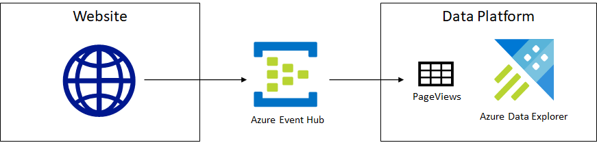
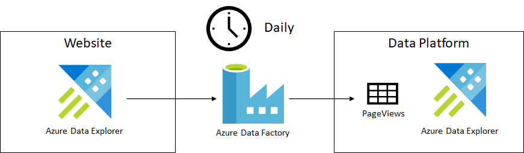

# Ingesting Data

This is an excerpt from chapter 2 of my book, [Data Engineering on
Azure](https://www.manning.com/books/azure-data-engineering), which
deals with storage. In this article we'll look at a few aspects of data
ingestion: frequency and load type, and how we can handle corrupted
data. We'll use Azure Data Explorer as the storage solution, but keep
in mind that the same concepts apply regardless of the data fabric used.
Code samples are omitted from this article, though available in the
book. Let's start by looking at the frequency with which we ingest
data.

## Ingestion frequency

Frequency defines how often we ingest a given dataset. This can range
from continuous ingestion, for streaming data, to yearly ingestion - a
dataset which we only need to ingest once a year. For example, our
website team produces web telemetry which we can, if we want to, ingest
in real time. If our analytics scenarios include some real time or near
real time processing, we can bring the data into our data platform as it
is being generated.

The following figure shows this streaming ingestion setup.

*As users visit website pages, each visit is sent as an event to an
Azure Event Hub. Azure Data Explorer ingests data into the PageViews
table in real time.*

Azure Event Hub is a service that can receive and process millions of
events per second. An event contains some data payload sent by the
client to the Event Hub. A high-traffic website could treat each page
view as an event and pass the user ID, URL, and timestamp to an Even
Hub. From there, data can be routed to various other services. In our
case, it can be ingested in Azure Data Explorer in real time.

Another option, if we don't have any real time requirements, is to
ingest the data on some regular cadence, for example every midnight we
load the logs for the day.

The following figure shows this alternative setup.

*Logs get copied from the website Azure Data Explorer cluster to our
Azure Data Explorer cluster using an Azure Data Factory. Copy happens on
a daily basis.*

In this case, the website team stores its logs into a dedicated Azure
Data Explorer cluster. Their cluster only stores data for the past 30
days since it is used just to measure the website performance and debug
issues. Since we want to keep data for longer for analytics, we want to
copy it to our cluster and preserve it there.

Azure Data Factory is the Azure ETL service, which enables serverless
data integration and transformation. We can use a Data Factory to
coordinate when and where data gets moved. In our case, we copy the logs
of the previous day every night and append them to our `PageViews`
table.

Let's take another example: the sales data from our Payments team. We
use this data to measure revenue and other business metrics. Since not
all transactions are settled, it doesn't make sense to ingest this data
daily. Our Payments team curates this data and officially publishes the
financials for the previous month on the first day of each month. This
is an example of a monthly dataset, one we would ingest once it becomes
available, on the 1st of each month.

The following figure shows this ingestion.

*Sales data gets copied from the Payments team's Azure SQL to our Azure
Data Explorer cluster on a monthly cadence.*

This is very similar to our previous Azure Data Factory ingestion of
page view logs, the difference being the data source - in this case we
ingest data from Azure SQL, and the ingestion cadence - monthly instead
of daily.

Let's define the cadence of when a dataset is ready for ingestion as
its *grain*.

> The **grain** of a dataset specifies the frequency at which new data
> is ready for consumption. This can be continuous for streaming data,
> hourly, daily, weekly, and so on.

We would ingest a dataset with a weekly grain on a weekly cadence. The
grain is usually defined by the upstream team producing the dataset.
Partial data might be available earlier, but the upstream team can
usually tell us when the dataset is complete and ready to be ingested.

While some data, like the logs in our example, can be ready in real time
or at a daily grain, there are datasets who get updated once a year. For
example, businesses use fiscal years for financial reporting, budgeting
and so on. These datasets only change year over year.

Another ingestion parameter is the type of data load.

## Load type

Outside of streaming data, where data gets ingested as it is produced,
we have two options for updating a dataset in our system. We can perform
a full load or an incremental load.

> A **full load** means we fully refresh the dataset, discarding our
> current version and replacing it with a new version of the data.

For example, our Customer Success team has the list of active customer
issues. As these issues get resolved and new issues appear, we perform a
full load whenever we ingest the active issues into our system.

The usual pattern is to ingest the updated data into a staging table,
then swap it with the destination table, as show in the following
figure.

*Queries are running against the ActiveIssues table. We ingest the data
into the ActiveIssuesStaging table. Queries are still running against
the old ActiveIssues table. We swap the two tables. Queries already
started before the swap will run against the old tables, queries started
after the swap will run against the new table. Finally, we can drop the
old table.*

Most storage solutions offer some transactional guarantees on renames to
support scenarios like this. This means if someone is running a query
against the `ActiveIssues` table, there is no chance of the query
failing due to the table not being found or of the query getting rows
from both the old and the new table. Queries running in parallel with a
rename are guaranteed to either hit the old or the new table.

The other type of data load is incremental.

> An **incremental load** means we append data to the dataset. We start
> with the current version and enhance it with additional data.

Let's take as an example a `PageViews` table. Since the Website team
only keeps logs around for 30 days and we want to maintain a longer
record when we ingest the data into our system, we can't fully refresh
the `PageViews` table. Instead, every night we take the page view logs
of the previous day and we *append* them to the table.

One challenge of incremental loads is to figure out exactly what data is
missing (that we need to append), and what data we already have. We
don't want to append again data we already have, as it would create
duplicates.

There are a couple of ways we can go about determining the delta between
upstream and our storage. The simplest one is contractual: the upstream
team guarantees that data will be "ready" at a certain time or date.
For example, the Payments team promises that the sales data for the
previous month will be ready on the 1st, by noon. In that case, on July
1st we will load all sales data with a timestamp within June and append
it to the existing sales data we have in our system. In this case, the
delta is June sales.

Another way to determine the delta is to keep track on our side of what
is the last row we ingested and only ingest from upstream data after
this row. This is also known as a *watermark*. Whatever is "under the
watermark" is data we already have in our system. Upstream can have
data "above the watermark", which we need to ingest.

Depending on the dataset, keeping track of the watermark can be very
simple or very complex. In the simplest case, if the data has a column
where values always increase, we can simply see what the latest value is
in our dataset and ask upstream for data with values greater than our
latest.

We can then ask for page views with a timestamp greater than the
watermark when we append data in our system.

Other examples of ever-increasing values are auto-incrementing columns,
like the ones we can define in SQL.

Things get more complicated if there is no easy ordering of the data
from which we can determine our watermark. In that case, the upstream
system needs to keep track of what data it already gave us, and hand us
a watermark object. When we hand back the object, upstream can determine
what is the delta we need. Fortunately, this scenario is less common in
the big data world. We usually have simpler ways to determine delta,
like timestamps and auto-incrementing IDs.

What happens though when a data issue makes its way into the system? We
got the sales data from our Payments team on July 1st, but the next day
we get notified that there was an issue: somehow a batch of transactions
was missing. They fixed the dataset upstream, but we already loaded the
erroneous data into our platform. Let's talk about restatements and
reloads.

## Restatements and reloads

In a big data system, it is inevitable that at some point, some data
gets corrupted, or is incomplete. The owners of the data fix the
problem, then issue a *restatement*.

> A **restatement** of a dataset is a revision and re-release of a
> dataset after one or more issues were identified and fixed.

Once data is restated, we need to reload it into our data platform. This
is obviously much simpler if we perform a full load for the dataset. In
that case, we simply discard the corrupted data we previously loaded and
replace it with the restated data.

Things get more complicated if we load this dataset incrementally. In
that case, we need to drop only the corrupted slice of the data and
reload that from upstream. Let's see how we can do this in Azure Data
Explorer .

Azure Data Explorer stores data in *extents*. An extent is a shard of
the data, a piece of a table which contains some of its rows. Extents
are immutable - once written, they are never modified. Whenever we
ingest data, one or more extents are created. Periodically, Azure Data
Explorer merges extents to improve query performance. This is handled by
the engine in the background.

The following figure shows how extents are created during ingestion,
then merged by Azure Data Explorer.

*Extents are created during ingestion, then merged by Azure Data
Explorer to improve query performance*

While we can't modify an extent, we can drop it. Dropping an extent
removes all data stored within. Extents support tagging, which enable us
to attach metadata to them. A best practice is to add the `drop-by` tag
to extents on creation. This tag has special meaning for Azure Data
Explorer: it will only merge extents with the same `drop-by` tag. This
will ensure that all data ingested into an extent with a `drop-by` tag
is never grouped with data ingested with another `drop-by` tag.

The following figure shows how we can use this tag to ensure data
doesn't get mixed, then we can drop extents with that tag to remove
corrupted data.

*We ingested 2 extents with drop-by tag 2020-06-29 and 2 extents with
drop-by tag 2020-06-30. They get merged into 1 extent with drop-by tag
2020-06-29 and 1 extent with drop-by tag 2020-06-30. We can ask Azure
Data Explorer to drop all extents tagged with 2020-06-29 to remove a
part of the data.*

The `drop-by` tag ensures that extents with different values for the tag
never get merged together, so we don't risk dropping more data than
what we want dropped. The value of the tag is arbitrary, we can use
anything, but a good practice is to use an ingestion timestamp. So for
example when we load data on 2020-06-29, we use the `drop-by:2020-06-29`
tag.

If we later learn that the data we loaded was corrupted and upstream
restates the data, we can drop the extents containing corrupted data and
re-ingest from upstream to repair our dataset.

Obviously, this process is more complicated than if we were doing a full
load of the data every time. In general, if we can afford a full load,
we should use that. Maintenance-wise, it is a much simpler approach.
Sometimes though, this is impossible - for example if we want to
maintain page view logs beyond the 30-day retention period upstream has,
we can't keep reloading the data. Other times, full load is just too
expensive: we end up moving the same gigabytes of data again and again,
with minor differences. For these situations, we have to look at an
incremental load and manage the additional complexity.

## Summary

* We can ingest data continuously (streaming), or at a certain regular
  cadence like daily, weekly, monthly, or yearly.
* When we ingest data, we can perform either a full load, or we can
  perform an incremental load.
* A full load means we fully refresh the dataset, discarding our
  current version and replacing it with a new version of the data.
* An incremental load means we append data to the dataset. We start
  with the current version and enhance it with additional data.
* It is inevitable for some data to get corrupted. Once repaired
  upstream, we need a way to discard the corrupted data from our
  system and reload the updated data.
