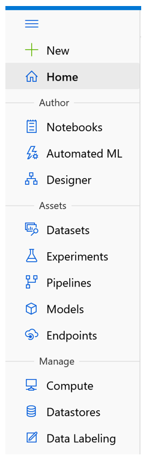

# Machine Learning on Azure - Part 2

This is an excerpt from chapter 7 of my book, [Data Engineering on
Azure](https://www.manning.com/books/azure-data-engineering), which
deals with machine learning workloads. This is part 2 in a 3 part
series. In this post, we'll explore the Azure Machine Learning (AML)
service and set it up in preparation of running our model in the cloud.

In this post, like throughout the book, we'll be using PowerShell Core
and Azure CLI to interact with Azure. You can install PowerShell Core
from [here](https://github.com/PowerShell/Powershell). Then from the
PowerShell Core shell, you can install Azure CLI using the following
command:

``` powershell
Invoke-WebRequest -Uri https://aka.ms/installazurecliwindows `
-OutFile .\AzureCLI.msi; Start-Process msiexec.exe `
-Wait -ArgumentList  '/I AzureCLI.msi /quiet'; rm .\AzureCLI.msi
```

Once Azure CLI is installed, you can use `az` commands as we'll see
throughout this post. First, log into your Azure account:

``` powershell
az login
```

## Introducing Azure Machine Learning

Azure Machine Learning is Microsoft's Azure offering for creating and
managing ML solutions in the cloud. An instance of Azure Machine
Learning is called a workspace.

> A *workspace* is the top-level resource for Azure Machine Larning,
> providing a centralized place to work with all the artifacts you
> create.

In this post, we'll create and configure a workspace, then we'll look
at everything needed for taking our high spender model we developed in
[part
1](https://vladris.com/blog/2021/09/10/machine-learning-on-azure-part-1.html)
from our local machine and running it on Azure.

## Creating a workspace

We'll start by using Azure CLI to create a workspace. First, we install
the `azure-cli-ml` extension, then we create a new resource group called
`aml-rg` to host our ML workloads, and finally, we create a workspace in
the new resource group. The following listing shows the steps:

``` powershell
az extension add -n azure-cli-ml

az group create `
--location "Central US" `
--name aml-rg  

az ml workspace create `
--workspace-name aml `
--location "Central US" `
--resource-group aml-rg
```

The first line adds the `azure-cli-ml` extension. The second line
creates the `aml-rg` resource group in the Central US Azure region. The
last command creates a new Azure Machine Learning workspace named `aml`
in the resource group.

The same way Azure Data Explorer (ADX) has a web UI accessible at
<https://dataexplorer.azure.com/> and Azure Data Factory has a web UI
accessible at <https://adf.azure.com/>, Azure Machine Learning also has
a web UI that you can find at <https://ml.azure.com/>. We will stick to
the Azure CLI and the Python SDK to provision resources, but I encourage
you to try the web UI. As we create more artifacts in this section, you
can use the web UI to see how these are represented there. If you visit
the web UI, you will see a navigation bar on the right with three
sections: Author, Assets, and Manage. The following figure shows the
navigation bar.



The Author section contains Notebooks, Automated ML, and Designer. We
won't focus on these but here is a quick walkthrough: Notebooks enables
users to store Jupyter notebooks and other files directly in the
workspace; Automated ML is a codeless solution for implementing ML; and
the Designer is a visual drag-and-drop editor for ML. We won't focus on
these features because these facilitate model development. We'll look
at the DevOps aspects of ML using our existing Python model as an
example, so this is less relevant for us. Of course, we could've built
our model in Azure Machine Learning directly, but this way, we learn how
we can onboard a model that wasn't created specifically to run on Azure
Machine Learning.

We will, however, touch on most of the items in the Assets and Manage
sections. Assets are some of the concepts Azure Machine Learning deals
with, such as Experiments and Models. We'll cover these soon. The
Manage section deals with the compute and storage resources for AML.
Let's zoom in on these.

## Creating an Azure Machine Learning compute target

One of the great features of Azure Machine Learning is that it can
automatically scale compute resources to train models. Remember, compute
in the cloud refers to CPU and RAM resources. A virtual machine (VM) in
the cloud provides CPU and RAM, but it incurs costs as long as it runs.
This is especially relevant for ML workloads, which might need a lot of
resources during training and training might not happen continuously.

For example, maybe our high spender model needs to be trained every
month to predict next month's marketing campaign targets. It would be
wasteful to keep a VM running all the time if we only need it one day of
the month. Of course, we could manually turn it on or off, but Azure
Machine Learning gives us an even better option - compute targets.

> A *compute target* specifies a compute resource on which we want to
> run our ML. This includes the maximum number of nodes and the VM size.

As a reminder, Azure has a set of defined VM sizes, each with different
performance characteristics and associated costs.[^1] A compute target
specifies which VM type and how many instances we'll need, but it
won't provision the resources until we run a model and request this
target. Once the model run finishes, the resources are deprovisioned.
This makes Azure Machine Learning compute elastic: resources are
allocated when needed, then freed up automatically. We only pay for what
we use, and the service takes care of all the underlying infrastructure.

Let's specify a compute target for our example. We'll request, at
most, one node, use the economical `STANDARD_D1_V2` VM size (1 CPU, 3.5
GiB memory), and name it `d1compute`. The following listing shows the
corresponding Azure CLI command:

``` powershell
az ml computetarget create amlcompute `
--max-nodes 1 `
--name "d1compute" `
--vm-size STANDARD_D1_V2 `  
--workspace-name aml `
--resource-group aml-rg
```

This won't cost us anything until we actually run a ML workload. If you
click through the UI to the Compute section and navigate to Compute
Clusters, you should see the new definition. Other compute options in
AML are compute instances that include:

* VMs preimaged with common ML tools and libraries.
* Inference clusters, where we can package and deploy models on
  Kunbernetes and expose these as REST endpoints.
* Attached compute the enables us to target compute resources like
  Azure Data Bricks not managed by Azure Machine Learning.

Let's move on to storage now. We'll see how we can make our input
available to Azure Machine Learning.

## Setting up Azure Machine Learning storage

We'll start by uploading our `input.csv` file from the previous section
to an Azure Data Lake Storage (ADLS) account. Let's first create the
account and a filesystem named `fs1`. In the code samples below, make
sure to replace `<Your ADLS account>` with an actual name. This name
needs to be unique across Azure, since it becomes part of the URL used
to address the storage account, so we can't hardcode the name in the
example.

``` powershell
az group create `
--location "Central US" `
--name adls-rg

az storage account create `
--name <Your ADLS account> `
--resource-group adls-rg `
--enable-hierarchical-namespace true

az storage fs create `
--account-name <Your ADLS account> `
--name fs1
```

The first command creates a new resource group named `adls-rg`. The
second command provisions an Azure Data Lake Storage Gen2 account in the
resource group. The last command creates a filesystem named `fs1` in the
storage account.

Let's now upload the `input.csv` file created in part 1 to the
filesystem. For this, we'll use the Azure CLI upload command to upload
our input file under the `models/highspenders/input.csv` path. The next
listing shows the commands.

``` powershell
az storage fs file upload `
--file-system fs1 ` 
--path "models/highspenders/input.csv" ` 
--source input.csv ` 
--account-name <Your ADLS account>
```

In practice, we would have various Azure Data Factory pipelines copying
datasets to our storage layers. From there, we would need to make these
datasets available to Azure Machine Learning. We'll do this by
attaching a datastore.

> An Azure Machine Learning *datastore* enable us to connect to an
> external storage account like Azure's Blob Storage, Data Lake, SQL,
> Databricks, etc., making it available to our ML models.

First, we need to provision a service principal that Azure Machine
Learning can use to authenticate. We will create a new service principal
in Azure Active Directory (AAD) and grant it Storage Blob Data
Contributor rights on the data lake. This allows the service principal
to read and write data in the data lake. The following listing shows the
steps.

``` powershell
$sp = az ad sp create-for-rbac | ConvertFrom-Json

$acc = az storage account show `
--name <Your ADLS account> | ConvertFrom-Json

az role assignment create `
--role "Storage Blob Data Contributor" `
--assignee $sp.appId `
--scope $acc.id
```

The first command creates a principal stored in `$sp` for role-base
access control (RBAC). The second command retrieves the details of the
Azure Data Lake Storage account and stores it in `$acc`. The last
command creates a new role assignment, granting read/write access on the
storage account to the service principal we just created.

The service principal can now access data in the storage account. The
next step is to attach the account to Azure Machine Learning, giving it
the service principal ID and secret so it can use these to connect to
the account. The following listing shows how to do this.

``` powershell
az ml datastore attach-adls-gen2 `
--account-name <Your ADLS account> `
--client-id $sp.appId `
--client-secret $sp.password `
--tenant-id $sp.tenant ` 
--file-system fs1 `
--name MLData 
--workspace-name aml `
--resource-group aml-rg
```

This attaches an Azure Data Lake Storage Gen2 datastore to Azure Machine
Learning, using a service principal to authenticate. We need to supply
the data lake account, the service principal ID, secret, and tenant, the
filesystem we want to attach, and the name we want to give it in Azure
Machine Learning (`MLData` in our case).

Now if you navigate to the Storage section in the UI, you should see the
newly created `MLData` datastore. In fact, you should see a couple more
datastores that are created by default and used within the workspace. In
practice, we need to connect to external storage, and data stores are
the way to do that.

Our workspace is now configured with both a compute target and an
attached data store. Let's grant our service, `principalContributor`,
rights to the Azure Machine Learning workspace too, so we can use it for
deployment. Note, in a production environment, we would have separate
service principals for better security, then if one of the principals
gets compromised, it has access to fewer resources. We'll reuse our
`$sp` service principal, though, to keep things brief. The following
listing shows how to grant the rights.

``` powershell
$aml = az ml workspace show `
--workspace-name aml `
--resource-group aml-rg `
| ConvertFrom-Json  

az role assignment create `
--role "Contributor" ` 
--assignee $sp.appId `
--scope $aml.id
```

The first command gets the details of an Azure Machine Learning
workspace and stores them in the `$aml` variable. The second command
creates a role assignment, granting the Contributor role to the service
principal `$sp` on the workspace.

We'll also store the service principal's password in an environment
variable so that we can read it without having to embed it into the
code. The following listing shows how to set an environment variable in
a PowerShell session. This won't get persisted across sessions, so make
a note of `$sp.password`.

``` powershell
$env:SP_PASSWORD = $sp.password 
```

The name *password* is a bit misleading. This is an autogenerated client
secret that was created when we ran `az ad sp create-for-rbac` (which
stands for "Azure Active Directory service principal create for
role-based access control"). We are all set. The next step is to
publish our Python code and run it in the cloud. We will do that in part
3.

[^1]: For more on VM sizes and costs, see
    <https://docs.microsoft.com/en-us/azure/virtual-machines/sizes>.
