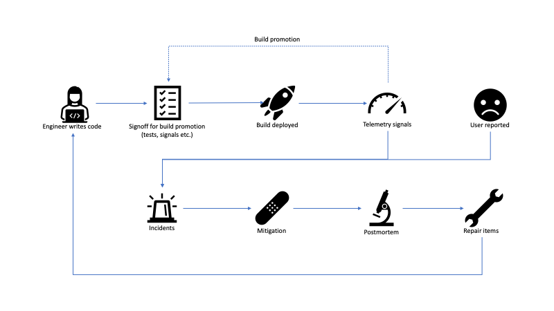

# Notes on Software Lifecycle

I spent a lot of time lately looking at how our team can improve our
product's reliability and capability to respond to production
incidents. This got me thinking about the lifecycle of a contemporary
software project. The model I've been using for this looks like the
following:

At a high level, the cycle starts with **engineers writing code**. The
code gets merged and at some cadence, a new build is prepared for
release. This usually includes looking at a combination of testing and
telemetry signals for engineers to **signoff on deploying the build**.
In case tests fail or telemetry shows some anomalies, the deployment is
abandoned. If all looks good, the **build gets deployed**. Once the
build is exposed to a larger audience, more **telemetry signals** come
in.

Most software these days uses some form of controlled exposure. For
example, services might be deployed first in a dev environment, then in
a pre-production environment, then to production in one region, then to
all regions. Client software is similarly deployed to different rings,
for example new Office builds get deployed first to the Office
organization, then to all of Microsoft, then to customers who opted into
the Insider program, then to the whole world (I'm very much
oversimplifying things here, as release management for Office is way
more complex, but you get the idea). Telemetry signals from a ring feed
back into the **build promotion** process to give confidence that a
build can be exposed to a larger audience in the next ring.

Of course, sometimes things go wrong. We identify issues in the product,
either from **telemetry signals** or, worse, from **user reports**.
These become **live site incidents**. On-call engineers react to these
and try to **mitigate** as fast as possible. After the fire is put out,
a good practice is to run a **postmortem** to understand how the issue
happened and see how it can be prevented in the future. The learnings
usually translate into **repair items**, which get added to the
engineering backlog.

We can split this lifecycle into two parts: a *proactive* part and a
*reactive* part, which roughly map to the top and bottom halves of the
diagram.

## Proactive

The proactive part deals with *what we can do to prevent issues from
making it to production*.

There are several things that could allow issues to slip through the
cracks.

### Code

On the coding part, a feature might be missing tests to uncover
regressions, it might not be instrumented well enough to get good
signals, or it might not be put under a feature gate. Feature gates are
service-controlled flags that can be turned on/off to disable a feature.
These are extremely valuable for quickly mitigating production issues.

All of the above are addressed through education and engineering
culture: more junior engineers on the team might not even be aware of
all the requirements a feature should satisfy before it is "ready"
(see my [Shipping a
Feature](https://vladris.com/blog/2021/08/12/shipping-a-feature.html)
post).

> A good practice is to have a *feature checklist*, a list of things
> engineers need to consider before submitting a pull request. This
> includes things like test coverage, telemetry, feature gates,
> performance, accessibility (for UI) etc.

Everyone writing code should know where this checklist is, and code
reviewers should keep it in mind while evaluating changes.

### Signoff for Build Promotion

Two main issues would allow a regression to get passed the build
validation process: either there is a gap in validation, or missed
signals. This, of course, assumes that the code has tests and is
properly instrumented in the coding stage. Here, the person or persons
validating a build, either miss running some validation (automatic or
manual tests) or miss looking at a telemetry signal that would tell them
something is wrong.

Both of these issues can be addressed with automation.

> Have a *go/no-go dashboard* that aggregates all relevant signals (like
> test run results, telemetry metrics).

Of course, putting together such a dashboard and ensuring all code has
the right test automation and instrumentation is not easy.

### Telemetry Signals

Telemetry could have gaps: issues could manifest themselves without us
receiving a signal. If this happens, we need to learn from these
incidents, understand where the gaps are, and eliminate them. More about
this on the *reactive* part.

## Reactive

The reactive part deals with *how we can mitigate issues as quickly as
possible if they make it to production*.

### Incidents

The entry point into the reactive cycle is an incident. An incident
alerts the on-call engineer and starts the mitigation process. The
sooner an incident is created, the sooner it can be addressed.

Issues here come from *alerting*. An alerting system runs automated
queries over incoming telemetry signals and looks for some anomalies or
thresholds. Things can go wrong in multiple ways:

* We can collect a lot of telemetry but not have the right queries to
  notice sudden spikes, or drops, or other anomalies in the telemetry
  stream.

* We could be overly cautious and generate too many alerts, most of
  them false positives, which makes it hard for on-call to figure out
  when an alert is real.

* Alerts might be very generic and not contain enough information for
  on-call to easily mitigate.

  > Alerts should be continuously finetuned to be accurate and
  > actionable, with as few false positives as possible.

Telemetry signals, even if correct, can be impacted by multiple things
outside of our control. For example, usage might raise or drop sharply
during weekends (depending on whether we're talking about a game or a
productivity app) or holidays. This makes it even harder to develop
accurate alerts.

The worst case is when issues get reported by customers before we see
any alerts: this signifies a big gap and a postmortem should identify
the follow up work (see *postmortems* below).

### Mitigation

Several things can make mitigation harder. The on-call engineer might
not know how to handle certain types of incidents.

> It's a good idea to have a *troubleshooting guide* (TSG) for each
> type of alert, where an area expert details the steps to mitigate an
> issue.

Another common issue is there is no easy mitigation. This goes back to
our **coding** section: code should be behind feature gates, so
mitigation is as easy as flipping a switch.

Yet another common issue, which we covered in the previous section when
we discussed alerts, is not having enough information to easily pinpoint
the actual issue. The on-call engineer sees an incidents, knows
something is wrong, but not enough information is available for a quick
mitigation. Alerts should contain enough information to be useful.

### Postmortems

Postmortems are an invaluable tool for learning from incidents.
Postmortems are reviews of incidents once mitigated, root caused, and
understood, where the team gets together to discuss what happened and
take steps to prevent the same type of issue form happening in the
future. A postmortem is not about blaming, it is about answering the
following question:

> What can we do to ensure this doesn't happen in the future?

A postmortem that doesn't answer this question is not that useful. A
good postmortem identifies one or more work items that can be handed to
engineering to implement additional guardrails so the same issue
doesn't recur.

### Repair Items

Finally, identifying repair items is not enough. A long backlog of
repair items that nobody gets around to implement won't make things any
easier.

> Engineers should treat repair items with priority.

Repair items are some of the most critical work items: we've seen
incidents in production, we know the scope of the impact, and we know
the work needed to prevent them in the future.

## Summary

In this post we looked at a model of software lifecycle, consisting of a
*proactive* part: engineers writing code, a signoff process to promote a
build, and signals to increase the audience for a build; and a *reactive
part*: a live site incident, which on-call engineers mitigate, the team
postmortems, and comes up with a set of repair items.

We also looked at some of the common issues across these various parts
of the lifecycle, and some best practices.

This was a very high-level overview - each of these steps has a lot of
depth, from writing safe code, to release management, to telemetry
models, site reliability engineering, and so on. All of these are
critical parts of shipping software.
