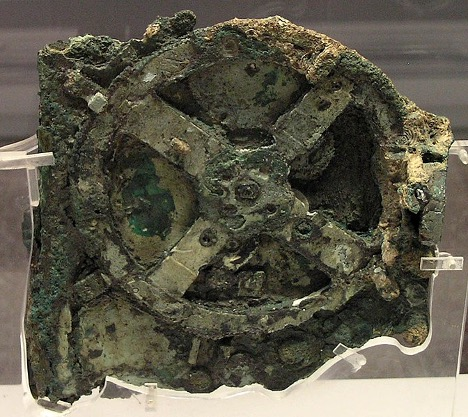
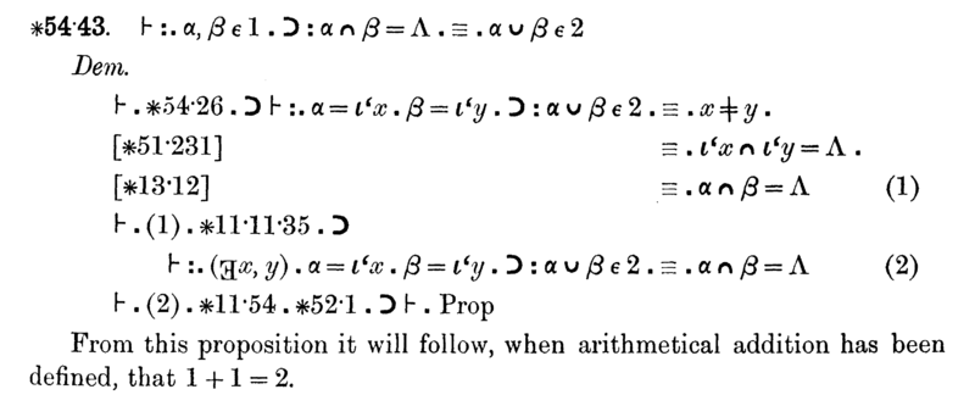

# Computability Part 1: A Short History

> An algorithm (/ˈælɡərɪðəm/ ) is a finite sequence of well-defined
> instructions, typically used to solve a class of specific problems or
> to perform a computation.

## Ancient computers

The first computer (we know of) is the Antikythera mechanism. It was
found in 1901 in a shipwreck. The device was built sometime between 100
BC and 150 BC and uses gears to predict astronomical positions of the
Sun, Moon, and planets through the zodiac.

*Image from Wikimedia Commons user Marsyas, [CC BY
2.5](https://creativecommons.org/licenses/by/2.5/)*

This millennia old device is a hand-powered analog computer. Humanity
has been looking at automating computation for quite some time.

## The father of computer science

Skipping forward a few hundred years, the famous Gottfried Wilhelm
Leibniz (1646-1714) designed the first device that could perform the 4
arithmetic operations and used an internal memory. He also invented the
binary system, and his Algebra of Thought is a precursor to Boolean
Algebra. Leibniz is famous as a mathematician (inventing calculus
independently of Isaac Newton), but some also call him *the father of
computer science*.

After creating his arithmetic machine, Leibniz dreamt of a machine that
could manipulate symbols in order to decide the truth value of
mathematical statements.

## The Difference Engine and the Analytical Engine

Over a century later, Charles Babbage (1791-1871) invents the Difference
Engine, a mechanical calculator that can tabulate polynomial functions.
Babbage created a small version of this, the Difference Engine 0, in
1822. Work on a larger version, which was supposed to enable larger
calculations, was funded by the British government. Unfortunately, this
did not materialize due to the manufacturing limitations of the time. It
took 20 years and large amounts until the project was abandoned. The
Difference Engine 1 was never completed.

During this time, Babbage started thinking about a general-purpose
computer, the Analytical Engine. The Analytical Engine would include an
arithmetic logic unit, control flow, and memory - components of modern
electronic computers. The programming language resembled modern day
assembly languages and would have been fed to the computer through punch
cards. This machine was never built.

Even though the physical Analytical Engine did not materialize, several
programs were created for it, both by Babbage and Ada Lovelace
(1815-1852). Ada published the first algorithm for the Analytical
Engine, used to compute Bernoulli numbers, and is regarded as the first
programmer.

## The foundational crisis of mathematics

At the beginning of the 20th century, mathematicians were looking for a
proper foundation for mathematics: a set of axioms from which all
theorems could be derived.

David Hilbert (1862-1943) put forward 23 problems in 1900, which heavily
influenced the direction of mathematics research in the 20th century.
Some of the problems have since been solved, others, like the famous
Riemann hypothesis (problem 8), are still unresolved.

The 2nd problem, directly tying into the foundational crisis, was to
prove that the axioms of arithmetic are consistent (meaning no
contradictions can arise as theorems are derived from the axioms).

Alfred North Whitehead (1861-1947) and Bertrand Russell (1872-1970)
start working on the Principia Mathematica. 3 volumes are published in
1910, 1912, and 1913. Starting with a minimum set of primitive notions,
axioms, and inference rules, they deduce theorems pertaining to logic,
arithmetic, set theory and so on. Famously, the proof that 1+1=2 appears
on page 379 of volume 1.

Kurt Gödel (1906-1978) proves, with his incompleteness theorem (1930),
that a formal system powerful enough to describe arithmetic cannot be
both consistent and complete. In other words, starting from a set of
axioms, if these are consistent (no contradictions can be derived), they
cannot be complete (there will be true statements that cannot be derived
from these axioms).

Building upon this work, in 1933, Gödel develops general recursive
functions as a model of computability (more on this later).

## Entscheidungsproblem and models of computability

David Hilbert proposes another challenge in 1928: the decision problem.
The problem asks for an algorithm that takes a statement as an input and
decides whether the statement is provable within the considered set of
axioms. Note that Gödel's incompleteness theorem shows that some true
statements cannot be proved from a consistent set of axioms. That
doesn't mean there isn't an algorithm that can decide whether a
statement is provable or not. Hilbert believed such an algorithm exists.

Alonzo Church (1903-1995) develops lambda calculus as a model of
computation that uses function abstraction, application, and variable
binding and substitution. Church's Theorem (1936) provides a negative
answer to the decision problem, based on lambda calculus. He shows there
is no computable function that can decide whether two lambda expressions
are equivalent.

During the same time, Alan Turing (1912-1954) develops another model of
computation: the Turing machine. This is an abstract computer consisting
of an infinite tape of cells, a head that can read from a cell, write to
a cell, and move left or right over the tape, and a set of rules which
direct the head based on the read symbol and the current state of the
machine. Turing also provides a negative answer to the decision problem
during the same year as Church (1936), based on Turing machines: he
shows that there is no general method to decide whether any given Turing
machine halts or not (the halting problem).

## Universal computability and Turing completeness

These are remarkable results: we now have proof that some problems are
incomputable. More than that, we know that a Turing machine can compute
anything that is computable.

The Church-Turing thesis shows that lambda calculus can be used to
simulate a Turing machine. That means that lambda calculus can compute
anything that a Turing machine can compute, thus the two systems have
the same computability power.

In general, if a system can be used to simulate a Turing machine, this
makes it *Turing complete*, meaning capable of computing anything that
is computable.

Gödel's general recursive functions are also shown to be an equivalent
model of computation (these are the functions that Turing machines can
compute).

We have 3 quite different approaches to universal computability: general
recursive functions, lambda calculus, and Turing machines. These turn
out to all be equivalent in terms of what is possible to compute.

Turing machines, with their simple definition, are easy to simulate,
thus making Turing completeness the preferred way of proving that a
system is capable of universal computation.
