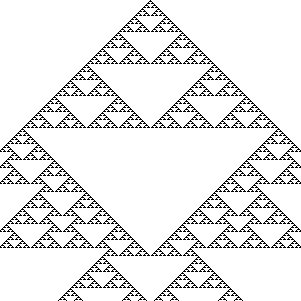
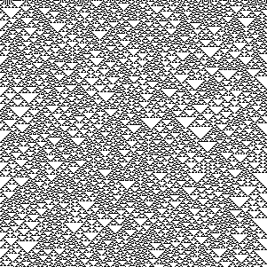
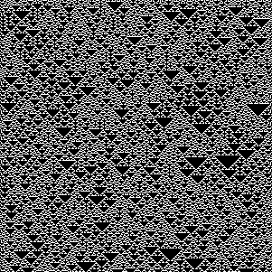
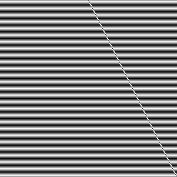
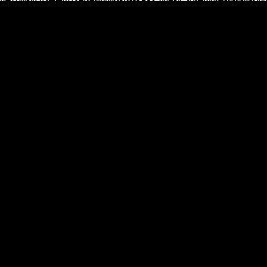
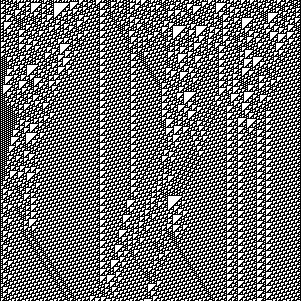

# Computability Part 5: Elementary Cellular Automata

In the [previous
post](https://vladris.com/blog/2022/06/11/computability-part-4-conway-s-game-of-life.html)
we talked about Conway's Game of Life as a well-known cellular
automaton. In this post we will cover even simpler automata - the
*elementary cellular automata*. Stephen Wolfram covers them extensively
in his book, [A New Kind of Science](https://www.wolframscience.com/).

To recap, we defined a cellular automaton as a discrete n-dimensional
lattice of cells, a set of states (for each cell), a notion of
neighborhood for each cell, and a transition function mapping the
neighborhood of each cell to a new cell state.

An elementary cellular automaton is 1-dimensional - an array of cells. A
cell can be either *on* or *off* (just like in Conway's Game of Life).
The neighborhood of a cell, meaning the cells that we take into account
when we determine the next state of the next generation, consists of the
cell itself and its left and right neighbors.

For example, we can define an elementary cellular automaton with the
following rules:

``` text
[ on,  on,  on] -> off
[ on,  on, off] -> off
[ on, off,  on] -> off
[ on, off, off] ->  on
[off,  on,  on] -> off
[off,  on, off] ->  on
[off, off,  on] ->  on
[off, off, off] -> off
```

If we start with a single *on* cell and produce 10 generations, we get
(using `#` to mean *on*):

``` text
#
###
#   #
### ###
#       #
###     ###
#   #   #   #
### ### ### ###
#               #
###             ###
```

## Rule encoding

The elementary cellular automata can easily be enumerated exhaustively:
the neighborhood of a cell can be in only one of 8 states, as we saw
above: `[on, on, on]`, `[on, on, off]`, ... `[off, off, off]`. The
transition function maps each of these possible states to either *on* or
*off*. If we think of the *on*/*off* as a bit, we need 8 bits to
represent the transition function.

``` text
[ on,  on,  on] -> off
[ on,  on, off] -> off
[ on, off,  on] -> off
[ on, off, off] ->  on
[off,  on,  on] -> off
[off,  on, off] ->  on
[off, off,  on] ->  on
[off, off, off] -> off
```

can be represented as the binary number `00010110`, which, in decimal,
is 22 (where `[off, off, off]` is the least significant bit). We can
represent numbers from 0 to 255 in 8 bits, so there are exactly 256
elementary cellular automata. This encoding is referred to as *Rule* as
in "transition rule". The elementary cellular automata in our above
example is called *Rule 22* .

## Elementary cellular automata behavior

A common way to plot the evolution of an elementary cellular automata
over multiple generation is to render each generation below the previous
one, like our above example using `#` for *on*. A more condensed version
with 1 pixel per cell of running rule 22 for 301 generations looks like
this:



At this level, we can clearly see patterns emerging in the automaton. We
get an even more interesting view if, instead of starting with just a
single *on* cell, we start with a random state - an array of random *on*
and *off* cells. Here is rule 22 starting with 301 random cells and
running for 301 generations:



We can also easily see some of the automatons are complements of other
automatons: if we simply flip each bit, we end up with a complementary
version. Rule 22's complement is Rule 151:



We can also reflect a rule by swapping the transitions for
`[on, off, off]` with `[off, off, on]` and `[on, on, off]` with
`[off, on, on]`. This doesn't work for rule 22, since its reflection is
still 22, but, for example, rules 3 and 17 are reflections of each
other.

Rule 3:

``` text
[ on,  on,  on] -> off
[ on,  on, off] -> off
[ on, off,  on] -> off
[ on, off, off] -> off
[off,  on,  on] -> off
[off,  on, off] -> off
[off, off,  on] ->  on
[off, off, off] ->  on
```

Renders as:



Rule 17:

``` text
[ on,  on,  on] -> off
[ on,  on, off] -> off
[ on, off,  on] -> off
[ on, off, off] ->  on
[off,  on,  on] -> off
[off,  on, off] -> off
[off, off,  on] -> off
[off, off, off] ->  on
```

Renders as:


That means that, even though there are 256 possible automata, from
behavioral perspective, some are complements or reflections of others
thus exhibit the same behavior. In fact, there are only 88 uniquely
behaving automata, all others being complements and/or reflections of
these.

## Implementation

Let's look at a Python implementation. We will represent the state of
an automaton as a list of Boolean cells. We can encode the state of a
neighborhood as a 3 bit number:
`left neighbor * 4 + cell * 2 + right neighbor`. Given a list of cells
and the index of a cell, we have:

``` python
def neighbors(cells, i):
    return (cells[i - 1] if i > 0 else False) * 4 + \
        cells[i] * 2 + \
        (cells[i + 1] if i < len(cells) - 1 else False)
```

If we run off the ends of the list, we assume the state of that cell is
*off*. In Python, `False` becomes `0` and `True` becomes 1 if we do
arithmetic with them, so this function will return a number between 0
and 7.

We can derive the transitions from the rule number by taking a rule
number and expanding it into a dictionary that maps each value from 0 to
7 to the corresponding bit in the rule number value:

``` python
def transition(rule):
    return {i: rule & (1 << i) != 0 for i in range(8)}
```

This might be a bit hard to understand, so let's work through an
example. Let's take Rule 22. The binary representation of Rule 22 is
`00010110`. We're iterating over the range 0\...7 (`i`) and for each of
these values, we shift `1` exactly `i` bits left. Then we check if the
rule *logic AND* this shifted bit is different than 0.

For `i == 0`: `00010110 & (1 << 0)`, which is `00010110 & 00000001`, we
get `False`, so `transitions[0] = False`.

For `i == 1`: `00010110 & (1 << 1)`, which is `00010110 & 00000010`, we
get `True`, so `transitions[1] = True`.

...

For `i == 7`: `00010110 & (1 << 7)`, which is `00010110 & 10000000`, we
get `False`, so `transitions[7] = False`.

Remember the keys of the dictionary are neighborhood states.

Now we just need a function that takes a rule, an initial state, and the
number of steps we want to run. The function will start with the initial
state, then at each step, update the list of cells using the transition
function:

``` python
def run(rule, initial_state, steps):
    t, cells = transition(rule), initial_state

    for _ in range(steps):
        yield cells
        cells = [t[neighbors(cells, i)] for i in range(len(cells))]
```

We talked about two ways to look at cellular automata: starting with a
single *on* cell, or starting with a random initial state.

Let's implement an `initial_state` function which takes a cell count as
input and returns a list of cells, all of which are *off* except the
middle one:

``` python
def initial_state(cell_count):
    result = [False] * cell_count
    result[cell_count // 2] = True
    return result
```

We'll also want a `random_initial_state` which takes a cell count and
returns a random cell list. We'll take advantage of the fact that
Python supports arbitrarily large integers natively, so we'll just
generate a random number with `cell_count` bits, then derive the cell
list from that (if a bit is `1`, the corresponding cell is *on*):

``` python
import random 

def random_initial_state(cell_count):
    seed = random.randint(0, 2 ** cell_count - 1)
    return [seed & (1 << i) != 0 for i in range(cell_count)]
```

Here is all the code in one listing:

``` python
def neighbors(cells, i):
    return (cells[i - 1] if i > 0 else False) * 4 + \
        cells[i] * 2 + \
        (cells[i + 1] if i < len(cells) - 1 else False)

def transition(rule):
    return {i: rule & (1 << i) != 0 for i in range(8)}

def run(rule, initial_state, steps):
    t, cells = transition(rule), initial_state

    for _ in range(steps):
        yield cells
        cells = [t[neighbors(cells, i)] for i in range(len(cells))]

def initial_state(cell_count):
    result = [False] * cell_count
    result[cell_count // 2] = True
    return result

import random 

def random_initial_state(cell_count):
    seed = random.randint(0, 2 ** cell_count - 1)
    return [seed & (1 << i) != 0 for i in range(cell_count)]
```

Here is how we can use this to print the first 30 steps of Rule 22:

``` python
for state in run(22, initial_state(61), 30):
    print(''.join(['#' if e else ' ' for e in state]))
```

## Wolfram classification

Wolfram analyzed the behavior of cellular automata and classified them
in 4 classes (called *Wolfram classes*). These go beyond elementary
cellular automata to cover other cellular automata like, for example,
ones where the next generation of a cell is not determined only by the
cell and the two cells next to it, rather the neighborhood includes
next-next cells. In this post we'll stick to elementary cellular
automata though.

### Class 1

Class 1 automata converge quickly to a uniform state. For example rule 0
becomes all *off* in one generation:


It's complement, rule 255, becomes all *on* in one generation:



### Class 2

Class 2 automata converge quickly to a repetitive state. For example
rule 4:


### Class 3

Class 3 automata appear to remain in a random state, without converging.
Rule 22, which we started with above, exhibits this type of behavior:


### Class 4

The most interesting class of cellular automata, class 4, has a quite
remarkable behavior: areas of cells end up in static or repetitive
state, while some cells end up forming structures that interact with
each other. Rule 110 is the only elementary cellular automaton that
exhibits this behavior:



## Turing completeness

The fact that Rule 110 has areas of cells that are static or repetitive
while some other cells form structures should remind you of the
Conway's Game of Life spaceships we discussed in the previous post. In
the previous post, we saw that the Game of Life is Turing complete, and
how a Turing machine was "implemented" using spaceships as signals
"processed" by other patterns.

Turns out Rule 110 is also Turing complete. Stephen Wolfram conjectured
this in 1985, and the conjecture was proved in 2004 by Matthew Cook[^1].
Cook uses Rule 110 gliders (interacting structures) to emulate a cyclic
tag system. We saw in [Computability Part 3: Tag
Systems](https://vladris.com/blog/2022/05/20/computability-part-3-tag-systems.html)
that cyclic tag systems can emulate tag systems, and an m-tag system
with $m \gt 1$ is Turing complete.

Rule 110, an elementary cellular automaton, is also capable of universal
computation. And while this all might seem very abstract, cellular
automata are so simple they show up in nature:


[^1]: See [Universality in Elementary Cellular
    Automata](https://wpmedia.wolfram.com/uploads/sites/13/2018/02/15-1-1.pdf).
