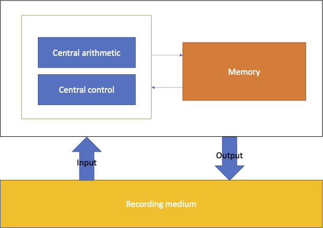

# Computability Part 6: Von Neumann Architecture

During the previous posts, we covered [Turing
machines](https://vladris.com/blog/2022/04/03/computability-part-2-turing-machines.html),
[tag
systems](https://vladris.com/blog/2022/04/03/computability-part-2-turing-machines.html),
and [cellular
automata](https://vladris.com/blog/2022/06/11/computability-part-4-conway-s-game-of-life.html).
All of these are equivalent in terms of what they can compute, but some
are more practical than others. In this post, we'll look at the von
Neumann architecture of physical computers and implement an extremely
inefficient machine, write a few programs targeting it, then prove it is
Turing complete.

John von Neumann was a famous mathematician and physicist. Contemporary
with Alan Turing, he was aware of Turing's work on Turing machines and
computability. At the same time, von Neumann was involved in the
[Manhattan Project](https://en.wikipedia.org/wiki/Manhattan_Project)
which required lots of computation provided by some early computers.
Thus he got involved in computer design. Unlike a Turing machine, a
physical computer can't have an infinite tape and while data is
processed based on input and states, this needs to be more ergonomic
than Yurii Rogozhin's 4-state 6-symbol machine we described in [Part
2](https://vladris.com/blog/2022/04/03/computability-part-2-turing-machines.html).

> Von Neumann described a computer architecture as consisting of the
> following components[^1]:
>
> * A *central arithmetic* component (CA) handling calculation.
> * A *central control* component (CC) driving which calculations
>   should be performed.
> * *Memory* (M) for storage.
> * *Input* (I) and *output* (O) components to get data into the
>   system and to communicate results outside of the system, from/to a
>   *recording medium* (R)

Here is a diagram of this architecture:



Before von Neumann, computers were single-purpose devices - the
programming was hardwired. One of the major innovations, which might not
be apparent, is the introduction of a *central control* component and
the ability of the memory to store not only data but also the program
itself. This makes devices based on this architecture able to be
reprogrammed to perform different tasks.

We can now load an arbitrary program into memory. The program will use
the instructions which our *central arithmetic* understands to perform
computations. The *central control* can read this program and have the
*central arithmetic* perform the required operations. During execution,
data is also read from/written to memory.

Programs (and data) is loaded into memory through the *input* component
and results are sent through the *output* component.

While over the following decades this architecture got tweaked and
tuned, it's pretty obvious it is the ancestor of all modern computers:
computers still have CPUs, which include control and arithmetic, and
memory.

Let's create a virtual machine based on this architecture.

## Implementation

We will create a very simple machine based on this architecture in
Python. In subsequent posts, we will look at other designs, but we're
starting with a direct translation of this architecture.

### Input

The interface to our input component is a function that, when called,
returns an integer. This is all our machine needs to get data.

We will implement this over a text file. Our input component will buffer
this file into a list and expose a `read_one()` function that will
return one integer (as returned by [ord()]{.title-ref}) for each
character from the buffer.

``` python
def inp(file):
    buffer = list(open(file).read())
    return lambda: ord(buffer.pop(0))
```

### Output

The interface to our output component is a function that takes an
integer as an argument. This is all our machine needs to output one
memory cell.

We will implement this using `print()` and actually convert the given
integer to a character. This is just to provide a convenient way for us
to look at output like "Hello world!".

``` python
def out(value):
    print(chr(value), end='')
```

### Memory

Our memory will consist of a list of 10000 integers. We will
zero-initialize the list, then load a program from a file to memory,
starting at address 0. We expect the program to consist of a series of
integers separated by a space or a newline character. We'll use this
encoding to make it easier for us to peek at the code targeting our von
Neumann machine.

``` python
def memory(file):
    memory = [0] * 10000
    for i, value in enumerate(' '.join(open(file).readlines()).split()):
        memory[i] = int(value)
```

10000 is chosen arbitrarily, at this point we're not worrying about
word size, page alignment etc. We simply have room to store 10000
integers in our memory, which will include both code and data.

### CPU

We'll package the control and arithmetic components into a `CPU` class.
We'll initialize this class with memory, input, and output components.

``` python
class CPU:
    def __init__(self, memory, inp, out):
        self.memory, self.inp, self.out = memory, inp, out
```

### Central control

Our control unit will maintain a *program counter* (`PC`), an index into
the memory pointing to the next instruction to execute. The machine runs
by reading 3 integers from memory (at `PC`, `PC + 1` and `PC + 2`), and
passing these to the arithmetic unit for processing. The program counter
is then incremented by 3. This repeats until `PC` goes outside the
bounds of the memory, at which point the machine halts (alternately we
could have provided some `HALT` instruction).

``` python
def run(self):
    self.pc = 0
    while self.pc < len(self.memory):
        instr, m1, m2 = self.memory[self.pc:self.pc + 3]
        self.process(instr, m1, m2)
        self.pc += 3
```

We will implement `process()` next.

### Central arithmetic

Our arithmetic unit will process triples of
`<Instruction> <memory address 1> <memory address 2>`. It will support 8
instructions:

* `AT` will set the value at `memory address 1` to be the value at the
  memory address specified by the value at `memory address 2` (in
  short, `m[m1] = m[m[m2]]`).
* `SET` will set the value at the memory address specified by the
  value at `memory address 1` to be the value at `memory address 2`
  (in short, `m[m[m1]] = m[2]`).
* `ADD` will update the value at `memory address 1` by adding the
  value at `memory address 2` to it (in short, `m[m1] += m[m2]`).
* `NOT` will update the value at `memory address 1` to be 0 if the
  value at `memory address 2` is different than 0, or 1 if the value
  at `memory address 2` is 0 (in short, `m[m1] = !m[m2]`).
* `EQ` will compare the values at `memory address 1` and
  `memory address 2` and update the value at `memory address 1` to be
  1 if they are equal, 0 otherwise (in short,
  `m[m1] = m[m1] == [m2]`).
* `JZ` will perform a conditional *jump* - if the value at
  `memory address 1` is 0, it will update the program counter to point
  to `memory address 2` (in short, `if !m[m1] then PC = m[m2]`).
* `INP` will read one integer from the input and store it at
  `memory address 1` + an offset value specified at `memory address 2`
  (in short, `m[m1 + m[m2]] = inp()`).
* `OUT` will write the value at `memory address 1` + an offset value
  specified at `memory address 2` to the output (in short,
  `out(m[m1 + m[m2]])`.

Since the instructions are also read from memory, which is a list of
integers, we will encode them as integers: `AT = 0`, `SET = 1`, ...
`OUT = 7`.

``` python
def process(self, instr, m1, m2):
    match instr:
        case 0: # AT
            self.memory[m1] = self.memory[self.memory[m2]]
        case 1: # SET
            self.memory[self.memory[m1]] = self.memory[m2]
        case 2: # ADD
            self.memory[m1] += self.memory[m2]
        case 3: # NOT
            self.memory[m1] = +(not self.memory[m2])
        case 4: # EQ
            self.memory[m1] = +(self.memory[m1] == self.memory[m2])
        case 5: # JZ
            if not self.memory[m1]:
                # Set PC to m2 - 3 since run() will increment PC by 3
                self.pc = m2 - 3
        case 6: # INP
            self.memory[m1 + self.memory[m2]] = self.inp()
        case 7: # OUT
            out(self.memory[m1 + self.memory[m2]])
        case _: 
            raise Exception("Unknown instruction")
```

### Von Neumann VM

Putting it all together, we'll take two input arguments: the first one
(`argv[1]`) will represent the code input file containing the program,
the second one (`argv[2]`) will be the file containing additional input
to be consumed by the `inp()` function:

``` python
import sys

vn = CPU(memory(sys.argv[1]), inp(sys.argv[2]), out)
vn.run()
```

Here is our von Neumann virtual machine in one listing:

``` python
def inp(file):
    buffer = list(open(file).read())
    return lambda: ord(buffer.pop(0))

def out(value):
    print(chr(value), end='')

def memory(file):
    memory = [0] * 10000
    for i, value in enumerate(' '.join(open(file).readlines()).split()):
        memory[i] = int(value)
    return memory

class CPU:
    def __init__(self, memory, inp, out):
        self.memory, self.inp, self.out = memory, inp, out

    def run(self):
        self.pc = 0
        while self.pc < len(self.memory):
            instr, m1, m2 = self.memory[self.pc:self.pc + 3]
            self.process(instr, m1, m2)
            self.pc += 3

    def process(self, instr, m1, m2):
        match instr:
            case 0: # AT
                self.memory[m1] = self.memory[self.memory[m2]]
            case 1: # SET
                self.memory[self.memory[m1]] = self.memory[m2]
            case 2: # ADD
                self.memory[m1] += self.memory[m2]
            case 3: # NOT
                self.memory[m1] = +(not self.memory[m2])
            case 4: # EQ
                self.memory[m1] = +(self.memory[m1] == self.memory[m2])
            case 5: # JZ
                if not self.memory[m1]:
                    # Set PC to m2 - 3 since run() will increment PC by 3
                    self.pc = m2 - 3
            case 6: # INP
                self.memory[m1 + self.memory[m2]] = self.inp()
            case 7: # OUT
                out(self.memory[m1 + self.memory[m2]])
            case _: 
                raise Exception("Unknown instruction")

import sys

vn = CPU(memory(sys.argv[1]), inp(sys.argv[2]), out)
vn.run()
```

We can save this as `vn.py`.

Let's create a "Hello world!" program targeting this machine. We will
use the `OUT` instruction to output each character of "Hello" and a
new line (`\n`). We'll first tell the VM to output the values at memory
address 21 to 26:

``` text
7 21 9999
7 22 9999
7 23 9999
7 24 9999
7 25 9999
7 26 9999
```

We are referencing addresses 21 to 26 plus the offset 0 (the value at
memory `9999`, since our memory is initialized with zeros).

We want to halt after this, so we need to jump our program counter to
10000. We will do this by using our `JZ` instruction, saying *if the
memory value at index 9999 is 0, jump to 10000*:

``` text
5 9999 10000
```

Now we get to memory address 21, so we will set the values of memory 21
to 26 to the values of the characters in "Hello" (as returned by
`ord()`) plus a `10` for `\n`:

``` text
72 101 108 108 111 10
```

Here is the full listing which we can save as `hello.vn`:

``` text
7 21 9999
7 22 9999
7 23 9999
7 24 9999
7 25 9999
7 26 9999
5 9999 10000
72 101 108 108 111 10
```

We can then use our VM to run the program like this:

``` shell
touch input
python3 vn.py hello.vn input
```

We're also creating a blank `input` file since "Hello world!" isn't
going to read anything via `inp()`.

Running this should print `Hello`. Our "program" is pretty hard to
write or read, we're programming with integers. Let's make our life a
bit easier.

## Assembler

We will implement an assembler for our VM. An assembly language is a
low-level language closely matching the architecture it targets (in our
case, our very simple von Neumann machine).

Our assembler will take 2 arguments - an input file and an output file -
and automatically translate the input (assembly language) into
instructions for our VM.

We will add the following features:

* Comments - Lines starting with `#` will be ignored.
* Instructions - We will express our instructions as `at`, `set`,
  `add`, `not`, `eq`, `jz`, `inp`, `out` to represent the instructions
  `0`, `1`, ... `5`.
* Labels - We will tag a location in the code by a string ending in
  `:`, for example `HERE:`. We will then be able to refer to the
  location using the identified preceded by `:`, like `:HERE`. We will
  also allow adding an offset to a reference: `:HERE+2` is 2 past the
  `HERE` label.
* `ORD` macro - To make implementing "Hello world!" easier, we will
  provide the `ORD()` macro which will return the integer
  representation of the character passed to it, for example `ORD(H)`
  will return `72`.

Using this assembly language, we can rewrite "Hello world!" as:

``` text
## Print 6 characters starting from DATA
out :DATA 9999
out :DATA+1 9999
out :DATA+2 9999
out :DATA+3 9999
out :DATA+4 9999
out :DATA+5 9999

## End program
jz 9999 10000

## Data section
DATA: ORD(H) ORD(e) ORD(l) ORD(l) ORD(o) 10
```

First, we'll read the input file and convert it into a list of tokens.
We will ignore lines starting with `#` (so we can add comments to our
assembly file).

``` python
import sys

if len(sys.argv) != 3:
    print("Usage: asm.py <input> <output>")
    exit()

## Read all lines into a list
lines = open(sys.argv[1]).readlines()
## Filter out blank lines and lines starting with '#'
lines = list(filter(lambda line: line and line[0] != '#', lines))
## Join all lines and split into tokens
tokens = ' '.join(lines).split()
```

The labels themselves aren't part of the program, rather mark locations
in the program, so in the next step we will pluck these out from the
list of tokens but retain the index they are referencing:

``` python
## pluck labels and remember position
labels, i = {}, 0
while i < len(tokens):
    # If not a label, advance
    if tokens[i][-1] != ':':
        i += 1
        continue

    # Store location and pluck label
    labels[tokens[i][:-1]] = i
    tokens.pop(i)
```

Now we will process all tokens and handle the following cases:

* If token starts with `:`, it is a label reference, so replace it
  with the actual location (as stored during the previous step).
* If the token is an op code, replace it with the integer value of the
  op code.
* If the token is an `ORD()` macro, replace the character passed to
  `ORD()` with its value.

``` python
## Op code list (constant)
OP_CODES = ['at', 'set', 'add', 'not', 'eq', 'jz', 'inp', 'out']

for i, token in enumerate(tokens):
    # replace label references with actual position
    if token[0] == ':':
        if '+' in token:
            base, offset = token.split('+')
            tokens[i] = labels[base[1:]] + int(offset)
        else:
            tokens[i] = labels[token[1:]]

    # replace op codes with values
    if token in OP_CODES:
        tokens[i] = OP_CODES.index(token)

    # replace ORD macro
    if token[:4] == 'ORD(':
        tokens[i] = ord(token[4:-1])
```

Finally, we write all tokens to the output file:

``` python
open(sys.argv[2], "w").write(
    ' '.join([str(token) for token in tokens]))
```

Here is the full source code of our assembler (`asm.py`):

``` python
import sys

if len(sys.argv) != 3:
    print("Usage: asm.py <input> <output>")
    exit()

## Read all lines into a list
lines = open(sys.argv[1]).readlines()
## Filter out blank lines and lines starting with '#'
lines = list(filter(lambda line: line and line[0] != '#', lines))
## Join all lines and split into tokens
tokens = ' '.join(lines).split()

## pluck labels and remember position
labels, i = {}, 0
while i < len(tokens):
    # If not a label, advance
    if tokens[i][-1] != ':':
        i += 1
        continue

    # Store location and pluck label
    labels[tokens[i][:-1]] = i
    tokens.pop(i)

## Op code list (constant)
OP_CODES = ['at', 'set', 'add', 'not', 'eq', 'jz', 'inp', 'out']

for i, token in enumerate(tokens):
    # replace label references with actual position
    if token[0] == ':':
        if '+' in token:
            base, offset = token.split('+')
            tokens[i] = labels[base[1:]] + int(offset)
        else:
            tokens[i] = labels[token[1:]]

    # replace op codes with values
    if token in OP_CODES:
        tokens[i] = OP_CODES.index(token)

    # replace ORD macro
    if token[:4] == 'ORD(':
        tokens[i] = ord(token[4:-1])

open(sys.argv[2], "w").write(
    ' '.join([str(token) for token in tokens]))
```

We can now save our assembly "Hello world!" (listed above) to a file,
let's call it `hello.asm` and use the assembler to convert it to a
program our VM can execute:

``` shell
python3 asm.py hello.asm hello.vn
```

The resulting `hello.vn` should have the same content as our
hand-crafted "Hello world!", minus the newlines (the assembler
doesn't output newlines). The content of the assembled file `hello.vn`
is:

``` text
7 21 9999 7 22 9999 7 23 9999 7 24 9999 7 25 9999 7 26 9999 5 9999 10000 72 101 108 108 111 10
```

We can run this using:

``` shell
python3 vn.py hello.vn input
```

We are again using an empty input file since we don't need input. As a
convention, we use the `.asm` extensions for assembly files and `.vn`
for assembled files targeting the VM.

### Variables and loops

Let's rewrite our program: instead of outputting `:DATA`, then
`:DATA+1`, then `DATA+2`... we should be able to output `:DATA + :I`
where `:I` goes from 0 to 5.

We can easily use a variable by tagging any part of the program then
referencing it, then using that label to refer to the variable.

``` text
I: 0
```

Then we can use `:I` to reference to it. We will use a `COUNTER`
variable to count down from 6 to 0, and an offset variable `I`:

``` text
## Variables
I: 0
COUNTER: 6
```

We also need a couple of constant values: `0`, `1` - by which we
increment `I` during each iteration, and `-1` to decrement `COUNTER`
during each iteration. And, of course, our `DATA`, where we store the
"Hello" string:

``` text
## Constants
CONST: 0 1 -1

## Data
DATA: ORD(H) ORD(e) ORD(l) ORD(l) ORD(o) 10
```

Now lets look at how we can implement a loop using `JZ`:

``` text
## Beginning of loop
LOOP: 
## Output I
out :DATA :I
## Decrement COUNTER, increment I
add :COUNTER :CONST+2
add :I :CONST+1
## If COUNTER is 0, we're done
jz :COUNTER 10000
## If not, jump to the start of the loop
jz :CONST :LOOP
```

At each iteration, our loop will output the character value at `DATA`
plus the offset specified in `I` (initially 0). Then we subtract -1 from
our `COUNTER` and add 1 to `I`. Since our VM uses memory addresses for
all operations, we stored `1` and `-1` in memory at `CONST` and
`CONST+1` respectively.

If `COUNTER` is 0, we're done, so we jump to `10000`. If not, we repeat
the loop (jump to `LOOP` if `CONST` is 0, but `CONST` is always 0).

Here is the full listing of this program:

``` text
## Beginning of loop
LOOP: 
## Output I
out :DATA :I
## Decrement COUNTER, increment I
add :COUNTER :CONST+2
add :I :CONST+1
## If COUNTER is 0, we're done
jz :COUNTER 10000
## If not, jump to the start of the loop
jz :CONST :LOOP

## Constants
CONST: 0 1 -1

## Data
DATA: ORD(H) ORD(e) ORD(l) ORD(l) ORD(o) 10

## Variables
I: 0
COUNTER: 6
```

We can save this as `hello2.asm`, then assemble and run it:

``` shell
python3 asm.py hello2.asm hello2.vn
python3 vn.py hello2.vn
```

### Notes

A few notes: data is mixed with code in all our programs, which follows
from the von Neumann architecture, in which the memory of the system
stores both code and data. This is fundamentally true for all computers,
and enables some interesting behavior like self-modifying code. This
could be intentional, or we could, accidentally due to a bug, interpret
data as code or vice-versa, code as data. Modern systems employ various
additional protections to prevent this type of accidental usage.

Because our particular VM starts execution from memory location 0, we
have to place our constants and variables (data) after the instructions
in the program. Executable files on modern systems similarly contain
code and data segments, albeit with more complex layout and rules.

## Turing-completeness

Let's prove our simple von Neumann VM is Turing-complete, meaning
capable of universal computation. As we saw throughout this series of
blog posts, the best way to prove this is to emulate another known
Turing-complete system.

We will prove this by implementing a
[Brainfuck](https://en.wikipedia.org/wiki/Brainfuck) interpreter. We
covered Brainfuck during the [second post in the
series](https://vladris.com/blog/2022/04/03/computability-part-2-turing-machines.html),
under *Esoteric Turing machines*. To recap: Brainfuck (BF) uses a byte
array (tape), a data pointer (index in the array), and 8 symbols: `>`,
`<`, `+`, `-`, `.`, `,`, `[`, `]`. The symbols are interpreted as:

* `>`: Increment the data pointer (move head right).
* `<`: Decrement the data pointer (move head left).
* `+`: Increment array value at data pointer.
* `-`: Decrement array value at data pointer.
* `.`: Output value at data pointer.
* `,`: Read 1 byte of input and store at data pointer.
* `[`: If the byte at data pointer is 0, jump right to the matching
  `]`, else increment data pointer.
* `]`: If the byte at data pointer is not 0, jump left to the matching
  `[`, else decrement data pointer.

We will use our assembly language to implement a program which reads a
BF program from input, then executes it. Effectively, we'll use our
very simple virtual machine to emulate another very simple virtual
machine!

I won't cover the details of the implementation, since it is quite
cumbersome due to the simplicity of our VM and assembly language. I will
just provide a short summary of what is going on:

* We'll start by reading the BF program from input, until we
  encounter a newline (`\`).
* We will use a `CODE_PTR` code pointer variable to point to the
  current BF instructions and a `DATA_PTR` data pointer variable to
  point to the BF array.
* We'll overlay the BF array BF array over the VM memory, starting at
  address 5000 (middle of our memory).
* We will then handle each possible input (`>`, `<`, etc.).
* Most of the instructions are easy to implement, the most complex are
  `[` and `]`, which require keeping track of unbalanced parenthesis
  so we properly jump from `[` to matching `]` and vice-versa.

Here is the full Brainfuck interpreter implemented in our assembly
language:

``` text
## Read Brainfuck program until a \n is encountered
START:
## Read one integer at PROG + offset I
inp :PROG :I
## Increment I by 1
add :I :CONST+1
## Zero out DONE_READING (!1)
not :DONE_READING :CONST+1
## DONE_READING = 10
add :DONE_READING :CONST+3
## Load the last integer we read in TEMP
at :TEMP :END
## Increment END to keep track of program end
add :END :CONST+1
## Check if the last integer we read was 10 (\n)
eq :DONE_READING :TEMP
## If it wasn't zero, jump to start and read another value
jz :DONE_READING :START 

## Start running program
BF_RUN:
at :TEMP :CODE_PTR
add :CODE_PTR :CONST+1

## Check if we're on a > instruction
not :TEMP2 :CONST+1
add :TEMP2 :BF
eq :TEMP2 :TEMP
not :TEMP2 :TEMP2
jz :TEMP2 :RIGHT

## Check if we're on a < instruction
not :TEMP2 :CONST+1
add :TEMP2 :BF+1
eq :TEMP2 :TEMP
not :TEMP2 :TEMP2
jz :TEMP2 :LEFT

## Check if we're on a + instruction
not :TEMP2 :CONST+1
add :TEMP2 :BF+2
eq :TEMP2 :TEMP
not :TEMP2 :TEMP2
jz :TEMP2 :INC

## Check if we're on a - instruction
not :TEMP2 :CONST+1
add :TEMP2 :BF+3
eq :TEMP2 :TEMP
not :TEMP2 :TEMP2
jz :TEMP2 :DEC

## Check if we're on a . instruction
not :TEMP2 :CONST+1
add :TEMP2 :BF+4
eq :TEMP2 :TEMP
not :TEMP2 :TEMP2
jz :TEMP2 :OUT

## Check if we're on a , instruction
not :TEMP2 :CONST+1
add :TEMP2 :BF+5
eq :TEMP2 :TEMP
not :TEMP2 :TEMP2
jz :TEMP2 :IN

## Check if we're on a [ instruction
not :TEMP2 :CONST+1
add :TEMP2 :BF+6
eq :TEMP2 :TEMP
not :TEMP2 :TEMP2
jz :TEMP2 :FORWARD

## Check if we're on a ] instruction
not :TEMP2 :CONST+1
add :TEMP2 :BF+7
eq :TEMP2 :TEMP
not :TEMP2 :TEMP2
jz :TEMP2 :BACKWARD

## No matching BF instruction so we're done
jz :CONST 10000

RIGHT:
## > - increment data pointer
add :DATA_PTR :CONST+1
jz :CONST :BF_RUN

LEFT:
## < - decrement data pointer
add :DATA_PTR :CONST+2
jz :CONST :BF_RUN

INC:
## + - increment cell
at :TEMP :DATA_PTR
add :TEMP :CONST+1
set :DATA_PTR :TEMP
jz :CONST :BF_RUN

DEC:
## - - decrement cell
at :TEMP :DATA_PTR
add :TEMP :CONST+2
set :DATA_PTR :TEMP
jz :CONST :BF_RUN

OUT:
## . - output cell
at :TEMP :DATA_PTR
out :TEMP :CONST
jz :CONST :BF_RUN

IN:
## , - store input in cell
inp :TEMP :CONST
set :DATA_PTR :TEMP
jz :CONST :BF_RUN

FORWARD:
## [
at :TEMP :DATA_PTR    
not :TEMP :TEMP
## If value in cell is not 0, continue
jz :TEMP :BF_RUN
## Find matching ]
## Set TEMP to 1, counting unbalanced [
not :TEMP :TEMP
add :TEMP :CONST+1
SCAN_FORWARD:
at :TEMP2 :CODE_PTR
eq :TEMP2 :BF+6
not :TEMP2 :TEMP2
## Jump if found a [
jz :TEMP2 :FORWARD_LPAR
at :TEMP2 :CODE_PTR
eq :TEMP2 :BF+7
not :TEMP2 :TEMP2
## Jump if found a ]
jz :TEMP2 :FORWARD_RPAR
## Keep scanning
add :CODE_PTR :CONST+1
jz :CONST :SCAN_FORWARD
## Increment counter when finding a [
FORWARD_LPAR:
add :TEMP :CONST+1
add :CODE_PTR :CONST+1
jz :CONST :SCAN_FORWARD
## Decrement counter when finding a ]
FORWARD_RPAR:
add :TEMP :CONST+2
## If counter is 0, we're done
jz :TEMP :BF_RUN
## Else keep scanning
add :CODE_PTR :CONST+1
jz :CONST :SCAN_FORWARD

BACKWARD:
## ]
at :TEMP :DATA_PTR    
## If value in cell is 0, continue
jz :TEMP :BF_RUN
## Find matching [
## Set TEMP to 1, counting unbalanced ]
not :TEMP :TEMP
add :TEMP :CONST+1
## Move code pointer back 2
add :CODE_PTR :CONST+2
add :CODE_PTR :CONST+2
SCAN_BACKWARD:
at :TEMP2 :CODE_PTR
eq :TEMP2 :BF+6
not :TEMP2 :TEMP2
## Jump if found a [
jz :TEMP2 :BACKWARD_LPAR
at :TEMP2 :CODE_PTR
eq :TEMP2 :BF+7
not :TEMP2 :TEMP2
## Jump if found a ]
jz :TEMP2 :BACKWARD_RPAR
## Keep scanning
add :CODE_PTR :CONST+2
jz :CONST :SCAN_BACKWARD
## Decrement counter when finding a [
BACKWARD_LPAR:
add :TEMP :CONST+2
## If counter is 0, we're done
jz :TEMP :BF_RUN
## Else keep scanning
add :CODE_PTR :CONST+2
jz :CONST :SCAN_BACKWARD
## Increment counter when finding a ]
BACKWARD_RPAR:
add :TEMP :CONST+1
add :CODE_PTR :CONST+2
jz :CONST :SCAN_BACKWARD

CONST: 0 1 -1 10 
BF: ORD(>) ORD(<) ORD(+) ORD(-) ORD(.) ORD(,) ORD([) ORD(])
I: 0
TEMP: 0
TEMP2: 0
END: :PROG
DONE_READING: 0
CODE_PTR: :PROG
DATA_PTR: 5000

## We'll load the BF program here
PROG:
```

We can save this program as `bf.asm`. We will also create a Brainfuck
program to run - "Hello world":

``` text
++++++++[>++++[>++>+++>+++>+<<<<-]>+>+>->>+[<]<-]>>.>---.+++++++..+++.>>.<-.<.+++.------.--------.>>+.>++.
```

We will save this as `hello.bf`. Now we can compile our BF interpreter
and run it using our VM:

``` shell
python3 asm.py bf.asm bf.vn
python3 vn.py bf.vn hello.bf
```

This should output "Hello world!".

Since Brainfuck is Turing-complete and our VM can emulate a Brainfuck
interpreter, our VM is also Turing-complete.

## Summary

* We talked about the von Neumann architecture and looked at a simple
  VM built using this architecture.
* We created an assembler targeting this VM, to make it easier to
  write code that runs on the VM.
* We looked at a couple of versions of "Hello world", and saw how we
  can use variables and loops.
* Finally, we implemented a Brainfuck interpreter that runs on the VM,
  proving our von Neumann machine is Turing-complete.

For convenience, the code we covered in this post is online here:

* [vn.py](https://vladris.com/code/vonNeumann/vn.py) - virtual
  machine.
* [asm.py](https://vladris.com/code/vonNeumann/asm.py) - assembler.
* [hello.asm](https://vladris.com/code/vonNeumann/hello.asm) - simple
  "Hello world".
* [hello2.asm](https://vladris.com/code/vonNeumann/hello2.asm) -
  "Hello world" using a loop.
* [bf.asm](https://vladris.com/code/vonNeumann/bf.asm) - Brainfuck
  interpreter.
* [hello.bf](https://vladris.com/code/vonNeumann/hello.bf) - "Hello
  world" in Brainfuck.

[^1]: [First Draft of a Report on the
    EDVAC](https://web.archive.org/web/20130314123032/http://qss.stanford.edu/~godfrey/vonNeumann/vnedvac.pdf).
