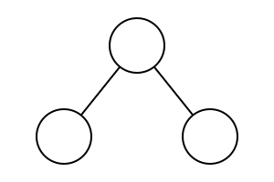
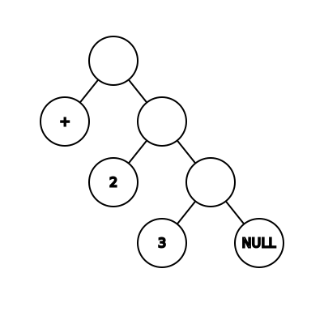
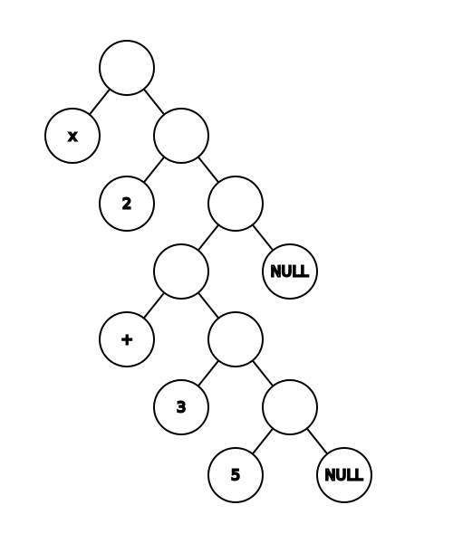
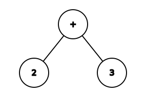

# Computability Part 9: LISP

In the [previous post](https://vladris.com/blog/2022/10/14/computability-part-8-lambda-calculus.html),
we covered lambda calculus, a computational model underpinning *functional
programming*. In this blog post, we'll continue down the functional programming
road and cover one of the oldest programming languages still in use: LISP.

LISP was originally specified in 1958 by John McCarthy and the paper describing
the language was published in 1960[^1]. It became very popular in AI research
and flavors of it are still in use today.

LISP has a quite unique syntax and execution model.

## S-expression

If we are going to talk about LISP, we need to start with *symbolic
expressions*. Symbolic expressions, or S-expressions, are defined as:

An S-expression is either

1. an atom, or
2. an expression of the form `(x . y)`

where `x` and `y` are S-expressions.

This very simple definition is very powerful: it allows us to represent any
binary tree. Let's start with a very simple universe where the only atom is
`()`, representing a null value. With this atom and the above definition, while
we can't (easily) represent data, we can capture the shape of a binary tree. For
example, the tree consisting of a root node and two leaf nodes:



can be represented as `(() . ())`.

The tree consisting of a root, a left leaf node, and a right node with two child
leaf nodes


would be `(() . (() . ()))`.

If we expand the definition of atom to include numbers and basic arithmetic
(`+`, `-`, `*`, `/`), we can represent arithmetic expressions as S-expressions.
`2 + 3`



can be represented as `(+ . (2 . (3 . ()))`.

`2 * (3 + 5)`



can be represented as `(* . (2 . ((+ . (3 . (5 . ()))) . ())`.

Note the S-expression definition only allows for "values" (atoms) at leaf nodes
of the tree. An S-expression is either a leaf node containing a value or a
non-leaf node with 2 S-expression children. That means we can't represent `2 +
3` as



but the representation we just saw is equivalent.

### Representing data

S-expressions can be used to represent data. Consider a simple list `1, 2, 3, 4,
5`. Much like we saw in the previous post when we looked at representing lists
as lambda expressions, we can represent lists using S-expressions using a head
and a tail (recursively):


can be viewed as


or `(1 . (2 . (3 . (4 . (5 . ())))))`.

We can also represent an associative array: instead of a value, we can represent
a key-value pair as an S-expression (`(key . value)`), so we can represent the
associative array `{ 1: 2, 2: 3, 3: 5 }` as `((1 . 2) . ((2 . 3) . ((3 . 5) .
())))`.

Historically, a non-atom S-expression in LISP is called a *cons cell* (from
"construction"). Instead of *head* and *tail*, LISP uses *car* and *cdr*
(standing for *contents of the address register* and *contents of the decrement
register*, which are artifacts of the computer architecture first flavors of
LISP were implemented in).

We just saw how we can represent trees, lists, and associative arrays using
S-expressions. But S-expressions aren't limited to representing data: we can
also use them to represent code.

### Representing code

We looked at how `2 + 3` would look like as an S-expression. In fact, we can
represent any function call as an S-expression, where the left node of the root
S-expression is the function to be called and the right subtree contains the
arguments.

`2 + 3` is equivalent to the function `add(2, 3)`. So we can represent the
function call `add(2, 3)` as the S-expression `(add . (2 . (3 . ())))`.

Note we can have any number of arguments as we grow the right subtrees: `sum(2,
3, 4, 5)` can be represented as `(sum . (2 . (3 . (4 . (5 . ())))))`. If we want
to pass the result of another function as an argument, say `sum(2, sum(3, 4),
5)`, we can represent this as `(sum . (2 . ((sum . (3 . (4 . ())) . 5)))`.

We saw in the previous post that we can represent pretty much anything using
functions. An if expression is a function `if(condition, true-branch,
false-branch)`. We can combine this with recursion to generate loops. So we have
all the building blocks for a Turing-complete system.

It turns out we can represent both data and code as S-expressions. Before
moving on to look at some implementation details, let's introduce some syntactic
sugar.

### Syntactic sugar

Writing S-expression like this can become tedious, so let's introduce some
syntactic sugar.  Instead of `(1 . (2 . (3 . (4 . (5 . ())))))`, we can write
`(1 2 3 4 5)`. We omit some of the parenthesis, the concatenation symbol `.`,
and the final `()`. By default, we concatenate on the right subtree. If we need
to go down the left subtree, we add parenthesis. So instead of representing the
associative array `{ 1: 2, 2: 3, 3: 5 }` as `((1 . 2) . ((2 . 3) . ((3 . 5) .
())))`, we can more succinctly represent it as `((1 2) (2 3) (3 5))`, without
losing any meaning.

Similarly, `(add . (2 . (3 . ())))` becomes `(add 2 3)` and `(sum . (2 . ((sum .
(3 . (4 . ())) . 5)))` becomes `(sum 2 (sum 3 4) 5)`.

In our implementation, we will represent S-expressions as lists which can
contain any number of elements. This is a more succinct representation and will
make our code easier to understand.

## Implementation

We can now look at implementing a small LISP. We take an input string, we parse
it into an S-expression, then we evaluate the S-expression and print the result.

First, the parser: we will take a string as input, split it into tokens, then
parse the tokens into an S-expression.

We will transform an input string into a list of tokens by matching it with
either `(`, `)`, or a string of alphanumeric characters. We'll use a regular
expression for this, then extract the matched values (using `match.group()`)
into a list:

``` python
import re

def lex(line):
    return [match.group() for match in re.finditer('\(|\)|\w+', line)]
```

We can now transform an input like `'(add 1 (add 2 3))'` into the list of tokens
`['(', 'add', '1', '(', 'add', '2', '3', ')', ')']` by calling `lex()` on it.

We need to transform this list of tokens into an S-expression. First, we need a
couple of helper functions. An atom can be either a number or a symbol. We'll
create one from a token using an `atom()` function:

``` python
def atom(value):
    try:
        return int(value)
    except:
        return value
```

The other helper function will yield while the head of our token list is
different than `)`, then pop the `)` token. We'll use this while parsing to
iterate over the tokens after a `(` and until we find the matching `)`:

``` python
def pop_rpar(tokens):
    while tokens[0] != ')':
        yield
    tokens.pop(0)
```

Parsing into an S-expression is now very simple:

* If we find a `(`, we recursively parse the following tokens until we reach
  the matching `)`.
* If we find a `)`, we raise an exception - this is an unmatched `)`.
* Otherwise we have an atom - we return the result of calling `atom()` on it.

``` python
def parse(tokens):
    match token := tokens.pop(0):
        case '(':
            return [parse(tokens) for _ in pop_rpar(tokens)]
        case ')':
            raise Exception('Unexpected )')
        case _:
            return atom(token)
```

That's it. If we parse the input string `'(add 1 (add 2 3))'` using our
functions - `parse(lex('(add 1 (add 2 3))'))` - we will get back
`['add', 1, ['add', 2, 3]]`.

We can now take text as input and convert it into the internal representation
we discussed.

The next step is to evaluate such an S-expression and return a result. We need
two pieces for this: an environment which stores built-in functions and
user-defined variables, and an evaluation function which takes an S-expression
and processes it using the environment.

We'll start with a simple environment with built-in support for equality,
arithmetic operations and list operations:

``` python
env = {
    # Equality
    'eq': lambda arg1, arg2: arg1 == arg2,

    # Arithmetic
    'add': lambda arg1, arg2: arg1 + arg2,
    'sub': lambda arg1, arg2: arg1 - arg2,
    'mul': lambda arg1, arg2: arg1 * arg2,
    'div': lambda arg1, arg2: arg1 / arg2,

    # Lists
    'cons': lambda car, cdr: [car] + cdr,
    'car': lambda list: list[0],
    'cdr': lambda list: list[1:],
}
```

Our evaluation function has a few special-case handling for variable
definitions, quotations, and if-expressions, and is otherwise pretty
straightforward:

``` python
def eval(sexpr):
    # If null or number atom, return it
    if sexpr == [] or isinstance(sexpr, int):
        return sexpr

    # If string atom, look it up in environment
    if isinstance(sexpr, str):
        return env[sexpr]

    match sexpr[0]:
        case 'def':
            env[sexpr[1]] = eval(sexpr[2])
        case 'quote':
            return sexpr[1]
        case 'if':
            return eval(sexpr[2]) if eval(sexpr[1]) else eval(sexpr[3])
        case call:
            return env[call](*[eval(arg) for arg in sexpr[1:]])
```

Our evaluation works like this:

* If we have an atom representing the empty list, we return it.
* If we have an atom that is a number, we'll return its value.
* If we have an atom that is a string (a symbol), we'll look it up in the
  environment and return what we find there.
* Otherwise we don't have an atom, rather an S-expression.
  * If the first symbol is `def`, we add a definition to the environment.
  * If the first symbol is `quote`, we return the second symbol unevaluated.
  * If the first symbol is `if`, we evaluate the second symbol and if it is
    truthy, we evaluate the third symbol, otherwise the fourth symbol.
  * If the first symbol doesn't denote a definition or an if expression, it
    is a function call: we grab the function from the environment,
    recursively evaluate all arguments, and pass them to the function.

We're taking a bit of a shortcut here and relying on Python's notion of
truthy-ness (e.g. `0` or an empty list `[]` is non-truthy). If needed, we can
enhance our implementation with Boolean support.

We can now implement a simple read-eval-print loop (REPL):

``` python
while line := input('> '):
    try:
        print(eval(parse(lex(line))))
    except Exception as e:
        print(f'{type(e).__name__}: {e}')
```

We can try a few simple commands (shown below with the corresponding output):

``` lisp
> (def a 40)
None
> (def b 2)
None
> (add a b)
42
> (if a 1 0)
1
> (add 2 (add 3 4))
9
> (def list (cons 1 (cons 2 (cons 3 ()))))
None
> (car list)
1
> (cdr list)
[2, 3]
```

### Custom functions

We can extend the environment with additional functions as needed. These
represent the "built-in" functions of our LISP interpreter. One capability we
are still missing is the ability to define custom functions at runtime. Let's
extend our interpreter to support that.

A function can take any number of arguments, which should become defined in
the environment while the function is executing but which don't exist outside
the function. For example, if we define an addition function as `add(x, y)`,
we should be able to refer to the `x` and `y` arguments inside the body of the
function but not outside of it. `x` and `y` only exist within the *scope* of
the function.

We can add scoping to our interpreter by extending our `eval` to take an
environment as an argument instead of always referencing our `env`. Then when
we create a new scope, we create a new environment to use.

For function definition, we will use the following syntax: `(deffun
function_name (arguments...) (body...))`. `deffun` denotes a function
definition. The second argument is the function name. The third is a list of
parameters and the fourth is the body of the function, which is going to be
evaluated in an environment where its arguments are defined.

We need a function factory:

``` python
def make_function(params, body, env):
    return lambda *args: eval(body, env | dict(zip(params, args)))
```

This takes the parameters, body, and environment and returns a lambda which
expects a list of arguments. Calling the lambda will invoke `eval` on the
body. Note we extend the environment with a dictionary mapping parameters to
arguments.

Let's update `eval` to use a parameterized environment and support the new
`deffun` function definition capability:

``` python
def eval(sexpr, env=env):
    # If number atom, return value
    if isinstance(sexpr, int):
        return sexpr

    # If string atom, look it up in environment
    if isinstance(sexpr, str):
        return env[sexpr]

    if sexpr == []:
        return []

    match sexpr[0]:
        case 'def':
            env[sexpr[1]] = eval(sexpr[2], env)
        case 'deffun':
            env[sexpr[1]] = make_function(sexpr[2], sexpr[3], env)
        case 'quote':
            return sexpr[1]
        case 'if':
            return eval(sexpr[2], env) if eval(sexpr[1], env) else eval(sexpr[3], env)
        case call:
            return env[call](*[eval(arg, env) for arg in sexpr[1:]])
```

Besides plumbing `env` through each `eval` call, we just added a `deffun` case where
we use our function factory.

We can run our REPL again and try out the new capability:

``` lisp
> (deffun myadd (x y) (add x y))
None
> (myadd 2 3)
5
```

Here is a Fibonacci implementation, using `deffun` and recursion:

``` lisp
> (deffun fib (n) (if (eq n 0) 0 (if (eq n 1) 1 (add (fib (sub n 1)) (fib (sub n 2))))))
None
> (fib 8)
21
```

If `n` is 0, return `0` else if `n` is 1, return `1`, else recursively call
`fib` for `n - 1` and `n - 2` and add the results.

We won't provide a proof of Turing-completeness but it should be obvious that
the capabilities we implemented so far are sufficient to emulate, for example,
a cyclic tag system like we did in the previous post with lambdas.

## Conclusions

The full implementation of our mini-LISP is [here](https://vladris.com/code/LISP/lisp.py).

Peter Norvig wrote a much more detailed article describing a LISP implementation
[here](https://norvig.com/lispy.html).

LISP is a very interesting language as it uses the same representation for both
data and code (for better or worse). Turns out binary trees (or trees if we use
our syntactic sugar) are enough to represent both.

As we just saw, a core LISP runtime is fairly easy to implement and many of the
more advanced features can be bootstrapped within the language itself.

Languages in the LISP family are called *LISP dialects*. Even though the
language is many decades old, modern dialects are alive and thriving. For
example Raket and Closure are LISP dialects.

## Summary

In this post we looked at LISP:

* S-expressions which describe binary trees.
* Representing data as S-expressions.
* Representing code as S-expressions.
* A simple LISP implementation including a lexer, parser, environment,
  evaluation function, and a REPL.
* Extending this with custom function definitions.

[^1]: Original paper: http://www-formal.stanford.edu/jmc/recursive.pdf.
