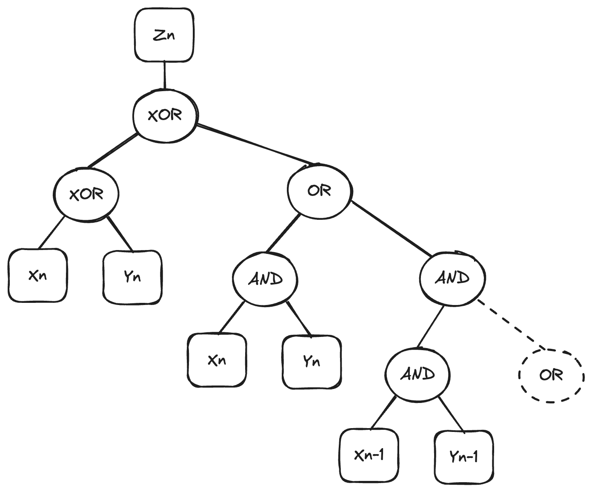

# Notes on Advent of Code 2024

I'm making this a tradition, as I wrote about [Advent of
Code](https://adventofcode.com/) during the past couple of years. This is the
10th year of Advent of Code!

All my solutions are on my GitHub [here](https://github.com/vladris/aoc). And
the standard disclaimer:

> **Disclaimer on my solutions**
>
> I use Python because I find it easiest for this type of coding. I treat
solving these as a write-only exercise. I do it for the problem-solving bit, so
I don't comment the code & once I find the solution I consider it done - I don’t
revisit and try to optimize even though sometimes I strongly feel like there is
a better solution. I don't even share code between part 1 and part 2 - once part
1 is solved, I copy/paste the solution and change it to solve part 2, so each
can be run independently. I also rarely use libraries, and when I do it's some
standard ones like `re`, `itertools`, or `math`. The code has no comments and is
littered with magic numbers and strange variable names. This is not how I
usually code, rather my decadent holiday indulgence. I wasn't thinking I will
end up writing a blog post discussing my solutions so I would like to apologize
for the code being hard to read.

I won't cover the first few days, as the first problems are always easy. The
first fun one for me this year has been part 2 of Day 12:

## Day 12: Garden Groups

Problem statement is [here](https://adventofcode.com/2024/day/12).

Part 1 was easy. I used a recursive algorithm like flood-fill to find the area
and perimeter of each garden. Keeping track of the squares already visited, we
add 1 to the area for this square then, if the north, east, south, or west
square has the same letter as the current one, we visit it recursively,
otherwise we add 1 to the perimeter (as we encountered a wall).

Part 2 was more interesting: we need to identify the number of sides rather than
the perimeter. A side is any contiguous boundary that can span multiple squares.
I tried to come up with the simplest way to tell how many sides an area has and
here is what I got: the number of sides is equal to the number of "corners", so
rather than counting sides, we can count how many times the the boundary takes a
corner.

For north-west, we have two cases in which we have a corner:

```text
XX   XA
XA   AA
```

If our square is `A`, if both north and sound are *not* `A`, we have a corner.
Alternately, if both north and west *are* `A` but north west is not, we also
have a corner.

All other permutations have the north east point be part of a segment or within
the area, not a corner:

```text
AA   XA   XX
AA   XA   AA
```

With this, we can compute how many of the four points around a square are
corners. Retrofitting this to the part 1 flood-fill algorithm, we can get, for
each area, the total surface and total number of corners.

## Day 13: Claw Contraption

Problem statement is [here](https://adventofcode.com/2024/day/13).

Part 1 was easy to brute-force, given the "at most 100 moves" constraint.

Part 2 can't be brute-forced. That said, the solution is very straight-forward:

$$
\left\{
\begin{aligned}
&X_A * i + X_B * j = X_{target} \\
&Y_A * i + Y_B * j = Y_{target}
\end{aligned}
\right.
$$

Here, $X_A$ and $Y_A$ are the X and Y offsets we get when pressing button A,
while $X_B$ and $Y_B$ are the offsets when pressing button B. Our target
coordinates are at $X_{target}$ and $Y_{target}$. So we just need to solve for
$i$ and $j$.

## Day 14: Restroom Redoubt

Problem statement is [here](https://adventofcode.com/2024/day/14).

Part 1 was again easy, just simulate 100 moves for each robot and figure which
quadrant they end up in.

Part 2 was surprising, I was expecting something like instead of 100 moves,
simulate some million moves. I didn't really solve finding the easter egg
algorithmically. Rather I advanced the robots step by step and displayed the
results. I noticed they tend to cluster at certain steps - for my input it was
33, 136, 239 etc. They didn't quite form a picture but I figured I can just look
at steps $33 + n103$ to find the easter egg, and indeed after a number of
iterations the robots formed a picture!

## Day 15: Warehouse Woes

Problem statement is [here](https://adventofcode.com/2024/day/15).

Part 1 was very easy.

Part 2 was a bit more tedious. For pushing boxes around horizontally, same code
as part 1 work, but for vertical pushes, we need to account for wider boxes. I
implemented two functions for this, first one just tells us if a move is
possible:

```python
def can_move(i, j, d):
    if grid[i + d][j] == ".":
        return True
    if grid[i + d][j] == "]":
        return can_move(i + d, j - 1, d) and can_move(i + d, j, d)
    if grid[i + d][j] == "[":
        return can_move(i + d, j, d) and can_move(i + d, j + 1, d)
    return False
```

`can_move()` recurses until it either finds a free `.` spot for everything that
needs pushing or until it hits a wall, in which case a move is not possible. The
`d` argument is the direction, since the only difference between going up and
down is whether we subtract 1 or add 1 to the row `i`.

If a move is possible, then we can update the grid like this:

```python
def do_move(i, j, d):
    if grid[i][j] == ".":
        return
    elif grid[i][j] == "[":
        do_move(i + d, j, d)
        do_move(i + d, j + 1, d)
        grid[i + d][j], grid[i + d][j + 1] = "[", "]"
        grid[i][j], grid[i][j + 1] = ".", "."
    elif grid[i][j] == "]":
        do_move(i + d, j - 1, d)
        do_move(i + d, j, d)
        grid[i + d][j - 1], grid[i + d][j] = "[", "]"
        grid[i][j - 1], grid[i][j] = ".", "."
    elif grid[i][j] == "@":
        do_move(i + d, j, d)
        grid[i + d][j] = "@"
        grid[i][j] = "."
```

Not the most pretty but it does the job: if we're on an empty spot `.`, we stop.
Otherwise if we're on a half of a box, we recursively move up the row above (or
below), then shift the box and replace it with empty space. Only other option is
we're on the `@`, in which case we also shift it and replace it with empty
space.

## Day 16: Reindeer Maze

Problem statement is [here](https://adventofcode.com/2024/day/16).

For the first part, I used a queue and kept track at each step of the best score
found so far for the given coordinates + heading. At each step, we can move 1
square towards our heading or rotate 90 degrees, changing our heading. This will
find the best score with which we can reach the destination.

```python
s_i, s_j = len(grid) - 2, 1
e_i, e_j = 1, len(grid[0]) - 2

visited, best, queue = {}, 10 ** 9, [(s_i, s_j, "E", 0)]
while queue:
    i, j, heading, score = queue.pop(0)
    if grid[i][j] == "#":
        continue

    if (i, j, heading) in visited and visited[(i, j, heading)] <= score:
        continue

    visited[(i, j, heading)] = score

    if i == e_i and j == e_j:
        if score < best:
            best = score
        continue

    match heading:
        case "E":
            queue.append((i, j, "N", score + 1000))
            queue.append((i, j, "S", score + 1000))
            queue.append((i, j + 1, heading, score + 1))
        case "N":
            queue.append((i, j, "W", score + 1000))
            queue.append((i, j, "E", score + 1000))
            queue.append((i - 1, j, heading, score + 1))
        case "W":
            queue.append((i, j, "N", score + 1000))
            queue.append((i, j, "S", score + 1000))
            queue.append((i, j - 1, heading, score + 1))
        case "S":
            queue.append((i, j, "W", score + 1000))
            queue.append((i, j, "E", score + 1000))
            queue.append((i + 1, j, heading, score + 1))
```

For part 2, my solution ended up quite long. I didn't want to update change the
traversal algorithm from part 1. Rather, I figured we can re-construct the best
paths starting from the end and looking at the visited squares we've been
keeping track of: if, for example, we are at coordinates `i`, `j`, and heading
`"N"` (north) with a score of `S`, then if the score we have for `(i - 1, j,
"N")` is `S - 1`, then the square at `i - 1`, `j` (with heading `N`) is also
part of the best path. Similarly, if `(i, j, "E")` or `(i, j "W")` had score `S
- 1000`, then turning is also part of the best path.

We already have all the scores in `visted`, so I reconstructed the best paths by
backtracking from the end:

```python
path = set()
def backtrack(i, j, heading, score):
    path.add((i, j))
    
    if i == s_i and j == s_j and heading == "E" and score == 0:
        return
    
    match heading:
        case "E":
            if (i, j, "N") in visited and visited[(i, j, "N")] == score - 1000:
                backtrack(i, j, "N", score - 1000)
            if (i, j, "S") in visited and visited[(i, j, "S")] == score - 1000:
                backtrack(i, j, "S", score - 1000)
            if (i, j - 1, "E") in visited and visited[(i, j - 1, "E")] == score - 1:
                backtrack(i, j - 1, "E", score - 1)
        case "N":
            if (i, j, "W") in visited and visited[(i, j, "W")] == score - 1000:
                backtrack(i, j, "W", score - 1000)
            if (i, j, "E") in visited and visited[(i, j, "E")] == score - 1000:
                backtrack(i, j, "E", score - 1000)
            if (i + 1, j, "N") in visited and visited[(i + 1, j, "N")] == score - 1:
                backtrack(i + 1, j, "N", score - 1)
        case "W":
            if (i, j, "N") in visited and visited[(i, j, "N")] == score - 1000:
                backtrack(i, j, "N", score - 1000)
            if (i, j, "S") in visited and visited[(i, j, "S")] == score - 1000:
                backtrack(i, j, "S", score - 1000)
            if (i, j + 1, "W") in visited and visited[(i, j + 1, "W")] == score - 1:
                backtrack(i, j + 1, "W", score - 1)
        case "S":
            if (i, j, "W") in visited and visited[(i, j, "W")] == score - 1000:
                backtrack(i, j, "W", score - 1000)
            if (i, j, "E") in visited and visited[(i, j, "E")] == score - 1000:
                backtrack(i, j, "E", score - 1000)
            if (i - 1, j, "S") in visited and visited[(i - 1, j, "S")] == score - 1:
                backtrack(i - 1, j, "S", score - 1)


backtrack(e_i, e_j, best[0], best[1])
```

This is not the prettiest implementation but after running this, the length of
`path` gives us the solution. Some of this can be condensed: if we're heading
either `"E"` or `"W"`, we can only change heading to `"N"` or `"S"` etc., but
GitHub Copilot was very good at filling in all the different cases, so I just
went with it.

## Day 17: Chronospatial Computer

Problem statement is [here](https://adventofcode.com/2024/day/17).

The first part was easy, just simulate the machine and execute the instructions.

The second part was a lot more fun. It was clear it's too hard to brute-force,
so I had to spend some time analyzing the program itself. For my input, it
looked like this:

```text
bst @A
bxl 1
cdv @B
bxc
bxl 4
adv 3
out @B
jnz 0
```

In other words:

```text
B <- A % 8 (last 3 bits of A)
B <- B XOR 1
C <- A >> B
B <- B XOR C
B <- B XOR 4
A <- A >> 3 (right-shift A 3 bits)
OUT <- B % 8 (last 3 bits of B)
JNZ 0 (repeat until A is 0)
```

The key takeaways from this are:

* Each step consumes the last 3 bits of register A
* ...which means B is between 0 and 7
* ...which C is A right-shifted by at most 7 bits
* ...then B gets XORed with 4 and C
* ...and we print its last 3 bits

At most the last 10 bits of A are relevant to producing an output (since C is A
right-shifted by at most 7 bits and XORed with B which comes out of the last 3
bits of A).

I implemented a function that takes a value of register A and prints the output
after one iteration:

```python
def step(a):
    b = a % 8
    b = b ^ 1
    c = a // 2 ** b
    b = b ^ c
    b = b ^ 4
    return b % 8
```

We search for the solution in groups of 3 bits:

* We find all permutations of 10 bits that produce the output number we want
* We prepend the last 3 bits to our solution
* We recursively look for the values that produce the next 3 bits but we keep
  the remaining 7 bits from this step as a suffix we expect the next iteration
  to have

So if we find that, say `b1000101010` outputs the first number we want, `4`, we
store the last 3 bits (`010`) as part of our solution but also expect numbers at
the next step to end with `1000101`.

Once we find all numbers in the program this way, we make sure the suffix is 0
(we shouldn't be expecting more digits as we should terminate the program), and
we found a solution. We can keep track of which of the solutions we found is the
smallest one. The whole search function is here:

```python
best = 10 ** 20
def search(i=0, valid_suffix=None, n=0):
    global best
    if i == len(prog):
        if valid_suffix == 0:
            best = min(best, n)
        return

    for x in range(1024):
        if valid_suffix is not None and x & (2 ** 7 - 1) != valid_suffix:
            continue

        if step(x) == prog[i]:
            search(i + 1, x >> 3, ((x % 8) << (3 * i)) + n)
```

`prog` contains the program instructions - the numbers we are searching for. If
we found all of them, `valid_suffix` should be 0, otherwise we don't have a
solution as our program will continue running and producing more output. We
convert `n` from a binary string to a number, and store the minimum we found so
far in `best`.

Otherwise we produce all permutations of 10 bits, which means counting to 1024.
If we have a `valid_suffix` we need to respect, we filter out values that don't
match the suffix. Next, we check if running a step of the program on these 10
bits produces the number we want. If so, we found the next 3 bits of our
solution, we recurse, looking for the next number (`i + 1`), setting the most
significant 7 bits of x as the expected suffix (`x >> 3`), then we prepend the
last 3 bits of x to the number we found so far (the math there just makes sure
we prepend it to `n`: `((x % 8) << (3 * i)) + n` shifts the last 3 digits we
found enough to go in front of `n`).

This problem was fun, as I had to reverse-engineer the program to figure out an
efficient way to search for the solution.

## Day 18: RAM Run

Problem statement is [here](https://adventofcode.com/2024/day/18).

This one was easy. The first part is another maze traversal, very much like day
16.

The second part is also easy: we keep adding bytes to the memory one by one and
check that the exit is still reachable. At some point, it stops being reachable
and we found our solution. As long as traversal is efficient, it's no problem
running it multiple times. Unlike part 1, we don't even need to find the
shortest path, just whether the exit can be reached or not.

## Day 19: Linen Layout

Problem statement is [here](https://adventofcode.com/2024/day/19).

Another surprisingly easy one. For part 1, the only gotcha is the input has much
larger sequences than the example, so trying all permutations would take a long
time unless we use memoization. Once we match a pattern suffix, we keep track of
whether we matched it or not. With this, the solution is just a few lines of
code:

```python
matched = {"": True}

def match(pattern):
    if pattern not in matched:
        matched[pattern] = any(match(pattern[len(towel):]) for towel in towels if pattern.startswith(towel))

    return matched[pattern]


print(sum(match(pattern) for pattern in patterns))
```

Here, `towels` is the list of available towels, and `patterns` is the list of
patterns to produce.

Part 2 asks us to count all possible combinations that produce a pattern rather
than just whether we can or cannot produce it. We can get this with minimal
modifications to the part 1 solution: we consider matching `""` to be `1`, and
instead of `any()`, we use `sum()` in the recursive function:

```python
matched = {"": 1}

def match(pattern):
    if pattern not in matched:
        matched[pattern] = sum(match(pattern[len(towel):]) for towel in towels if pattern.startswith(towel))

    return matched[pattern]


print(sum(match(pattern) for pattern in patterns))
```

This counts all possible combinations.

## Day 20: Race Condition

Problem statement is [here](https://adventofcode.com/2024/day/20).

This was another surprisingly easy one. Since there is a single path through the
maze without cheating, my approach was to first determine how far away each
point that is not a wall is from the exit:

```python
dist, at = {end: 0}, end
while at != start:
    i, j = at
    if (i - 1, j) not in dist and grid[i - 1][j] != "#":
        dist[(i - 1, j)] = dist[at] + 1
        at = (i - 1, j)
    elif (i + 1, j) not in dist and grid[i + 1][j] != "#":
        dist[(i + 1, j)] = dist[at] + 1
        at = (i + 1, j)
    elif (i, j - 1) not in dist and grid[i][j - 1] != "#":
        dist[(i, j - 1)] = dist[at] + 1
        at = (i, j - 1)
    else:
        dist[(i, j + 1)] = dist[at] + 1
        at = (i, j + 1)
```

Traversal is easy: starting from the exit point, there should always be a single
not visited space we can go to next. Once we have this, the solution is easy.
For each `(i, j)` we can be on, meaning the keys of `dist`, we check if `(i - 2,
j)`, `(i, j - 2)` etc. are in `dist` too (so all places we can get to in two
steps, ignoring walls). If any of the new coordinates are also in `dist`, we
check if we have indeed a shortcut: `dist[(i, j)] - dist[(i + dx, j + dy]) -
2 >= 100`. That is, the distance at `(i, j)` minus the distance at the end of
the cheat `(i + dx, j + dy)` minus `2` for the two steps we take while cheating
is greater than 100. Here, `(dx, dy)` is any of `[(-2, 0), (0, -2), (2, 0), (0,
2), (-1, -1), (-1, 1), (1, -1), (1, 1)]`.  Counting these gives us all the
cheats:

```python
shortcuts = 0

def cheat(i, j, dx, dy):
    global shortcuts
    if (i + dx, j + dy) in dist and dist[(i + dx, j + dy)] < dist[(i, j)] - 2:
        d = dist[(i, j)] - dist[(i + dx, j + dy)] - 2
        if d >= 100:
            shortcuts += 1


for i, j in dist:
    for (dx, dy) in [(-2, 0), (2, 0), (0, -2), (0, 2), (-1, -1), (-1, 1), (1, -1), (1, 1)]:
        cheat(i, j, dx, dy)

```

Part 2 is not much more difficult. We can now cheat for up to 20 steps rather
than just 2. That means instead of the hardcoded list of `(dx, dy)` we
considered at step 1, we instead need to look for all coordinates `(si, sj)`
that are also in `dist`, with a Manhattan distance of at most 20 from `(i, j)`.
I implemented a function that gives us all the candidates:

```python
def candidates(i, j):
    for si, sj in dist:
        if si == i and sj == j:
            continue
        if abs(si - i) + abs(sj - j) <= 20:
            yield si, sj
```

With this, we can update the algorithm from part 1 as follows:

```python
shortcuts = 0
for i, j in dist:
    for si, sj in candidates(i, j):
        d = dist[(i, j)] - dist[(si, sj)] - (abs(si - i) + abs(sj - j))
        if d >= 100:
            shortcuts += 1
```

This will gives us all the cheats for part 2.

## Day 21: Keypad Conundrum

Problem statement is [here](https://adventofcode.com/2024/day/21).

This was a bit tedious, but fun. It was the first one this year that took me a
bit longer to solve. I solved this bottom-up, so there might be a more concise
solution, but this is what I got: for part 1, I first represented the two types
of keypads as graphs:

```python
num_pad = {
    "A": { "<": "0", "^": "3" },
    "0": { ">": "A", "^": "2" },
    "1": { "^": "4", ">": "2"},
    "2": { "<": "1", "^": "5", ">": "3", "v": "0" },
    "3": { "<": "2", "^": "6", "v": "A" },
    "4": { "^": "7", ">": "5", "v": "1" },
    "5": { "<": "4", "^": "8", ">": "6", "v": "2" },
    "6": { "<": "5", "^": "9", "v": "3" },
    "7": { ">": "8", "v": "4" },
    "8": { "<": "7", ">": "9", "v": "5" },
    "9": { "<": "8", "v": "6" },
}

dir_pad = {
    "^": { ">": "A", "v": "v" },
    "A": { "<": "^", "v": ">" },
    "<": { ">": "v" },
    "v": { "<": "<", "^": "^", ">": ">" },
    ">": { "<": "v", "^": "A" }
}
```

Note I used an *edge-to-node* representation. Then I wrote a function to
computed all possible paths in a given graph between two nodes:

```python
def paths(i, dest, result, graph, visited, path):
    if i == dest:
        result.append("".join(path) + "A")
        return

    visited.add(i)

    for direction, next_i in graph[i].items():
        if next_i in visited:
            continue
        
        visited.add(next_i)
        path.append(direction)
        
        paths(next_i, dest, result, graph, visited, path)
        
        visited.remove(next_i)
        path.pop()
```

The result is accumulated in the `result` parameter. With this, I generated all
possible paths between any two nodes in both graphs:

```python
def map_path(graph):
    path_map = {}
    for k1 in graph:
        for k2 in graph:
            if k1 == k2:
                path_map[(k1, k2)] = ["A"]
                continue

            result = []
            paths(k1, k2, result, graph, set(), [])
            path_map[(k1, k2)] = result
    return path_map


num_pad_moves = map_path(num_pad)
dir_pad_moves = map_path(dir_pad)
```

The `map_path()` function generates all possible paths between any combination
of nodes. I stored the results in `num_pad_moves` and `dir_path_moves` for the
number pad and the directions pad.

The main gotcha of this problem is we can't brute force all possible
combinations of, say, going from `9` to `0` on the number pad, as each level
has, in turn, different ways to produce a working combination. This blows up
fast.

Also, the shortest path at one level might not be the shortest one at the next
level. For example, a path like `<<<` at the higher level pad translates into
navigating the lower level to `<` then pressing `A` 3 times. If the lower level
keys are further apart, the higher level requires more presses to get there, so
we also can't just look at the shortest path at the lower level to figure out
the best solution for the higher level.

On the other hand, I realized that once we do know at the next higher level how
to best get the lower level from one key to another, we don't need to recompute
that. So if, say, the second robot needs to get from `<` to `>`, the robot one
level above can always use the same optimal combination of key presses to get it
to do so. The search space for this is actually quite small. So I started with
the highest level, the best combinations of keys I can press to get the robot
one level below to go from any key to any other key:

```python
best_moves = {
    1: { (k1, k2): min(dir_pad_moves[(k1, k2)], key=len) for k1, k2 in dir_pad_moves }
}
```

These are the best moves for level 1, the robot right below. Then I implemented
a function which, given a pair of nodes and a depth level, returns the best
(shortest) combination of keys:

```python
def sequence(k1, k2, depth, graph=dir_pad_moves):
    best, best_len = None, 10 ** 10
    for path in graph[(k1, k2)]:
        if len(k := "".join(best_moves[depth][p] for p in zip("A" + path, path))) < best_len:
            best, best_len = k, len(k)
    return best
```

For each path we can take between nodes `k1` and `k2` in our graph, we look at
what is the concatenation of the best moves we can take at that level. We return
the shortest result. I'm prepending an `"A"` to the path here, as we always
start from atop the `"A"` key on any keypad.

Now we can use the `best_moves` for level 1 to populate the best moves for level
2, then do level 3 the same way:

```python
best_moves[2] = {(k1, k2): sequence(k1, k2, 1, dir_pad_moves) for k1, k2 in dir_pad_moves}
best_moves[3] = {(k1, k2): sequence(k1, k2, 2, num_pad_moves) for k1, k2 in num_pad_moves}
```

Now `best_moves[3]` contains the shortest path (in terms of key presses at the
highest level) to go between any two keys. We can easily produce the value we
need from there:

```python
total = 0
for code in codes:
    result = "".join(best_moves[3][pair] for pair in zip("A" + code, code))
    total += len(result) * int(code[:-1])
```

For part 2, I first thought of simply scaling out the solution to part 1 -
instead of computing `best_moves` 3 levels deep, do it 26 levels deep. This
should theoretically work, but it blows up the memory because we're dealing with
larger and larger sequences of keypresses. I realized we don't actually care
about the strings themselves, rather we just need the lengths for our result.

I modified the part 1 code to just look at lengths. `best_moves` is now
initialized with the minimum path length rather than just the path:

```python
best_moves = {
    1: { (k1, k2): len(min(dir_pad_moves[(k1, k2)], key=len)) for k1, k2 in dir_pad_moves }
}
```

`sequence()` now assumes `best_moves` contains lengths and returns a length
itself:

```python
def sequence(k1, k2, depth, graph=dir_pad_moves):
    best = 10 ** 20
    for path in graph[(k1, k2)]:
        if (k := sum(best_moves[depth][p] for p in zip("A" + path, path))) < best:
            best = k
    return best
```

Now we can scale out building `best_moves` up to 26 levels:

```python
for i in range(2, 26):
    best_moves[i] = {(k1, k2): sequence(k1, k2, i - 1, dir_pad_moves) for k1, k2 in dir_pad_moves}
best_moves[26] = {(k1, k2): sequence(k1, k2, 25, num_pad_moves) for k1, k2 in num_pad_moves}
```

With this, we can get the solution the same way we did in part 1. Note the same
solution would've worked for part 1. Strings are not needed at all, it just took
me until part 2 to realize this.

This was a neat problem. The part I found tedious was generating the keypad
graphs and computing the possible paths between nodes. But outside of that, I
really enjoyed it. Both parts had an "aha" moment for me, which is my favorite
part of Advent of Code and puzzles in general.

## Day 22: Monkey Market

Problem statement is [here](https://adventofcode.com/2024/day/22).

This one was very easy, as I was able to brute force the solution for both part
1 and part 2. For part 1, with the set up of multiplying, XORing, and modulo, I
was thinking I'll have to derive some formula to speed up computation, but that
wasn't the case. I got the results reasonably fast without having to do anything
clever. I implemented this function to advance a number one step:

```python
def step(n):
    n = ((n * 64) ^ n) % 16777216
    n = ((n // 32) ^ n) % 16777216
    n = ((n * 2048) ^ n) % 16777216
    return n
```

Then getting the result was straightforward:

```python
total = 0
for n in nums:
    for _ in range(2000):
        n = step(n)
    total += n
```

I was expecting part 2 will maybe introduce larger numbers (like instead of 2000
iterations, do 2000000) but no. I have a solution that runs in under 1 minute
and gets the correct result. First, I updated the step function to also return
the change in the least significant digit between the old value and the new
value, plus 9 (more on the plus 9 below):

```python
def step(n):
    d = n % 10
    n = ((n * 64) ^ n) % 16777216
    n = ((n // 32) ^ n) % 16777216
    n = ((n * 2048) ^ n) % 16777216
    return n, n % 10 - d + 9
```

Then, for each initial number, I generate the next 2000 numbers, track the
sequence given by the 4 changes, and the value we would get if the monkey would
buy this sequence for this number:

```python
buys, seq = {}, set()
for i, n in enumerate(nums):
    buys[i] = {}
    n, d1 = step(n)
    n, d2 = step(n)
    n, d3 = step(n)
    change = d1 * 19 ** 2 + d2 * 19 + d3
    for _ in range(1997):
        n, d = step(n)
        change = (change % 19 ** 3) * 19 + d
        seq.add(change)
        if change not in buys[i]:
            buys[i][change] = n % 10
```

Since the first 3 numbers don't have a sequence (we need 4 changes), I hoisted
these out of the loop. That's the first 3 calls to `step()`. The change between
2 numbers can be any value between -9 and 9. If the previous digit is 9 and the
current one is 0, the change is -9. If the previous digit is 0 and the current
one is 9, the change is 9. Instead of keeping track of 4 different numbers, we
can encode the sequence into a single number. There are 18 possible values
between -9 and 9, so if we add 9, we get a number between 0 and 18. This way, we
can uniquely encode 4 digits as $d_1 * 19^3 + d_2 * 19^2 + d_3 * 19 + d_4$.

I'm storing this in `change`. At each step, we get rid of the oldest change by
getting the modulo $19^3$ of the value, then we multiply by 19 and add the new
change. If we haven't seen `change` before for this buyer, we store the last
digit of `n` in `buys[i][change]` where `i` is the index of the buyer, `change`
is the sequence.

After executing this, `buys` will contain all possible values for all possible
sequences for each buyer. As a small optimization trading off memory for speed,
I'm also storing all sequences we've seen in the `seq` set.

To produce the result, we can simply try each sequence from `seq` and add up the
values we get for each buyer:

```python
best = 0
for s in seq:
    total = 0
    for i in range(len(nums)):
        if s in buys[i]:
            total += buys[i][s]
    best = max(total, best)
```

Without the optimization, we can simply try all possible sequences, which is up
to $19^4$.  It's a large number (130321), but not astronomical. With the
optimization, for my input, we only need to try 40951 values.

As I said, this solves the problem in less than a minute. There's probably a
smarter, faster solution, but brute force was good enough here.

## Day 23: LAN Party

Problem statement is [here](https://adventofcode.com/2024/day/23).

This one was easy. For both parts 1 and 2, I represented the connections as an
undirected graph. Starting with the connected pairs:

```python
graph = {}
for pair in pairs:
    if pair[0] not in graph:
        graph[pair[0]] = set()
    graph[pair[0]].add(pair[1])

    if pair[1] not in graph:
        graph[pair[1]] = set()
    graph[pair[1]].add(pair[0])
```

Then for part 1, I generated all combinations of 3 nodes (using `itertools`) and
checked whether all 3 nodes are connected if one of them starts with "t":

```python
total = 0
for group in itertools.combinations(graph.keys(), 3):
    if group[0][0] != "t" and group[1][0] != "t" and group[2][0] != "t":
        continue
    if group[1] in graph[group[0]] and group[2] in graph[group[0]] and group[2] in graph[group[1]]:
        total += 1
```

For the second part, I implemented a helper function that checks whether all
nodes in an arbitrarily long group are connected:

```python
def all_connected(group):
    for i in range(len(group)):
        for j in range(i + 1, len(group)):
            if group[i] not in graph[group[j]]:
                return False
    return True
```

Then I simply generated all possible combinations, keeping track of the largest
group:

```python
best = []
for k in graph:
    subsets = [combo for r in range(len(best), len(graph[k]) + 1) for combo in itertools.combinations(graph[k], r)]
    for subset in subsets:
        if all_connected([k] + list(subset)):
            best = [k] + list(subset)
```

## Day 24: Crossed Wires

Problem statement is [here](https://adventofcode.com/2024/day/24).

For part 1, I preloaded the values of `x` and `y` wires in a dictionary:

```python
vals, gates = open("input").read().split("\n\n")

calc = {line.split(": ")[0]: int(line.split(": ")[1]) for line in vals.split("\n")}
```

Then I implemented a function to recursively compute the value of a gate:

```python
def get_val(v):
    if not isinstance(calc[v], int):
        match calc[v][1]:
            case "AND":
                calc[v] = get_val(calc[v][0]) & get_val(calc[v][2])
            case "OR":
                calc[v] = get_val(calc[v][0]) | get_val(calc[v][2])
            case "XOR": 
                calc[v] = get_val(calc[v][0]) ^ get_val(calc[v][2])
    return calc[v]
```

If we already have an int in the dictionary, return that. Otherwise we
recursively get the value of the inputs. Then I loaded the gates into `calc` as
tuples of `(wire, gate type, wire)` - this is what `get_value()` expects.

```python
for gate in gates.split("\n"):
    expr, to = gate.split(" -> ")
    calc[to] = expr.split(" ")
```

To get the final number, we start with all the `z` wires, reverse sorted, and
build up the result from there:

```python
total = 0
for z in sorted(filter(lambda val: val.startswith("z"), calc), reverse=True):
    total <<= 1
    total |= get_val(z)
```

Part 2 was more difficult. This one took me longest to solve out of all problems
in the event. In fact, I got to the solution doing some ad-hoc exploration,
before I had an algorithm that produces it. The key observation was that for any
$z_n$, the wire configuration to determine whether it is 0 or 1 looks like this:



Realizing this, I solved the problem by checking whether the wires have the
right shape. For part 2, I represented the input wires `x` and `y` as their
names:

```python
calc = {f"x{i:02}": f"x{i:02}" for i in range(45)} | {f"y{i:02}": f"y{i:02}" for i in range(45)}
```

The values don't matter in this part. Then the rest of the graph as tuples, this
time ordered to make things easier:

```python
for gate in gates.split("\n"):
    expr, to = gate.split(" -> ")
    calc[to] = sorted(expr.split(" "))
```

So the gate `x01 AND y01 -> gcq` would be represented as `calc[gcq] = ("AND",
"x01", "y01")`.

I implemented a few helper functions. First one checks that for the given key,
we have the exact operation between $x_n$ and $y_n$:

```python
def op_n(key, op, n):
    return calc[key] == [op, f"x{n:02}", f"y{n:02}"]
```

So `op_n("gcq", "AND", 1)` would return `True`. Then I implemented a couple of
search functions.

```python
def find_key(value):
    for key in calc:
        if calc[key] == value:
            return key


def find_subtree(root_op, op, n):
    for key in calc:
        if calc[key][0] == root_op and (op_n(calc[key][1], op, n) or op_n(calc[key][2], op, n)):
            return key
```

`find_key` simply finds the key for a given value in `calc`. The second one is
more interesting: it looks for a subtree with the `root_op` operation at the
root, then either on its left or right branch, the `op` operation between $x_n$
and $y_n$. This would help us find subtrees matching known shapes. For example,
if I know `z05` starts with an `XOR` gate then one of its inputs is another
`XOR` gate for `x05` and `y05`, I can retrieve the key `z05` by calling
`find_subtree("XOR", "XOR", 5)`.

Next, I implemented functions to check parts of the tree, making sure it has the
expected shape. If the shape is not what we expect, we identified a swapped
wire. Then we can use one of the above search function to find the right wire
and correct the mistake. These checking functions either don't return anything,
or return a pair of wires that should be swapped.

From the top, the function to check a `z` has the right shape is:

```python
    if n == 0:
        if calc["z00"] != ["XOR", "x00", "y00"]:
            return "z00", find_key(["XOR", "x00", "y00"])
        else:
            return
    if n == 45:
        return check_or(f"z45", n - 1)

    z = calc[f"z{n:02}"]
    if z[0] != "XOR":
        return f"z{n:02}", find_subtree("XOR", "XOR", n)

    if op_n(z[1], "XOR", n):
        return check_or(z[2], n - 1)
    elif op_n(z[2], "XOR", n):
        return check_or(z[1], n - 1)
    else:
        if check_or(z[1], n - 1) is None:
            return z[2], find_key(["XOR", f"x{n:02}", f"y{n:02}"])
        else:
            return z[1], find_key(["XOR", f"x{n:02}", f"y{n:02}"])
```

First we handle a couple of special cases. If `n` is 0, we don't have a carry,
if `n` is 45, we don't have an `XOR` at the root since $z_{45}$ doesn't have
corresponding $x_{45}$ and $y_{45}$. Special cases aside, we check whether we
have an `XOR` at the root. If not, we have an issue here. We need to find the
subtree with two `XOR`s.

If we do have an `XOR` at the root, we check whether the left or right branch is
`XOR` between $x_n$ and $y_n$. If it is, we move on to check the carry subtree
by calling `check_or` (implementation below). If it isn't we have an issue here.
We search for the correct subtree and return.

Using the same idea, we check the subtrees for the carry rooted at `OR` and at
`AND`:

```python
def check_or(key, n):
    if n == 0:
        if not op_n(key, "AND", 0):
            return key, find_key(["AND", f"x00", f"y00"])
        return

    if calc[key][0] != "OR":
        return key, find_subtree("OR", "AND", n)

    if op_n(calc[key][1], "AND", n):
        return check_and(calc[key][2], n)
    elif op_n(calc[key][2], "AND", n):
        return check_and(calc[key][1], n)
    else:
        return key, find_key(["AND", f"x{n:02}", f"y{n:02}"])


def check_and(key, n):
    if calc[key][0] != "AND":
        return key, find_subtree("AND", "XOR", n)

    if op_n(calc[key][1], "XOR", n):
        return check_or(calc[key][2], n - 1)
    elif op_n(calc[key][2], "XOR", n):
        return check_or(calc[key][1], n - 1)
    else:
        return key, find_key(["XOR", f"x{n:02}", f"y{n:02}"])
```

Then to produce the solution, we check each `z` in turn, and if `check_z`
returns two key, we add them to our result, swap their values, and continue:

```python
result = []
for i in range(46):
    if (check := check_z(i)) is not None:
        x, y = check
        result += [x, y]
        calc[x], calc[y] = calc[y], calc[x]

```

After running this, we end up with the 8 keys we need in `result`.

This problem was really fun, as I had to do a bunch of exploration of the tree
shapes and of the input to come up with the solution. This only works because
all the gates conform to this shape. I can think of wiring that would still
produced the desired result but not respect this shape, in which case my
solution wouldn't work. For example, introduce somewhere an `OR` node with one
of the input wires being a value `XOR`ed with itself. That wouldn't change the
evaluation result, as the value `XOR`ed with itself would always be 0, so
whatever  the other input is, `OR`ing it with 0 would keep it unchanged. That
said, it seems all inputs were shape-conforming so checking parts of their
subtree did the trick.

## Day 25: Code Chronicle

Problem statement is [here](https://adventofcode.com/2024/day/25).

Without converting the keys and locks to numbers, we simply need to check if any
two schematics have a `#` in any one position:

```python
def overlap(s1, s2):
    for l1, l2 in zip(s1, s2):
        for c1, c2 in zip(l1, l2):
            if c1 == "#" and c2 == "#":
                return True
    return False
```

Here, `s1` and `s2` are schematics represented by arrays of strings. We don't
even care to separate the schematics into keys and locks, since all keys overlap
with each other on the bottom row and all locks overlap with each other on the
top row.

We check all pairs of schematics and count the ones which don't overlap to get
our solution:

```python
total = 0
for i in range(len(schematics)):
    for j in range(i + 1, len(schematics)):
        if not overlap(schematics[i], schematics[j]):
            total += 1
```

I found this year's problems to be easier than prior years. The most difficult
one for me by far was part 2 of day 24. The second one that took me a bit longer
was part 2 of day 21. I was a bit disappointed that I was able to brute-force
the solution to some of the later days. That said, it was all good fun. I always
enjoy Advent of Code and hope the tradition continues for many more decades!
