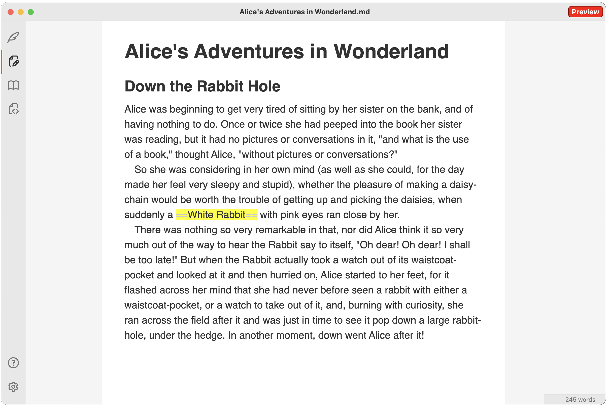

# DevLog 1: Flow

I wrote about [authoring tools](https://vladris.com/blog/2024/12/07/notes-on-authoring-tools.html) last year and my side project of building an editor. I am now happy to announce the preview release of [Flow](https://saturn9.studio/flow/), a creative writing app.

## MVP

Flow is at MVP state currently, with a bunch of features that I am planning to add later on. The public roadmap is [here](https://saturn9.studio/flow/roadmap/). It does have the basics though: Markdown support with markup hiding when not under the cursor, a full-screen distraction-free mode, automatic file saving, theming, and word count. This is pretty much what I need for a creative writing session, and I hope other authors will find it inspiring too.

It also includes a couple of unique features: a special `***` horizontal rule that gets rendered as a centered `∵` and automatic indentation of paragraphs. This will automatically make the text resemble a print book, which I'm hoping will help with inspiration and motivation.

I did not implement export yet, but copy/paste to Word should work. Copy will put both the raw Markdown text and HTML on the clipboard. Similarly, paste supports conversion from HTML to Markdown.

Flow is currently missing a few popular Markdown features, like support for hyperlinks, images, tables, code blocks etc. but for a creative writing-focused MVP I think that's OK. I'll be adding those soon. Also planning to add export to PDF and Word. Once some of the existing gaps are filled and Flow graduates from Preview, it will move to the App Store. For now it is available as a download.

And that's enough about the product, I promised a DevLog, so let's go over some engineering details. I'll start with a high-level overview and if future posts dig deeper into some of the implementation details.

## Architecture

The core editor is built on [ProseMirror](https://prosemirror.net/), a flexible and extensible web-based editor framework. All editor features are implemented as ProseMirror plugins.

The editor is wrapped in an Electron app. I went for Electron as I do want to make this available across both Mac and Windows and this provides an easy way to do this.

The UI is built with React.

### Core editor

ProseMirror maintains a clean separation of editor state and view. Changes to the state are done via transactions. Plugins can listen to both view events and state changes and run code to update the document state. On the view side, this means reacting to DOM events like user pasting content into the editor, keypresses etc. State changes include content changes, selection changes and so on.

The editor behind Flow implements multiple plugins to handle anything from decorating Markdown markup (so it can be highlighted or automatically hidden), to providing word count, copy/paste conversion between Markdown and HTML, and many others.

Markdown is an interesting (and foundational) piece for Flow. ProseMirror does support Markdown out-of-the-box via the [prosemirror-markdown](https://github.com/ProseMirror/prosemirror-markdown) plugin. This converts Markdown to a rich document schema that includes entities like headings, blockquotes and so on. It also gets rid of the markup. My vision for Flow was a bit different though, so I didn't use this. As I mentioned in the previous post, I want something that behaves more like [Bear](https://bear.app/) or [Obsidian](https://obsidian.md/). I wanted all markup to stay in the document, and simply hide when the cursor is not on it. To that end, I ended up using a very simple document schema containing just paragraphs. I parse the markdown using [markdown-it](https://github.com/markdown-it/markdown-it). The `markdown-it` library parses Markdown text and can render HTML, but since I don't want a full HTML rendering, I'm using only the parser. Instead of converting, say `**bold**` to `<strong>bold<strong>`, I just want to annotate the `**`s to keep track of what is markup and annotate the whole `**bold**` as something that should be rendered in bold. With this approach, the user is editing the raw Markdown but we can provide appropriate styling based on these annotations ([Decorations](https://prosemirror.net/docs/ref/#view.Decorations) in ProseMirror parlance).

### App shell

Electron is the go-to for bundling web applications as native apps. This was my first time working with Electron, and I was pleasantly surprised by how many things come turnkey with it. Electron makes building and signing an Apple app very easy. I'm also using the electron-updater module which makes auto-updates seamless.

The one thing I didn't realize was how large an Electron bundle is. While the total bundle size of my editor code is only a couple of MBs, the app itself gets to be around 500 MBs compressed to around 170 MBs dmg file. That's because Electron needs to bundle Node and Chromium. I guess that's the cost of convenience. I was looking at other options, for example [Tauri](https://tauri.app/) sounded promising, but it comes with fewer out-of-the-box features and, more importantly, it uses the operating system's web view which might lead to inconsistencies across MacOS and Windows. For now I will stick with Electron.

App size aside, Electron is easy to use. The main thing I had to wrap my head around was the main process/renderer process and inter-process communication mechanisms. The main process runs Node and can do things like file I/O and OS-native stuff like setting up the menu bar. The renderer thread runs the app UI. There are several ways for the two processes to exchange data, both synchronously and asynchronously. A good future article I'm planning to write is on commanding: a command like "make selection bold" cross all layers of the stack, from the editor (which knows whether the current selection is or is not bold), to the DOM, to the main process that handles the menu bar, and back.

As I mentioned above, the app UI is built using React. Most of it is fairly straightforward run-of-the-mill React. The two maybe more interesting bits are the `ThemeProvider` and the `FileProvider`. The `ThemeProvider` handles theming for the app, making sure all windows have the user selected theme applied. The `FileProvider` helps with IO - it keeps the content of the editor in sync with the file on disk and periodically calls the main process to save the document. Conversely, when the user opens a new file, which happens on the main thread (since the renderer thread can't access the file system), `FileProvider` ensures the editor loads the new file's content. I will cover the details of this in a future article.

## Copilot

A note on developing with AI: I relied heavily on GitHub Copilot to build this. While I have some prior experience with React, I'm by no means an expert. I never used ProseMirror nor Electron before.

Copilot still has its rough edges. I hit one clear example of incorrect output while working on my Markdown plugin for ProseMirror. It was obvious the model was trained on the ProseMirror code and other projects leveraging the `prosemirror-markdown` plugin. But since I was using a very different document schema, any code it produced would not be applicable.

A funny observation: I had situations in which OpenAI's model stubbornly repeated its answer even when I was pointing out it is not working. On the other hand, Anthropic's model is very eager to apologize and agree with me (even when I'm in the wrong). Interesting how they each have their own personality.

Complaints aside, before LLMs it would've taking a lot more time and digging through StackOverflow to put something like this together. I definitely feel Copilot makes me much more productive. Even if the code produced is imperfect, it's way easier for me to correct it than to type it up from scratch. Having an LLM I can ask questions is invaluable. I went into this with zero knowledge of ProseMirror and Electron and I know feel a lot more comfortable with both and have a much deeper understanding of how they work.

## End

In this post I covered the very high-level architecture of Flow. I will follow up with articles that will go deeper on some of the more interesting implementation details. Until then, check out [Flow](https://saturn9.studio/flow/).
