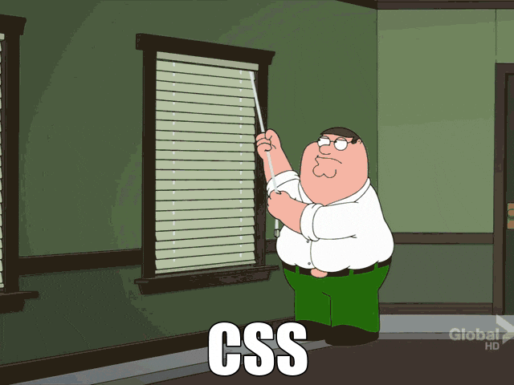

# Digital Horology

I started getting ads for [Klydoclock](https://www.klydoclock.com/) on
Instagram. The product looks really neat:

<div style="width: 90%; position: relative; aspect-ratio: 16 / 9; margin: 0 auto;">
<iframe style="position: absolute; top: 0; left: 0; width: 100%; height: 100%" src="https://www.youtube-nocookie.com/embed/gmyS-SMnW0U?si=CBJds1yeQxd-s9nO" title="YouTube video player" frameborder="0" allow="accelerometer; autoplay; clipboard-write; encrypted-media; gyroscope; picture-in-picture; web-share" referrerpolicy="strict-origin-when-cross-origin" allowfullscreen></iframe>
</div>

I love the idea of a digital pendulum clock. I figured it would make for a cool
DIY project: implement the clock display, then run it on a cheap tablet I can
stick in a box. Of course, the Klydo folks build a cool product, working with
multiple artists for the various clock faces, and, from what I can tell based on
the videos, it's a polished product. I'm not trying to dunk on their hard work.
I was simply intrigued by how one would go about implementing a pendulum clock.

I spent a couple of days playing with how I would implement something like this.
Here's what I have so far:

<div class="container">
    <div class="circle top-circle">
        <div class="clock">
            <div class="hand hour-hand"></div>
            <div class="hand minute-hand"></div>
            <div class="pin"></div>
        </div>
    </div>
    <div class="circle bottom-circle">
        <div class="pendulum">
            <div class="pendulum-line"></div>
            <div class="pendulum-circle"></div>
        </div>
    </div>
</div>

This was built with a little bit of HTML, some CSS, and a dash of JavaScript. I
have a love-hate relationship with CSS. From centering a div, to debugging
obscure layout issues, I always think of this GIF:



That said, it's incredible how much one can achieve with CSS. In this blog post,
I'll go over the clock implementation. I'll show some inline renderings of the
clock, tweaked to be embedded inside this post. The original, unmodified source
code is at <https://github.com/vladris/vladris.github.io/tree/master/clock>, and
live at <https://github.com/vladris/clock/>. For example, a notable difference
in the original implementation is sizes are specified in `vh` units, as I built
it for full-screen rendering, but for the clocks embedded in this post the CSS
uses `px` units. The code snippets are taken from the original implementation,
so _view source_ won't be as helpful. Now let's build a clock!

## Pendulum

The most notable feature of the clock is the pendulum. I implemented this as 4
divs:

```html
<div id="bottom-circle" class="circle">
    <div class="pendulum">
        <div class="pendulum-line"></div>
        <div class="pendulum-circle"></div>
    </div>
</div>
```

The `circle` class is just to make the div render as a circle, which we can do
with CSS like this:

```css
.circle {
    border-radius: 50%;
}
```

The `bottom-circle` further configures this:

```css
#bottom-circle {
    width: 25vh;
    height: 25vh;
    position: relative;
    overflow: hidden;
}
```

We want a set height and width for it, and we want anything that ends up outside
of the circle to be hidden.

Now here comes the fun part: the pendulum itself. The pendulum consists of a line
and a circle, wrapped inside a container div:

```css
.pendulum {
    position: absolute;
    top: -21vh;
    left: 50%;
    height: 44.5vh;
    transform: translateX(-50%);
}

.pendulum-circle {
    width: 22vh;
    height: 22vh;
    border-radius: 50%;
    box-shadow: 0 10px 20px rgba(0 0 0 / 50%);
    position: absolute;
    bottom: 0;
    left: 50%;
    transform: translateX(-50%);
}

.pendulum-line {
    width: 2vh;
    height: 35vh;
    top: 0;
    left: 50%;
    position: absolute;
    transform: translateX(-50%);
}
```

The divs have `left: 50%` and `transform: translateX(-50%)`. This centers them
inside their container. The `box-shadow` adds a nice shadow effect. Here's what
we have so far:

<div class="container">
    <div class="circle top-circle" style="background: black">
    </div>
    <div class="circle bottom-circle">
        <div class="pendulum" style="animation: none">
            <div class="pendulum-line"></div>
            <div class="pendulum-circle"></div>
        </div>
    </div>
</div>

And here comes the swing animation:

```css
.pendulum {
    ...

    animation: swing 2s infinite ease-in-out;
    transform: translateX(-50%);
}

@keyframes swing {
    0% {
        transform: rotate(-5deg);
    }
    50% {
        transform: rotate(5deg);
    }
    100% {
        transform: rotate(-5deg);
    }
}
```

This applies a `swing` animation to the pendulum, which rotates the whole
thing by 5 degrees on each side:

<div class="container">
    <div class="circle top-circle" style="background: black">
    </div>
    <div class="circle bottom-circle">
        <div class="pendulum">
            <div class="pendulum-line"></div>
            <div class="pendulum-circle"></div>
        </div>
    </div>
</div>

The "trick" to it is the pendulum top is high outside the circle. The animation
is anchored there (`transform-origin: top`) and the motion itself is only 5
degrees each way.

## Clock face

The top part of the clock looks like this:

```html
<div id="top-circle" class="circle">
    <div class="clock">
        <div class="hand" id="hour-hand"></div>
        <div class="hand" id="minute-hand"></div>
        <div class="pin"></div>
    </div>
</div>
```

The classic typeface is called _Breguet_, named after the luxury watch company
that introduced it. Luckily, I found a free SVG with a Breguet dial:


We can use this as the background of the top circle:

```css
#top-circle {
    background-size: cover;
    background-image: url("breguet.svg");
}
```

The nice thing about SVGs is they scale very smoothly.

<div class="container">
    <div class="circle top-circle">
    </div>
    <div class="circle bottom-circle">
        <div class="pendulum">
            <div class="pendulum-line"></div>
            <div class="pendulum-circle"></div>
        </div>
    </div>
</div>

We need hour and minute hands, and also a "pin" in the middle. We already
saw these in the clock top HTML:

```html
<div id="top-circle" class="circle">
    <div class="clock">
        <div class="hand" id="hour-hand"></div>
        <div class="hand" id="minute-hand"></div>
        <div class="pin"></div>
    </div>
</div>
```

The styling for the clock face:

```css
#top-circle {
    width: 50vh;
    height: 50vh;
    margin-bottom: 5vh;
    position: relative;
    background-size: cover;
    background-image: url("breguet.svg");
}

.clock {
    position: absolute;
    width: 100%;
    height: 100%;
    border-radius: 50%;
    top: 50%;
    left: 50%;
    transform: translate(-50%, -50%);
}

.pin {
    width: 0.5vh;
    height: 0.5vh;
    border-radius: 50%;
    position: absolute;
    top: 50%;
    left: 50%;
    transform: translate(-50%, -50%);
}

.hand {
    position: absolute;
    box-shadow: 0 0 10px rgba(0 0 0 / 50%);
    stroke-width: 100;
    top: 50%;
    left: 50%;
    border-radius: 1vh;
    transform: translate(-50%, -15%);
}

#hour-hand {
    height: 17vh;
    width: 1.8vh;
    transform-origin: 50% 15%;
}

#minute-hand {
    height: 22vh;
    width: 1.2vh;
    transform-origin: 50% 15%;
}
```

This looks like a lot but it really isn't: we center the clock with
`left: 50%; top: 50%; transform: translate(-50%, -50%)`. We do the same
with the pin, this is just a small circle at the very center of the clock.

The hour and minute hands are similarly centered, with a slightly different
`translate`: `translate(-50%, -15%)` - we want them to look like the pin
goes through them at 15% of their length. We also add shadows to the hands.

<div class="container">
    <div class="circle top-circle">
        <div class="clock">
            <div class="hand" style="height: 100px; width: 10px; transform-origin: 50% 15%"></div>
            <div class="hand" style="height: 120px; width: 6px; transform-origin: 50% 15%"></div>
            <div class="pin"></div>
        </div>
    </div>
    <div class="circle bottom-circle">
        <div class="pendulum">
            <div class="pendulum-line"></div>
            <div class="pendulum-circle"></div>
        </div>
    </div>
</div>

Almost done! The only thing we need to do is show the time. This is where the
bit of JavaScript comes in:

```javascript
function updateClock() {
    const now = new Date();
    const minutes = now.getMinutes();
    const hours = now.getHours();

    const minuteDegree = (minutes / 60) * 360 + (seconds / 60) * 6 + 180;
    const hourDegree = (hours / 12) * 360 + (minutes / 60) * 30 + 180;

    document.getElementById(
        "minute-hand"
    ).style.transform = `translate(-50%, -15%) rotate(${minuteDegree}deg)`;
    document.getElementById(
        "hour-hand"
    ).style.transform = `translate(-50%, -15%) rotate(${hourDegree}deg)`;
}

setInterval(updateClock, 1000);
updateClock();
```

We implement an `updateClock()` function that gets the current time and rotates
the hands. We compute how many degrees we want the minute hand and the hour hand
to be rotated by:

```javascript
const minuteDegree = (minutes / 60) * 360 + (seconds / 60) * 6 + 180;
const hourDegree = (hours / 12) * 360 + (minutes / 60) * 30 + 180;
```

Note the minute hand also takes into account the seconds while the hour hand
takes into account the minutes, to ensure smooth movement.

We then get the `minute-hand` and `hour-hand` elements and update their
`transform` to include a `rotate` by the determined number of degrees.

We use `setInterval()` to run `updateClock` every second. And that's it!

<div class="container">
    <div class="circle top-circle">
        <div class="clock">
            <div class="hand hour-hand"></div>
            <div class="hand minute-hand"></div>
            <div class="pin"></div>
        </div>
    </div>
    <div class="circle bottom-circle">
        <div class="pendulum">
            <div class="pendulum-line"></div>
            <div class="pendulum-circle"></div>
        </div>
    </div>
</div>

## Skins

Since all the styling is done with CSS, it's very easy to provide multiple
skins for it, much like Klydo does. Here's a Mickey Mouse version:

<div class="container">
    <div class="circle top-circle" style="background-image: url(https://vladris.com/clock/mickey/mickey.gif); width: 240px; height: 240px; margin: 20px 0 30px 0">
        <div class="clock">
            <div class="hand hour-hand" style="background-color: #f4c81d"></div>
            <div class="hand minute-hand" style="background-color: #f4c81d"></div>
            <div class="pin"></div>
        </div>
    </div>
    <div class="circle bottom-circle" style="background-color: #b49a7d">
        <div class="pendulum">
            <div class="pendulum-line" style="background-color: #040204"></div>
            <div class="pendulum-circle" style="background-color: #c13941"></div>
        </div>
    </div>
</div>

In fact, in my original implementation I have several clock faces, each coming
with a set of color customizations and a background image for the clock. The
following JavaScript looks for a `style` query parameter and loads the specified
CSS file:

```javascript
function loadCSSFromQueryParam() {
    const urlParams = new URLSearchParams(window.location.search);
    const style = urlParams.get("style") ?? "breguet";
    const styleParam = `${style}/style.css`;
    if (styleParam) {
        const link = document.createElement("link");
        link.rel = "stylesheet";
        link.href = styleParam;
        document.head.appendChild(link);
    }
}

loadCSSFromQueryParam();
```

The default is `breguet`, loading the Breguet dial, but using `style=mickey` in
<https://vladris.com/clock/?style=mickey> loads the Mickey Mouse face.

## Conclusions

CSS is still very cumbersome, but it's impressive how easy it is to achieve
quite complex effects with it. Adding a subtle shadow can be done with a
`box-shadow` one-liner. The pendulum animation is a simple `rotate`
transform with 3 keyframes:

```css
@keyframes swing {
    0% {
        transform: rotate(-5deg);
    }
    50% {
        transform: rotate(5deg);
    }
    100% {
        transform: rotate(-5deg);
    }
}
```

Similarly, having the hands point to the right time is just another `rotate`.
Quite nice!

The full implementation we went over is [here](https://github.com/vladris/vladris.github.io/blob/master/clock/index.html).

<style>
.container {
    margin: auto;
    display: flex;
    flex-direction: column;
    justify-content: center;
    align-items: center;
    height: 480px;
    background-color: black;
    border-radius: 20px;
    width: 300px;
}
.circle {
    border-radius: 50%;
}
.top-circle {
    width: 280px;
    height: 280px;
    margin-bottom: 10px;
    position: relative;
    background-size: cover;
    background-image: url(https://vladris.com/clock/breguet/breguet.svg);
}
.bottom-circle {
    width: 140px;
    height: 140px;
    position: relative;
    overflow: hidden;
    background-color: #f7ebd3;
}
.clock {
    position: absolute;
    width: 100%;
    height: 100%;
    border-radius: 50%;
    top: 50%;
    left: 50%;
    transform: translate(-50%, -50%);
}
.pin {
    width: 3px;
    height: 3px;
    border-radius: 50%;
    position: absolute;
    top: 50%;
    left: 50%;
    background-color: #905923;
    transform: translate(-50%, -50%);
}
.hand {
    position: absolute;
    box-shadow: 0 0 10px rgba(0 0 0 / 50%);
    stroke-width: 100;
    top: 50%;
    left: 50%;
    border-radius: 6px;
    background-color: #cd7f23;
    transform: translate(-50%, -15%);
}
.hour-hand {
    height: 100px;
    width: 10px;
    transform-origin: 50% 15%;
}
.minute-hand {
    height: 120px;
    width: 6px;
    transform-origin: 50% 15%;
}
.pendulum {
    position: absolute;
    top: -120px;
    left: 50%;
    height: 250px;
    transform-origin: top;
    animation: swing 2s infinite ease-in-out;
    transform: translateX(-50%);
}
.pendulum-circle {
    width: 120px;
    height: 120px;
    border-radius: 50%;
    box-shadow: 0 10px 20px rgba(0 0 0 / 50%);
    position: absolute;
    bottom: 0;
    left: 50%;
    background-color: #cd7f32;
    transform: translateX(-50%);
}
.pendulum-line {
    width: 12px;
    height: 240px;
    top: 0;
    left: 50%;
    position: absolute;
    background-color: #905923;
    transform: translateX(-50%);
}
@keyframes swing {
    0% { transform: rotate(-5deg); }
    50% { transform: rotate(5deg); }
    100% { transform: rotate(-5deg); }
}
</style>

<script>
    function updateClock() {
        const now = new Date();
        const seconds = now.getSeconds();
        const minutes = now.getMinutes();
        const hours = now.getHours();

        const minuteDegree = ((minutes / 60) * 360) + ((seconds / 60) * 6) + 180;
        const hourDegree = ((hours / 12) * 360) + ((minutes / 60) * 30) + 180;

        for (const elem of document.getElementsByClassName("minute-hand")) {
            elem.style.transform = `translate(-50%, -15%) rotate(${minuteDegree}deg)`;
        }

        for (const elem of document.getElementsByClassName("hour-hand")) {
            elem.style.transform = `translate(-50%, -15%) rotate(${hourDegree}deg)`;
        }
    }

    setInterval(updateClock, 1000);
    updateClock();
</script>
