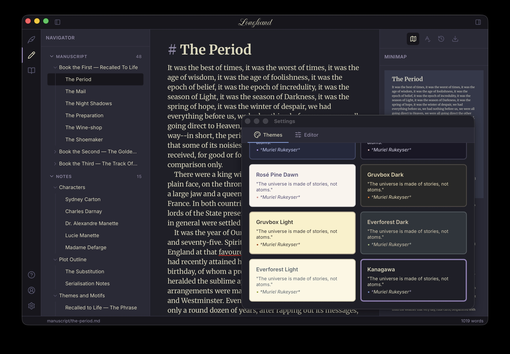

# DevLog 7: Longhand

I talked a bunch about Flow, the focused text editor I built during the past
couple of years. I released Flow on the MacOS App Store and on the Windows Store
and I'm pretty happy with the editing experience.

One thing I was still missing was a solution for long form writing. I used
Obsidian to organize my last novel, but Obsidian is a note taking/PKB tool, not
a manuscript management tool. I mentioned this when I started working on
[Flow](https://vladris.com/blog/2025/03/08/devlog-1-flow.html). Since then, I
learned about several other applications in the space, like
[Ulysses](https://ulysses.app/) and [Dabble](https://www.dabblewriter.com/),
which are closer to what I'm imagining but still lacking in UX and
cross-platform support.

Now that I have a solid core editor, my next project is an editor for long form
writers. Introducing: *Longhand*.

I absolutely plan to write my next book with it.

## Information Architecture

The app uses the same side rail as Flow for modes, settings etc.

Unlike Flow, which is a single-file editor, Longhand works across multiple
files. I'm following the Obsidian model, where a project is simply a folder on
disk. These are split into two main categories: *Manuscript* and *Notes.* Should
be self-explanatory. Longhand allows hierarchical groupings - for example
multiple *chapters* belong to a *part*. Notes can similarly be parented. Here,
unlike Obsidian, I am not using sub-folders. That's because in a book, hierarchy
parents might contain content themselves. The novel's *Part 1* page has a title,
maybe a quote, so just sticking chapters under a `Part 1` subfolder isn't
enough. The app has a collapsible left pane to manage manuscript chapters and
notes.

Reading mode pulls together the whole manuscript into one view.

The other concept I introduced is that of *Tools*. Tools appear on the right side pane and offer various useful functionality. So far I have:

* Minimap - Not sure how useful this is but I really like how minimaps look so I
  built one.
* ToC - Table of Contents inferred based on hierarchy and headings, with
  one-click navigation.
* Search - Search tool with filters to scope search to manuscript or notes
  only.
* Grammar checker - Non-intrusive, revise grammar only when needed.
* Export - I have big plans here but starting small, with basic PDF and Word
  export.
* Version history - This is a useful one. Whenever the user first edits a file
  in a session, Longhand automatically saves a copy. Unhappy with the latest
  revision? You can easily go back in time to an older version.

I have a long list of tools to add on the backlog. For example, a tool to pin notes relevant to the chapter on the side for easy reference etc.

This should give you more insight on my previous [rant on
Markdown](https://vladris.com/blog/2026/03/22/notes-on-markdown.html). I want
to add support for comments and revisions. This is where Markdown is no longer
a great fit and I'll need to figure out how to implement these.

## Platform

One of the biggest decisions I ended up regretting with Flow is choosing
Electron. I quickly learned Electron is a hog, the bundled browser taking up
hundreds of megabytes, way more than my modes app code. I was also disappointed
to learn Electron doesn't run on iPad. I like writing on my iPad with a Magic
Keyboard.

For Longhand I'm using [Tauri](https://v2.tauri.app/). Tauri uses the OS native
web view, for better or worse. It's a lot slimmer because of this, but I expect
cross-platform becomes more difficult targeting different web platforms. At this
point I'm willing to accept the tradeoff. Tauri is tiny! It uses Rust on the
native side and works on all platforms. More or less, iOS support is still
"experimental." That said, I was able to get Longhand running on an iPad
simulator.

I'm currently focusing on the MacOS version to get a solid initial experience
out. Then Windows, like I did with Flow. Then iPad and iPhone.

## A Note on Coding Agents

I've been more and more impressed with the capability of coding agents. When I
first started working on Flow, it was a lot of co-authoring with Copilot in VS
Code. Most of Longhand implementation was Claude CLI. Ever since Opus 4.5,
coding agents work great autonomously.

It also helps that I'm using the same core editor as Flow, which didn't require
a lot of changes. I did have to touch it for a couple of new features, like
multiple highlight colors. The agent did a solid job, don't get me wrong, but
those are the PRs I spend most time on since the core editor is the engine
behind all of this.

The full app experience includes a lot of chrome and tools which are fairly
self-contained. I believe I got the app architecture right, so tacking on tools
with Claude is very easy.

I wanted to implement subscriptions for Longhand. I have no experience setting
this up and was able to stand up an end-to-end sign in and subscription flow
with Supabase, Resend, and Stripe in a few hours. As I said, I am more and more
impressed with what agents can do.

I am also saddened by how developer-hostile Apple is. On Apple platform I must
use their APIs for any in-app payments (from which they take their 30% cut).
Getting this working took a lot longer than Stripe, with many manual steps
involved and a testing solution that doesn't quite work. As much as I love using
Apple products for their great user experience, the developer experience on the
platform was always terrible and is not getting any better.

## Release

The first version of Longhand will be out for MacOS in the next few days. I have
a long backlog of stuff to add to it, but I have a very solid MVP.
