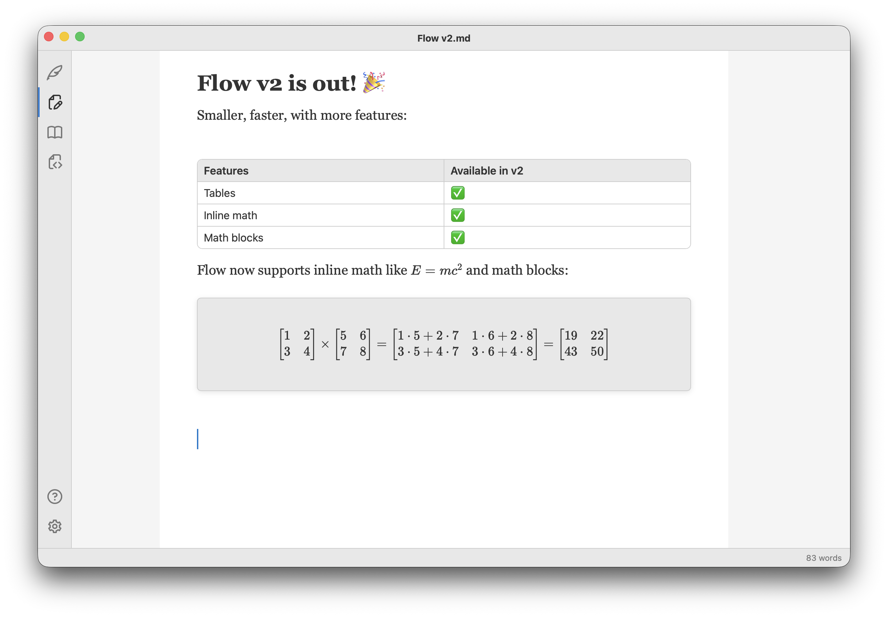
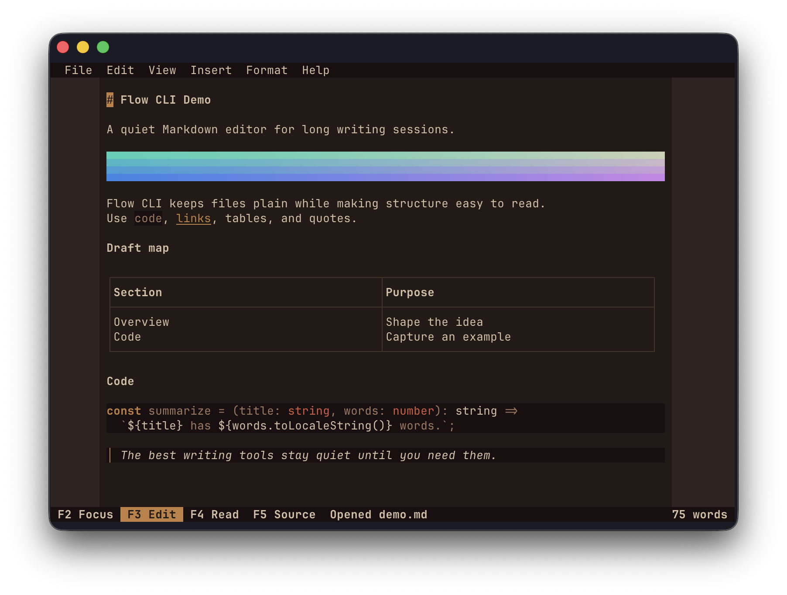

# DevLog 9: Flow 2

In the [previous post](https://vladris.com/blog/2026/06/13/devlog-8-replat.html)
I talked about replatforming my editors on a custom stack, including a custom
incremental Markdown parser and a custom HTML editor, which I open sourced as
[markoffset](https://github.com/saturn9studio/markoffset) and
[scribeframe](https://github.com/saturn9studio/scribeframe).

Since then, I released [Flow 2](https://saturn9.studio/flow/), the next major
release, which ditches Electron for Tauri and ProseMirror for scribeframe. Flow
2 is now available on both the MacOS App Store and the Microsoft Store.

The user experience stays mostly the same, except the whole editor should be
snappier. I'm very happy with the bundle size, going down from hundreds of MBs
(Electron) to dozens of MBs with the much smaller Tauri bundle.

I fully expect some bugs are still around and need to be squashed, but overall
I'm happy with where things are at.

## New Stuff

I didn't want to release a v2 that is just smaller, so this newest version comes
with added support for a few more Markdown features: tables and math - both
inline math and math blocks.

Here's a sample:

These were easy to add on the new stack: both the parser and editor have strong
support for plugins so adding new capabilities like this becomes trivial.

Encouraged by the agentic rewrite, I decided to build a version of Flow for the
terminal because why not? [Flow CLI](https://github.com/saturn9studio/flow-cli)
is a fully open-source, TUI version of the app. It includes the same editor
modes and features, even an "image" widget that converts a given image into ANSI
art.

Flow CLI can be installed via Homebrew, Winget, or npm.

## What's Next

Next, I'm going back to [Longhand](https://saturn9.studio/longhand/), my long
form writing app. From the start, I used Flow as a test bed. With the first
release of Flow, I built up the core editor (then based on ProseMirror) and
learned the lesson that Electron is not as great for what I'm trying to do as I
originally thought.

For the first version of Longhand, I ditched Electron, kept the editor, and
focused on multiple file management and tools.

Now that I have a new editor stack, I want to port Longhand to it too -
markoffset and scribeframe will replace the editor, while preserving the overall
experience. I'm expecting this shift to be less work. The editor stack is
working end to end in Flow 2 and Longhand is already a Tauri app. A bunch of the
heavy lifting of getting Flow 2 on Tauri doesn't apply here. The port is manly
swapping out one editor for the other.

Behind the scenes, I also did some refactoring to share more code. You might
have noticed that Flow and Longhand have a very similar app shell: custom title
bar, side rail, status bar etc. These were different implementations back when
Flow was an Electron app but now that both apps share the same platform I
extracted a lot of code into a shared package that provides everythign from
window chrome to driving the OS menus and file IO. As things stabilize, I might
open source more of the stack.

I did spend a bunch of time on this replatform sidequest but I think it's for
the best. My projects are converging towards a robust long term solution. That
said, I'm looking forward to wrap up the Longhand move to the new editor and
resume working on what I really set out to do: a feature-rich editor for
authors, with intelligent tools and beautiful UX. While I have an MVP out, there
are plenty more things to build on it.

## Agentic Coding

I'm relying more and more on coding agents, so I've been tending to include a
section on my experience with most blog posts.

Models are getting better and better. I've been using GPT 5.6 Sol for most of
the replatform work, and it has been doing a solid job overall. I still found
multiple UX bugs and glitches in the typing experience which I had to
workthrough. Not perfect, but if I would've written markoffset and scribeframe
by hand and ported Flow over it would've taken me a lot more time than it took
the agent.

I'm still gathering my thoughts, I'll probably write a dedicated post once I
form a solid opinion but I do think software engineering itself is shifting. The
[Harness engineering](https://openai.com/index/harness-engineering/) article by
OpenAI is illuminating. I've been incorporating some of the practices into my
editor project.

Verification is a bottleneck. The model produces tests of dubious quality. One
pattern I noticed as we were working through UX bugs what it adding various "CSS
tests" which are completely useless. It also bloated CI with browser-driven
automation for these which immediately blew through my GitHub credits for
Actions.

Autonomy is improving. For example, to debug, the agent can independently boot
the UI in playwright, capture a screenshot, inspect it, and iterate. I also
absolutely love [DebugMCP](https://github.com/microsoft/DebugMCP), which lets an
agent drive a debugger.

I've been writing various skills to improve output quality.

The technology is moving so fast that today's best practices quickly become
obsolete.

At some point I'll coalesce the above into a coherent post. Until then, upgrade
to [Flow 2](https://saturn9.studio/flow/), give [Flow
CLI](https://github.com/saturn9studio/flow-cli) a try, and stay tuned for the
release of Longhand 2.
